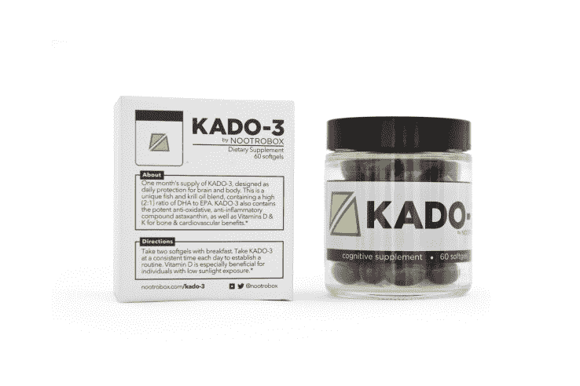

# Nootrobox 想用维生素 D 增强你的脑力

> 原文：<https://web.archive.org/web/https://techcrunch.com/2016/06/22/nootrobox-wants-to-boost-your-brain-power-with-vitamin-d/>

谁需要太阳？许多硅谷初创公司以漫长而艰苦的工作时间为荣，从黎明一直工作到深夜。但是这种工作自豪感是有代价的——他们可能严重缺乏维生素 d。

如今，大多数美国办公室职员都做 T1，T2 Nootrobox 联合创始人 Geoff Woo 说这影响了我们的大脑。

维生素 D 在钙吸收中起着重要作用，增强你的免疫系统，并可能预防某些形式的癌症、1 型糖尿病和多发性硬化症。没有足够的睡眠，你可能会经历一种[脑雾](https://web.archive.org/web/20221209130909/https://www.vitamindcouncil.org/health-conditions/cognitive-impairment/)和[认知功能下降](https://web.archive.org/web/20221209130909/http://www.scientificamerican.com/article/does-d-make-a-difference/)。

去年，像 Nootrobox、Nootroo 和其他“智能药物”订阅服务这样的初创公司开始涌现，以帮助硅谷员工提高脑力。他们加入了生物黑客运动中越来越多的家庭手工业产品，如防弹咖啡、智能可可，甚至是小剂量的裸盖菇素(致幻蘑菇)，旨在帮助初创企业提高业绩。

吴和他的联合创始人迈克尔·布拉德特最初发布了一系列化学增强药丸，承诺帮助人们醒来，集中注意力，睡得更好。这家初创公司在 2015 年吸引了安德森·霍洛维茨、雅虎的玛丽莎·梅耶尔和 Zynga 创始人马克·平卡斯作为投资者，帮助推出订阅服务。Nootrobox 后来发布了“Go Cubes”，可咀嚼的咖啡块，它提供了一种“均衡”的咖啡因效果。

现在，吴想添加维生素 D(实际上是一种激素，而不是维生素)来提高脑力。

Nootrobox 正在推出 [KADO-3](https://web.archive.org/web/20221209130909/https://nootrobox.com/kado-3) ，这是一种鱼油和磷虾油的混合物，其中 DHA(二十二碳六烯酸)与 EPA(二十碳五烯酸)的比例特别高，可以为认知功能提供优质维生素 D。

尽管建议在我们日常饮食中所需的量上有所不同，但对维生素的兴趣一直持续到白宫。第一夫人米歇尔最近说服美国食品和药物管理局(T2)在新的食品标签上增加维生素 D 含量。

但是随便去一家当地的营养商店，货架上就有大量的维生素 D。吴说那些瓶子里的东西和他提供的不一样。

“典型的欧米伽-3 混合物含有高比例的 EPA 和 DHA。EPA 与心血管益处相关，而 DHA 与大脑益处相关。而 Nootrobox 则提高了 DHA 与 EPA 的比例，”Woo 说。

该混合物还添加了虾青素和维生素 K2，虾青素是一种神经保护剂，有助于控制老年疾病的风险，维生素 K2 也被证明对心血管系统和大脑有益。

Woo 还透露，该公司计划最终基于某人的 DNA 创造一种个性化的混合物，以增强他们的整体功能，Nootrobox 可能会与一家大型基因测试公司合作提供这样的产品，但他表示，他没有与任何人进行谈判，短期内不会提供这种产品。