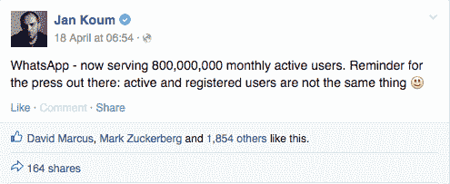

# WhatsApp 的月活跃用户数是怎么回事？

> 原文：<https://web.archive.org/web/https://techcrunch.com/2015/04/21/not-hatin-just-sayin/>

本周，WhatsApp 跨越了一个里程碑，[首席执行官简·库姆透露](https://web.archive.org/web/20230404224325/https://www.facebook.com/jan.koum/posts/10153230480220011)其活跃用户突破了 8 亿。在这个时代，当领先的全球社交网络和互联网服务建立良好时，这是相当了不起的。打入这个俱乐部并不容易，但 WhatsApp 做到了——自从脸书以令人瞠目的 190 亿美元收购了 T4 以来，它的用户群在过去一年中几乎翻了一番。

然而，尽管这些数字令人印象深刻，但这个新的数据点也有一些令人不安的地方。

以下是库姆的《脸书邮报》:

此时，大多数人都知道这两个指标的区别。月活跃用户是一种更准确的衡量服务覆盖面和参与度的方式——但这并不确定。

认为 MAUs 提供了企业及其用户群的真实情况，往好里说是天真，往坏里说是误导。

“除了 8 亿 MAUs 之外，我们不会提供任何额外的数据，”WhatsApp 的一位发言人在我们联系要求获得更多信息后告诉 TechCrunch。

## 指标就是指标

例如，我可以一个月打开一次 WhatsApp 在 30 天内打开 5 分钟——我就会被算作其 8 亿“活跃”用户之一。这可差远了。(我甚至没有考虑那些通过双卡手机‘两次’使用这项服务的人。)

> 认为 MAUs 提供了企业及其用户群的真实情况，往好里说是天真，往坏里说是误导。

消息应用是核心服务；因为我们每天都和朋友、家人和同事交谈，所以他们应该比一个月一次更经常使用。

衡量 WhatsApp 吸引力的一个更好的指标可能是每周或每月的用户数量、用户之间发送的消息、每个用户每天发送的消息等。

当然，我说起来容易。WhatsApp 更喜欢把这些数据留给自己。这很好——它完全有权这样做。但是声称披露 MAU 数据揭露了数字背后的真相是完全错误的。

这不仅仅是对数字吹毛求疵；这里有一个重要的商业问题。消息传递的下一个阶段正在迅速到来，这是服务的本地网络至关重要的时候。

## 超越聊天

在保持用户体验的同时，你可以从聊天中赚钱的方法只有这么多。正如脸书在发布其信使平台时所展示的，未来是连接服务——如支付、企业对消费者的沟通等等。在亚洲，商务和线上线下服务正日益成为即时通讯应用的焦点。

这里的关键事实是本地网络的实力。你在全世界有多少用户并不重要。如果你在某个国家没有稳固的基础，那么拉拢当地的服务合作伙伴来拓展业务就是一个挑战。

例如，韩国卡考的注册用户不到 2 亿，其中每月活跃用户可能不到 1 亿。

然而，在韩国，其应用程序安装在超过 95%的智能手机上。这使得推出[出租车预订功能](https://web.archive.org/web/20230404224325/https://techcrunch.com/2015/03/30/kakaotaxi-launch/)、[支付](https://web.archive.org/web/20230404224325/https://techcrunch.com/2014/11/12/korean-internet-giant-daum-kakao-launches-its-own-mobile-payment-platform/)和其他服务变得显而易见，因为零售商和其他人知道有一个他们可以直接利用的专属受众。

Kakao 自 2013 年以来一直盈利，去年它以 30 亿美元的交易与当地互联网巨头 Daum 合并。它确实错过了全球信息传递的机会，但它的韩国业务仍然是信息传递走向的证据。

## WhatsApp 的挑战

WhatsApp 在全球拥有 8 亿“月活跃用户”。我们知道[它在印度](https://web.archive.org/web/20230404224325/http://timesofindia.indiatimes.com/tech/tech-news/WhatsApps-India-user-base-crosses-70-million/articleshow/45018845.cms)特别大，每月活跃用户超过 7000 万，但不清楚它的网络在其他地方是否有强大的高参与度用户。

这一点很重要，因为在未来，如果它希望在 1 美元年费之外赚钱，它将需要在当地市场的实力和深度，以使其平台具有吸引力。

WhatsApp 似乎有可能在印度以及欧洲和中东的部分地区胜出，但它已经失去了亚洲(中国、韩国、日本和台湾)的顶级市场，并且正在与东南亚和世界其他地区的一系列竞争对手展开竞争。鉴于 iMessage 的高使用率以及 Kik 和 Snapchat 等竞争对手，美国市场也极具挑战性。

这与“8 亿月活跃用户”[截然不同，后者意味着统治世界](https://web.archive.org/web/20230404224325/http://thenextweb.com/insider/2014/02/20/whatsapp-is-hugely-popular-but-it-doesnt-dominate-the-world-quite-like-you-might-think/)。

我听到很多业内人士谈论的另一个因素是，很大一部分 WhatsApp 用户不在 Android 和 iOS 设备上。在这种手机上推出服务是 WhatsApp 工程能力的真实证明——以及它在非洲和拉丁美洲的受欢迎程度——但在黑莓、Windows Phone 或 Symbian 上向这些用户推出额外服务在技术上具有挑战性，很可能是不可能的。

这是 WhatsApp 要应对的另一个问题，因为它希望从一个通信工具发展成为一项利润丰厚的业务。

因此，虽然 8 亿 mau 是一个令人印象深刻的统计数字，但请记住，这只是另一个统计数字。