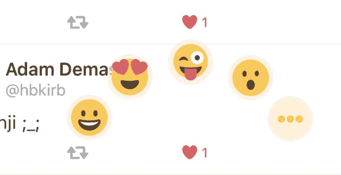
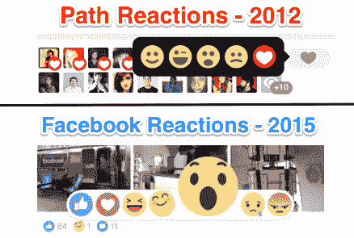

# 没有进入心脏？Twitter 似乎正在测试多表情符号的反应

> 原文：<https://web.archive.org/web/http://techcrunch.com/2015/11/16/not-into-the-hearts-twitter-appears-to-be-testing-multi-emoji-reactions/>

# 没有进入心脏？Twitter 似乎正在测试多种表情符号的反应

是的，fav 变成了 like。明星变成了[心](https://web.archive.org/web/20230406193504/https://techcrunch.com/2015/11/03/heart-heart-heart/)。一些推特用户对这一变化不太高兴，尽管推特上说[的参与度很好](https://web.archive.org/web/20230406193504/https://techcrunch.com/2015/11/10/twitter-sees-6-increase-in-like-activity-after-first-week-of-hearts/)——事实上，在新用户中有所增加。

今天，我们了解到，一直在测试许多东西的 Twitter 正在[让人们玩](https://web.archive.org/web/20230406193504/https://twitter.com/codeblue87/status/666337737461653505)通过表情符号以多种方式分享反应的能力。别管心脏了。还有那颗星星。如果你愿意。

这是不是让按钮变得毫无意义了？更有意义？我还不确定。让人们在回应某件事时说出他们的个人感受很有魅力，但即便如此，人们还是会抱怨他们的情绪没有被表达出来。

上周在巴黎发生的事件让人们对在 Twitter 上被告知“如何感受”的感受曝光。这个论点非常公平。

首席执行官杰克·多西称赞了 Twitter 向简单性的迈进，所以这次测试似乎重新混淆了一个本不该混淆的变化。当然，你不可能“喜欢”或“爱”一切*，[脸书也一直在努力寻找摆脱困境的方法](https://web.archive.org/web/20230406193504/https://techcrunch.com/2015/10/08/with-reactions-facebook-supercharges-the-like-button-with-6-empathetic-emoji/)，但是太多的选择会不会开始变得令人讨厌？*

 *表情符号反应的“选择轮”看起来有点像 Path 书中的设计:

这显然激发了脸书最近的产品:

这其中有一部分是不言而喻的:想象一个[付费表情符号](https://web.archive.org/web/20230406193504/https://techcrunch.com/2015/09/17/twitters-cashmoji-campaign-with-coke-also-leverages-niche-and-vine/)代替其中一个选项。可能是暂时的。可能是宣传某个品牌的新 XXXXXX。是的，Twitter 很擅长找出新的赚钱方法。

我们已经在 Twitter 上发表了评论，一旦收到回复，我们会及时更新。

**更新:**推特发言人给我们发来了以下声明:

🙊*