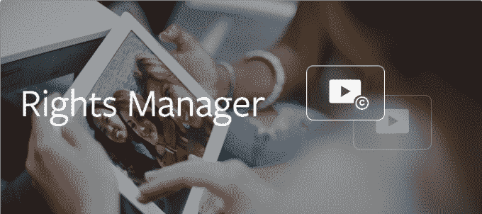

# 脸书允许内容所有者宣称盗版视频的广告收入

> 原文：<https://web.archive.org/web/https://techcrunch.com/2017/04/27/not-so-freebooting/>

# 脸书允许内容所有者索取盗版视频的广告收入

脸书终于有了一个更好的解决方案来对付“偷拍”——偷拍视频并上传到自己的脸书页面以获取参与度和观众增长的常见做法。[今天对去年发布的](https://web.archive.org/web/20230316161133/https://media.fb.com/2017/04/27/improvements-to-rights-manager/)[脸书版权管理工具](https://web.archive.org/web/20230316161133/https://techcrunch.com/2016/04/12/content-fb/)的更新包括了一个新选项，可以在别人上传你的视频时“索取广告收入”。通过这种方式，如果一个侵权视频包含脸书正在测试的新的中间插播广告，收入将被发送给内容的所有者，而不是窃取它的上传者。

现在，版权所有者无需手动审查所有盗版内容实例，而是可以设置自动规则，以确定侵权上传是否应立即被阻止、允许，但查看指标应显示给所有人、允许所有人索取广告收入或发送给手动审查。

“要求广告收入”选项使脸书版权管理器的功能更接近行业标准，即 YouTube 的内容 ID。当脸书去年推出 Rights Manager 时，TechCrunch 指出这个功能是它最大的缺陷。

此前，版权所有者的唯一行动是允许或屏蔽并删除侵权视频。两者都剥夺了内容所有者和盗版者分享引人注目的内容的好处的机会——所有者得到钱，盗版者得到参与权。

Rights Manager 的工作原理是让内容所有者上传视频的原始版本以进行索引。然后，它可以检测到同一视频或其一部分何时被其他人上传。

就目前而言，原始版权持有者能够获得的收入可能很少，因为[中间广告时段](https://web.archive.org/web/20230316161133/https://www.facebook.com/facebookmedia/get-started/ad-breaks)还没有完全推出，并且只对一组封闭的测试者开放。他们让内容所有者选择何时在他们的视频中插入一个 15 到 20 秒的广告。脸书与上传者分享这些广告收入的 55%，除非这些广告收入被其他人通过版权管理器认领。

这种新发现的财政保护和激励措施可能会吸引更多的优质视频内容所有者来到脸书及其拥有 18 亿用户的庞大观众群。