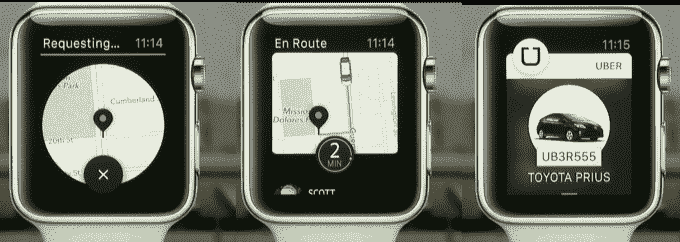
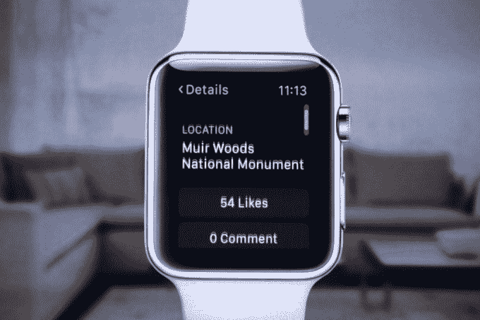

# 你可以把你的 iPhone 放在口袋里。不相信我？观看 

> 原文：<https://web.archive.org/web/https://techcrunch.com/2015/03/09/not-subordinate/>

# 你可以把你的 iPhone 放在口袋里。不相信我？看着吧

这不是跟班。它不仅仅是一个伴侣。Apple Watch 完全消除了在许多情况下掏出手机的需要。这是今天发布会的主题。

这不仅仅是另一个通知屏幕。是的， [Apple Watch 是时间，保存了](https://web.archive.org/web/20221005184337/https://beta.techcrunch.com/2015/03/06/the-apple-watch-is-time-saved/)。但是 Apple Watch 也是做出来的东西。欢呼并找到你的优步。浏览并喜欢 Instagram 照片。回复微信消息。使用麦克风和扬声器接听电话。

到目前为止，人们对智能手表的看法是，它们只是手机的伴侣。你可能会从可穿戴设备上获得轻量级警报并采取基本行动，但要做任何实质性的事情，就必须拿出手机。

但是苹果想让你手臂上的东西来挑起重担。这可能会挫败我听到的对智能手表的最高批评:我们的生活已经够复杂了。

许多人已经感觉完全被技术淹没了。无处不在的屏幕、堆积如山的电子邮件、平板电脑和智能电视占据了我们的视线，最令人恼火的是，不停的通知和其他掏出手机的理由。

一些技术爱好者渴望一种更快的方式来解析通知，因此出现了 Pebble。但不得不在手机和智能手表之间切换功能让这个问题听起来更糟，而不是更好。

随着今天在舞台上展示的手表应用程序，苹果公司明确表示，你不必学习变戏法。

你的 iPhone 仍然是你手表的大脑、发射器和应用商店入口。你不能完全抛弃它。但当手表正常工作时，你的手机会牢牢地卡在你的裤子或钱包里，而不是你的手里。浪费在打开它上的几秒钟现在被用来体验真实的生活。在 Apple Watch 的帮助下，我们可以从手机上夺回对生活的控制权。

这使得这款新设备与史蒂夫·乔布斯多年前为苹果公司树立的理念相一致[，当时他说](https://web.archive.org/web/20221005184337/http://retailindustry.about.com/od/retailbestpractices/ig/Company-Mission-Statements/Apple-Inc--Mission-Statement.htm)“人类是这个世界变革的创造者。因此，他应该凌驾于制度和结构之上，而不是从属于它们。”