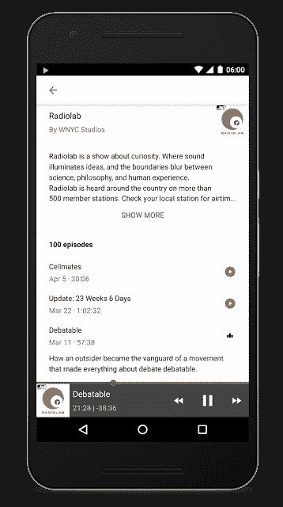

# 现在，你可以在谷歌的移动应用 TechCrunch 中收听播客

> 原文：<https://web.archive.org/web/https://techcrunch.com/2016/04/20/now-you-can-listen-to-podcasts-right-in-googles-mobile-app/>

Google today 通过在其 Android 应用中引入播客支持，让 Android 用户更容易收听播客。这意味着你可以使用谷歌的搜索引擎搜索播客，然后点击一个按钮开始收听，而不必订阅或切换到另一个应用程序。

该功能还包括屏幕底部的标准音频控制，包括播放/暂停按钮、倒带和快进。但更方便的是，你可以在听的时候继续浏览网页或使用手机。谷歌表示，你甚至可以关闭屏幕，播客将在背景中简单播放。

在发布时，已经有成千上万的播客被编入索引，并支持在谷歌应用程序中播放，但谷歌指出，随着时间的推移，将会增加更多的播客。然而，你肯定会毫不费力地找到顶级名字，比如*系列、新鲜空气*或*无线电实验室*。

当你找到你想听的播客时，应用程序会在谷歌的搜索结果中显示最近的三集，所以你不必点击而是一次就可以开始收听最新的节目。

此外，您可以使用此功能来了解旧节目——搜索结果将显示一个选项来查看“更多剧集”这将带你到一个更长的播客档案列表。事实上，在大多数情况下，这似乎是完整的过期目录。

在此之前，[谷歌在 Google Play Music 中首次推出了期待已久的播客支持，](https://web.archive.org/web/20221025235411/https://beta.techcrunch.com/2016/04/18/google-brings-podcasts-to-google-play-music/)昨天刚刚推出。对于该公司的 iTunes 竞争对手来说，无法搜索、发现、订阅和播放播客是一个令人惊讶的疏忽。谷歌应用程序支持播放播客可能是因为谷歌现在终于在其服务器上维护了这些热门节目的更新目录。

还值得指出的是，谷歌应用对播客的支持似乎不是为了推广谷歌播放音乐。播客只是在应用程序中播放，最终用户并没有被告知要去 Google Play 听更多内容，也没有链接到这项服务。

当然，这不是谷歌第一次在搜索中引入对流媒体音频内容的支持。几年前，[开始在搜索结果中将网络用户与音乐](https://web.archive.org/web/20221025235411/https://beta.techcrunch.com/2011/03/31/googles-music-search-engine-quietly-vanishes-from-the-web/)联系起来，如今，当移动用户搜索艺术家和歌曲时，它将[与流媒体服务](https://web.archive.org/web/20221025235411/https://beta.techcrunch.com/2011/03/31/googles-music-search-engine-quietly-vanishes-from-the-web/)和视频联系起来。但这些功能更多的是提供一次性的珍闻信息，而这个新的播客支持实际上更像一个音频流应用程序，你可以直接从你的搜索结果页面使用。

谷歌表示，这些播客在全球范围内都可以获得，但只有英语版本。