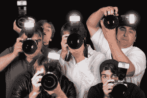
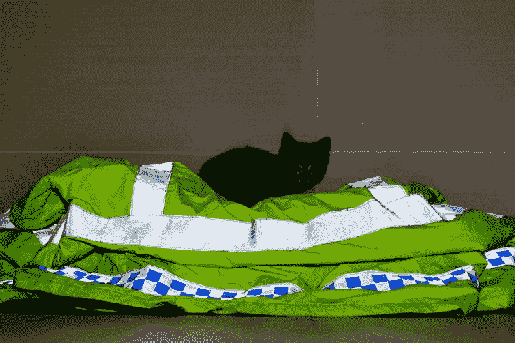
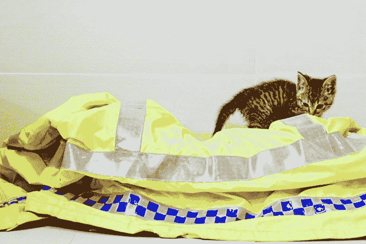
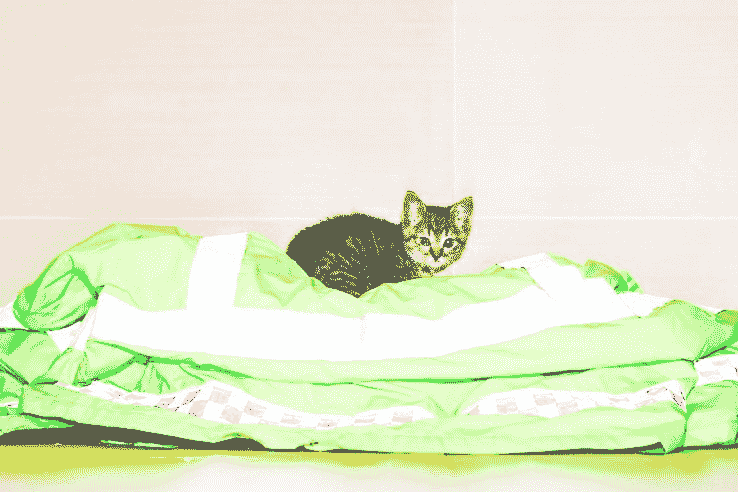

# 这就是反狗仔队服装的工作原理 

> 原文：<https://web.archive.org/web/https://techcrunch.com/2016/06/29/now-you-see-me-now-you-dont/>

如果狗仔队有权拍照([他们有权](https://web.archive.org/web/20230123233643/http://lifehacker.com/5912250/know-your-rights-photography-in-public))，报纸被允许刊登狗仔队拍摄的照片([他们有权](https://web.archive.org/web/20230123233643/http://www.firstamendmentcenter.org/faq/frequently-asked-questions-press))，那么那些在热切的摄影师闪光灯短暂聚光灯下的人也有权反击(他们确实这样做了)。反狗仔队服装已经出现了一段时间，如果你想知道它是如何工作的，*哦，男孩*你来对地方了。

有几个品牌提供反狗仔队服装。Betabrand 的[闪回摄影轰炸机](https://web.archive.org/web/20230123233643/https://www.betabrand.com/mens-reflective-flashback-hoodie-jacket.html)和[闪回银屏](https://web.archive.org/web/20230123233643/https://www.betabrand.com/reflective-silver-screen-flashback-scarf.html)以及 [ISHU 反狗仔队围巾](https://web.archive.org/web/20230123233643/http://www.theishu.com/)是一些商业上可用的例子，但这种基本技术已经被世界各地不愿面对镜头的名人使用了很长时间。

诀窍是使用逆反射材料。这些是纺织品、塑料或金属，它们会将光反射回光源。如果你曾经在路上开车，看到你的车头灯几乎不可能照亮远处的路标，或者如果你见过所谓的[猫眼](https://web.archive.org/web/20230123233643/https://en.wikipedia.org/wiki/Cat%27s_eye_(road))，你就会看到它的实际作用。

## 闪光灯如何工作

啊啊啊！

狗仔队摄影师使用的大多数相机闪光灯(或“闪光灯”，如果你愿意的话)都是由相机控制的，处于所谓的“通过镜头”或 TTL 自动模式。它是这样工作的:

1.  摄影师按下快门按钮，相机告诉闪光灯，摄影师要拍照。
2.  闪光灯会发出一点闪光，称为“预闪”
3.  预闪被主体反弹，通过相机镜头返回相机。这个闪光灯的亮度是由相机测量的。
4.  相机告诉闪光灯“正确”曝光需要多少光，闪光灯将增加闪光灯输出，以匹配相机要求的光量。
5.  快门打开，闪光灯这次真的亮了，照片就拍下来了。

上面的五个步骤只需要几分之一秒——事实上，它是如此之快，以至于你甚至不太可能意识到有两次闪光而不是一次。

## 反狗仔队服装是如何工作的

想象一下，有一种方法可以欺骗摄像机，让它认为场景看起来与实际不同。如果你能够欺骗相机，让它认为场景非常非常暗，它就会告诉闪光灯增加输出。结果，图像会太亮，可能会被破坏。

反光材料则相反；通过将比普通布料更多的光线反射回相机，相机认为场景比实际亮很多，并减少了闪光输出。实际上，相机对反射材质曝光“正确”,但对场景中的其他东西曝光不正确，可能会破坏照片。

请允许我用一件高筒夹克和一只小猫来说明。

Ouf。如果我把这个发给我的图片编辑，我会被当场解雇。

在这张照片中，你可以看到当相机被这件反光夹克上的反光带扔了一圈后的样子。干得好，小猫，这次你赢了。

## 摄影师如何衬托反狗仔队服装？

不幸的是，对于各地的名人来说，服装远非万无一失，而且有许多方法可以规避这些影响。

其中一个问题是，大多数反光材料都被设计成将光线反射回相对较窄的锥形，因此如果摄影师将光源(即闪光灯)移离镜头更远，效果就会减弱。不幸的是，对于不情愿的主体来说，许多摄影师已经将闪光灯从镜头移开，不是为了衬托他们的衣服，而是为了获得更自然的照明，部分是为了避免另一种类型的反射:照片中有时会出现的红眼效应。

另一个解决问题的方法是不使用闪光灯拍摄——这并不总是可行的，但如今相机在近乎完美的黑暗中拍摄的效果越来越好。关于这方面的一个例子，[见短片《月光](https://web.archive.org/web/20230123233643/https://vimeo.com/105690274)，它是在月光下拍摄的。短片中的图像可能不足以在你最喜欢的小报上发表，但总比没有照片好。

只要关掉闪光灯，重新拍摄小猫，就产生了这个镜头。是的，用闪光灯会更清晰，但结果显然比上面的例子好得多。

也许这很明显，但是一个机智的摄影师也可以通过将闪光灯和相机都切换到全手动模式来避免这个问题。如果没有电子产品可以愚弄，那就没有问题。理论上。在实践中，如果摄影师能够通过增加闪光灯输出或其他相机技巧，为反光服装后面的人正确曝光，回归反光服装将看起来非常明亮，图像不太可能看起来特别好。

最后，有可能稍后在 Photoshop 中修复照片。像许多摄影师一样，用 Raw 拍摄，意味着你在事后编辑照片方面得到了很多宽容，甚至一张非常暗的照片也可能是可以挽救的。

很难获得普利策奖，但通过调整 Adobe Lightroom 中原本太暗的图像，至少现在这只小猫可以在阵容中被认出来。为什么有人需要这样做将留给读者作为练习。

反狗仔队服装是一项有趣的技术，这是肯定的，但穿着它并不能保证你可爱的脸不会出现在小报上。当然，你可以尝试用[这种不畏狗仔队的奴隶闪光灯](https://web.archive.org/web/20230123233643/http://www.wired.com/2009/07/celebrity-shielding-flashgun-handbag-defeats-paparazzi/)来进一步增加赌注，或者坚持在摄像机镜头前举起一只手这种屡试不爽的方法。