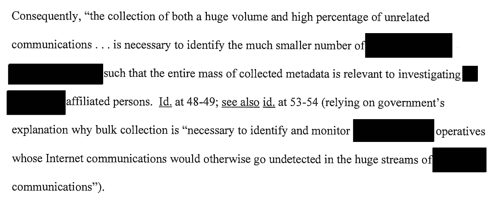

# NSA 互联网元数据计划收集的数据超出允许范围，共享数据过于广泛 

> 原文：<https://web.archive.org/web/https://techcrunch.com/2014/08/12/nsa-internet-metadata-program-collected-more-than-was-allowed-shared-data-too-broadly/>

最近解密的法庭文件显示，一个现已解散的国家安全局(NSA)批量收集项目超越了其权限，收集了太多的信息，并且过于自由地分享这些信息。

根据[在记录 Tumblr 页面](https://web.archive.org/web/20221007133102/http://icontherecord.tumblr.com/post/94459123638/newly-declassified-documents-regarding-the)上的官方 IC，该程序收集了“某些电子通信元数据，如电子邮件的‘收件人’、‘发件人’和‘抄送’行，以及电子邮件的时间和日期。”下文详述的合规性问题通常是自我报告的，因此不能被视为 NSA 在特定项目生命周期内越权的全部程度。

该文件指出，政府“承认，在根据命令进行的超过[修订]年的采购中，NSA 不断超出授权采购的范围。”

根据这份文件，外国情报监视法院(FISC，在本文中被称为 FISA 法院)授权国家安全局“批量获取特定类别的互联网通信元数据”查询将通过使用“种子”账户来执行，该材料将种子账户定义为“有合理理由怀疑其与目标国际恐怖组织有关联的互联网账户。”

对美国人来说，FISA 法院的文件指出，RAS“不能仅仅基于第一修正案所保护的活动”

该文件还指出，“只有在指定的国家安全局官员确定美国个人信息与反恐有关，并且是理解反恐信息或评估其重要性所必需的情况下，国家安全局才能向其他机构传播美国个人信息。”

为什么国家安全局需要收集这么多信息？该文件有时被大量编辑，因此这里的推理是不连贯的。下面的屏幕截图包含详细说明所讨论的批量收集参数的部分:

最初的未经授权的收集事件——作为合规事件的通知提交——源于政府所称的 NSA 雇员缺乏知识，他们随后与[编辑]方沟通不畅，我认为他们是承包商。

法院询问政府是否收集了元数据以外的信息。据说没有其他类型的信息。这份文件冷淡地指出，“这一保证被证明是不真实的。”

在后来的事件中——文件中所有的数字日期都被编辑——一个“印刷错误”也导致了“未经授权的收集”

## 三人行

在文件的语言中，“下一个相关的合规问题将在[修订]年浮出水面”，并涉及“访问元数据”、“查询结果和从中得出的信息的披露”和“过度收集”。简而言之，国安局在项目运作中超越权限的三种不同方式。

在政府披露“NSA 使用一种基于电话号码的自动查询形式，定期访问大量电话元数据，而这种自动查询并没有得到 RAS 标准的批准”之后，FISA 法院“命令政府核实对大量(互联网)元数据的访问符合类似的限制。”简而言之，因为政府在一个类似的项目中越界了，它被迫证明，在互联网通信元数据方面，它没有越界。

政府回来说，与 RAS 系统不一致的“中断的”查询实践已经存在。国家安全局承诺通过其互联网通信元数据计划来加强合规性。也许有点晚了。

根据法院的说法，继续这一年的合规问题，“未被授权访问”互联网通信元数据的 NSA 分析师“仍然直接收到未压缩的查询结果”。

NSA 还承认，“将[查询]结果放入其他机构人员可以访问的数据库，而没有确定它是否与反恐信息有关，以及是否有必要了解反恐信息或评估其重要性，”这是另一项违反规定的行为。

根据法院的说法，NSA 还“在没有获得所需决定的情况下，向其他机构传播包含从[互联网]元数据项目中提取的美国个人信息的 NSA 情报报告，这是一种普遍做法。”因此，美国国家安全局非常愿意与其他机构分享美国公民的信息，这不符合政府为收集数据的项目或其共享制定的规则。

根据 FISA 法院的说法，政府“完全忽视”了现有的传播规则。

最后，关于过度收集，政府提出了“另一种形式的实质性违规”，涉及收集“超出[编辑]授权类别的信息”除了收集的其他类型的数据，政府表示，收集的“实际上曾经(互联网)元数据记录”——现在根据法院的说法——“包括一些未经授权收集的数据。”

FISA 法院的文件面无表情地说，“政府[……]没有全面解释为什么会发生如此大规模的超额征收。”该文件还称，政府没有提到如何允许系统性的过度征收继续下去。“或者，换句话说，政府没有弄清楚它是如何在这么长的时间里犯下如此严重的错误的。

引用国家安全局的重大失误，法院判定“那些负责监督国家安全局的人未能有效地做到这一点。”

称之为年度轻描淡写。

简而言之，美国国家安全局被赋予了收集大量互联网通信元数据的能力，但受到谁可以访问数据、如何共享数据以及可以获取何种信息的限制。

在每一个案例中，它都违反了规则，收集了太多的数据，允许未经授权的人搜索汇集的数据，并且在没有足够保护的情况下过于广泛地共享这些数据。

混蛋。

图片由 FLICKR 用户 [AWYU322](https://web.archive.org/web/20221007133102/https://www.flickr.com/photos/angelawyu/5741919272/in/photolist-9KoQy9-4wBpte-6rSkJG-amPQt-51AUqq-8acXXd-8nqqaK-8PkrKM-btYjAB-jwjFNv-brhrTJ-bxfDef-abpJte-6RK3gQ-4DAoBj-bEciDZ-4wBprZ-btYiXH-fsxy39-bxfvQQ-4wFxW5-8aa2mV-i4Eg4w-bLajcz-btYi2c-brhn6y-97cr3b-3n5NV2-7cX8xM-3n5P2T-8aa8b2-9n4don-6AwSrg-btYmuF-7d253j-6CkWK-nYXviJ-b47GD-51wMp2-n8c9wk-n8bZon-n8c7iH-n8c3Fx-4aBudY-eMbxa-bEcns6-n8dS2d-b2JSN-dGGCF1-6tUwNZ) 下 [CC BY 2.0](https://web.archive.org/web/20221007133102/http://creativecommons.org/licenses/by/2.0/) 授权(图片已裁剪)