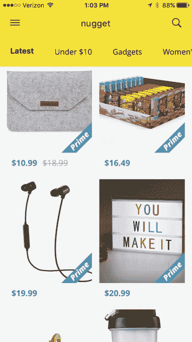
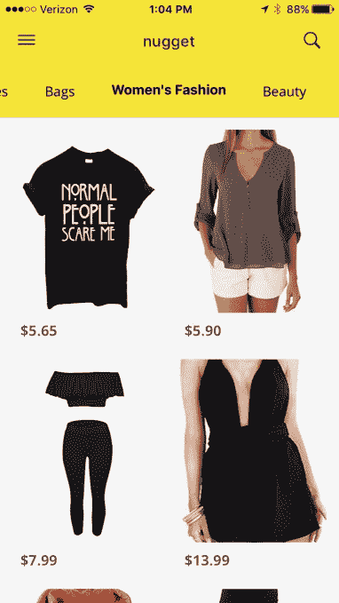

# 掘金的新应用程序在亚马逊 TechCrunch 上找到最好的交易

> 原文：<https://web.archive.org/web/https://techcrunch.com/2017/05/05/nuggets-new-app-finds-the-best-deals-on-amazon/>

亚马逊上有很多很好的交易，但在零售商的大量产品中找到它们仍然是一个挑战。这就是一款名为[掘金](https://web.archive.org/web/20221207045423/http://www.nuggetapp.co/)的新应用的用武之地。这款应用在亚马逊上搜索更高质量、更低价格的产品，然后将它们分类，你可以通过手机浏览。它的所有交易都来自亚马逊，所以你不必担心履行、运输或客户服务问题。此外，大多数推荐的产品都包括 Prime shipping，可以实现更快的 2 天送达。

Nugget 的想法是为 Wish 这样的流行购物应用提供一种选择，Wish 也是[迎合便宜货买家的。](https://web.archive.org/web/20221207045423/https://www.wsj.com/articles/wish-a-direct-from-china-shopping-app-lures-bargain-hunters-1431909072)

但 Wish 的问题在于，它的低成本无品牌服装、珠宝、家居用品、智能手机保护套等产品，大部分直接来自中国。Wish 购物者往往会抱怨漫长的运输时间、劣质的产品或比预期小的衣服——尽管许多人愿意以低得离谱的价格来换取负面影响。

掘金在其他方面也类似于 [Canopy](https://web.archive.org/web/20221207045423/https://canopy.co/app) ，这是一个购物应用程序，收集亚马逊最好的产品。然而，Canopy 的建议不一定是低成本产品。亚马逊现在也通过[提供自己的策划商店，这是一个名为有趣的发现](https://web.archive.org/web/20221207045423/https://beta.techcrunch.com/2016/11/28/amazon-expands-its-online-gift-shop-interesting-finds-adds-human-curation/)的网站功能。

与此同时，掘金正在开拓一个利基市场，更专注于亚马逊上的交易。

这款应用的创意来自旧金山的开发者汤姆·施米特，他曾在脸书和 Instagram 担任产品经理。

他说，像 Canopy 和亚马逊有趣的发现这样的应用程序是 Nugget 的灵感来源。

“我们认为[Canopy]本可以在移动领域做得更好，并追求这种高端美学，这并不真正适合亚马逊联盟商业模式，”施密特解释道。“人们不太关心免费送货，更关心花费 100 美元以上时找到合适的商品，”他说。

施密特认为，低于 20 美元的价格点在移动设备上效果更好，并在头脑中建立了移动发现的掘金。

这家初创公司结合使用机器学习和人类监管(通过承包商网络，网站[称](https://web.archive.org/web/20221207045423/http://www.nuggetapp.co/press))，他们帮助挑选 Nugget 上的产品。人类策展人帮助删除重复内容，并找到代表最佳交易和最佳运输选项的项目。

[gallery ids="1485958，1485959，1485957"]

产品在掘金上被组织成不同的类别，以便于发现。有一个部分是最新的交易，另一个部分是 10 美元以下的商品，然后是小工具、女式手表、家居装饰、爱好、手机升级、包、女性时尚、美容和零食等类别。(该应用程序将根据您在注册时提供的脸书性别信息，向您显示男士或女士商品。)

当你浏览这些交易时，你可以“用心”将它们保存到应用程序中的“我的金块”页面，供以后购买，或者你可以点击进入亚马逊购买。

该应用利用了亚马逊对深度链接会员链接的支持，因此 Nugget 将启动安装在你手机上的亚马逊应用，并直接带你到商品页面进行一键结账。

施密特说，Bootstrapped Nugget 目前通过代销费赚钱，但将来可能会考虑其他货币化选择。

这款应用可以在 [iTunes 应用商店](https://web.archive.org/web/20221207045423/https://itunes.apple.com/us/app/nugget-the-best-stuff-on-amazon/id1213176294?ls=1&mt=8)和 [Google Play 上免费下载。](https://web.archive.org/web/20221207045423/https://play.google.com/store/apps/details?id=com.ths.colfax)