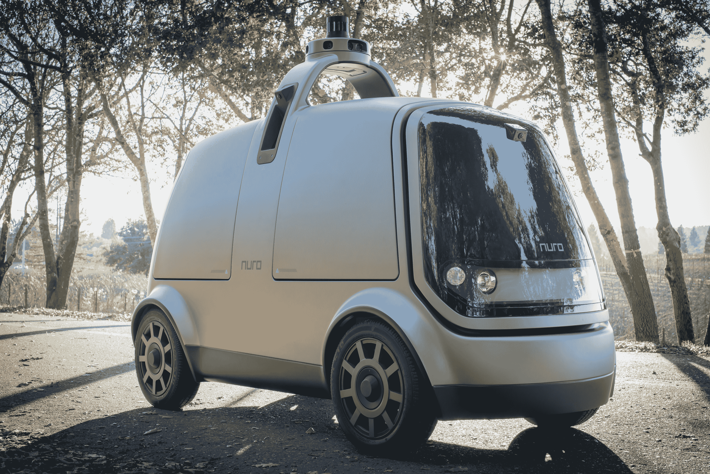

# Nuro 的自动驾驶汽车是一个杂货店和跑腿的人 

> 原文：<https://web.archive.org/web/https://techcrunch.com/2018/01/31/nuros-self-driving-vehicle-is-a-grocery-getter-and-errand-runner/>

并不是每辆自动驾驶汽车都必须能够将乘客从 A 点移动到 b 点，以 Nuro 为例:这家初创公司刚刚透露了他们独特的自动驾驶汽车平台，与其说是自动驾驶汽车，不如说是移动小型物流平台。

该公司迄今为止一直在山景城以隐形模式工作，已经筹集了由 Banyan Capital 和 Greylock Partners 牵头的 9200 万美元的 A 轮融资，以帮助实现其独特的自动运输愿景。

Nuro 的车辆是一个带轮子的小而窄的盒子，大约是普通汽车的一半宽度，旨在成为一种轻量级的方式，将货物从当地企业运送到客户手中，或者从社区或城市中的一个人运送到另一个人手中。然而，这个平台只是 Nuro 想要做的事情的一个例子；这家初创公司自称是一家产品公司，专注于将“机器人的好处”带给日常生活和普通人。

Nuro 的 AV 也完全自主操作，看起来像你在复古未来主义科幻秀中在月球基地看到的东西。有一个用于用户交互的 pin pad，只有合适的客户才能访问存储在其中的内容，还有一个顶部安装的传感器阵列，包括激光雷达、光学相机和雷达(其他传感器位于车辆周围，以实现其自动驾驶)。

这家年轻的初创公司的目标是与企业合作建立运输服务。你可以很容易地想象这种很好地插入到像 Uber Eats 这样的东西中，并将食物从当地的午餐点带到人们饥饿但无法亲自去他们通常去的地方的办公室。或者，举例来说，这些可以支持亚马逊市内配送的最后一英里需求。不过，Nuro 还没有谈到具体的合作关系。

这款适合各种用途的汽车和专注的焦点可以帮助 Nuro 实现福特对其 AV 项目的一些愿景，例如，在有限的市场和特定的受限环境中部署可能会遇到更少的障碍。然而，对于这家初创公司来说，现在仍处于早期阶段，而且它在某些方面也在与 Starship Robotics 等更成熟的年轻公司竞争。尽管如此，这仍然是一个整洁的第一个产品和一个有趣的愿景。