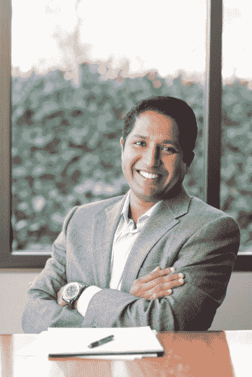

# NVCA 主持移民订单:“如果你不在餐桌旁，你就在菜单上。”

> 原文：<https://web.archive.org/web/https://techcrunch.com/2017/01/30/nvca-chair-on-immigration-orders-if-youre-not-at-the-table-youre-on-the-menu/>

价值 44 亿美元的风险投资公司 Menlo Ventures 的董事总经理、美国国家风险投资协会现任主席 Venky Ganesan 正在走一条政治走钢丝，并努力避免掉下来。

风险投资行业是许多科技巨头的金融家，它依靠移民人才创办初创公司，帮助他们茁壮成长，并推动他们继续取得成功。

现在，这让这个行业完全落入了总统政府的视野，总统政府的政策是希望 T2 减少来自移民成为科技行业支柱的国家的外国移民。

加内桑表示，该行业需要做一次深呼吸，并专注于确定立场，以便开始与唐纳德·特朗普总统及其内阁进行讨论。

“如果你不在餐桌旁，你就在菜单上，”加内桑说。“与本届政府进行建设性接触的最佳方式是就政策进行对话。这是为了帮助他们塑造它，而不是忽视他们。”

Venky Ganesan，全国风险投资协会主席

甘尼森在接受 TechCrunch 采访时表示，与其将政府视为敌人，“重要的是建设性地参与进来”，这并不意味着我们必须达成一致。但是要理解彼此的观点，因为这是我们进步的方式。"

事实上，在其通常支持商业、支持企业家的议程中，本届政府和风险投资界实际上有很多共同点。

“我不认为我们中的任何人把这变成一场彻底的、没有对话、没有限制的战争是有成效的，”加内桑说。"我们在四年任期的第九天。"

降低企业税率，将藏匿在国外的资金汇回国内，增加基础设施支出，鼓励对小企业的投资，这些都是 NVCA 全心全意支持的行动项目。

正是这些明确的目标让彼得·泰尔加入进来。当时，这位风险资本家、连续企业家、新西兰居民和狂热的自由意志主义者被引述说，人们应该“认真对待人们，而不是照字面上看。”

“我们处于一个未知的领域，我们必须弄清楚我们是否必须用比喻的方式或者字面的方式，或者两者兼而有之，”加内桑说。

Ganesan 的中间反应让风险投资协会与他们曾经资助的一大群科技公司有点不一致，这些公司在更靠左的地方设置头寸。

他说，加内桑希望风险投资业和科技界“帮助政府理解行政命令的挑战”。

“我完全理解史蒂夫·班农所说的‘太多亚洲 CEO’和硅谷太多像我一样的人……(但)我专注于探索移民如何在美国创造就业和经济财富的共同点。”

这与洛杉矶的风险投资家、advanced Ventures 的创始人马克·苏斯特在他自己的博客上的立场大相径庭。

> 特朗普。在一周内，有足够的证据表明，他确实是我们在选举中看到的自恋的孩子和仇外的种族诱饵，这不仅仅是真人秀让他当选。
> 
> 这是一句你应该后悔相信的话
> 
> “媒体从字面上理解他，但并不当真；他的支持者认真对待他，但不是字面上的。
> 
> 你们都应该从字面上理解他。他任命史蒂夫·班农(布莱巴特前总统)为国家安全委员会和主要委员会成员，出席每一次会议，而国家情报总监和参谋长联席会议仅在需要时才被邀请。
> 
> 史蒂夫·班农说媒体是“反对党”，“应该闭嘴”如果一个人的目标是集中政府控制，自己做出行政决策，压制批评者，为所欲为，他就会这么说，这么做。
> 
> 所以现在是 ***你的*** 站出来说话的义务。这是一种义务。

“我不认为这届政府的核心……这届政府及其政策的重点不是创造一个白人美国，”加内桑说。

相反，政府和风险资本行业有两件事可以共同关注。"我们如何鼓励资本形成，如何鼓励创造就业机会？"加内桑说。“我想在这个国家释放企业家精神……不要关税，要自由贸易。是的，在基础设施方面。”

这是一个简单的问题。如果人们有饭吃，有工作要做，他们就不会担心其他人有同样的机会。Ganesan 说，当人们自己的盘子不够时，他们就开始看他们的邻居。