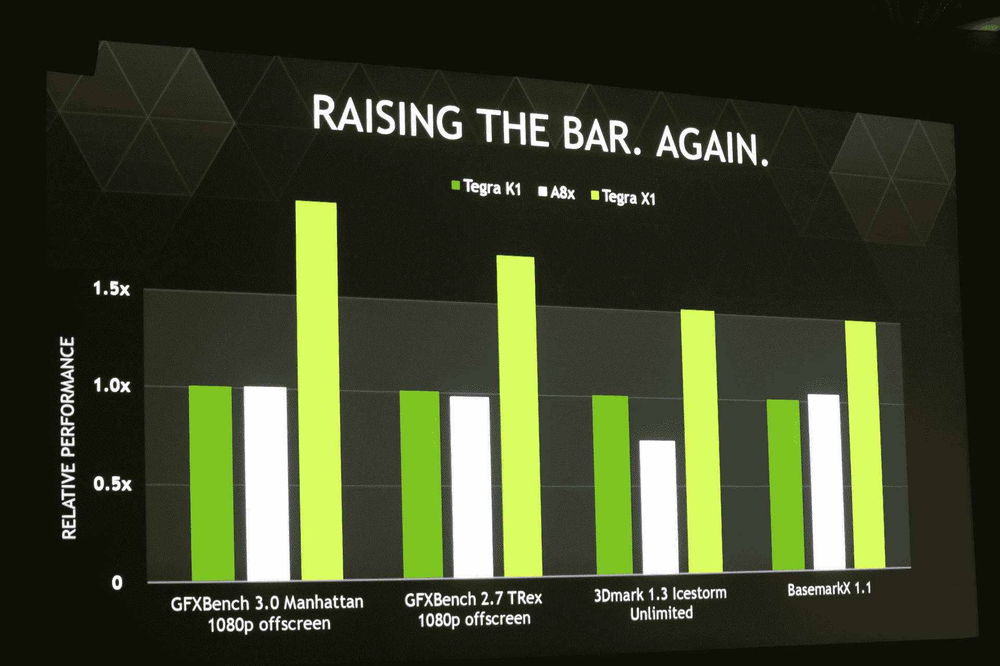

# Nvidia 宣布采用 Maxwell GPU TechCrunch 的 Tegra X1

> 原文：<https://web.archive.org/web/https://techcrunch.com/2015/01/04/nvidia-announced-tegra-x1-with-maxwell-gpu/>

# Nvidia 宣布采用 Maxwell GPU 的 Tegra X1

在拉斯维加斯的新闻发布会上，Nvidia 今天宣布了其非常成功的 Tegra K1 移动处理器的更新。X1 结合了 64 位基于 ARM 的处理器和基于该公司 [Maxwell 架构](https://web.archive.org/web/20221207050159/http://game24.nvidia.com/maxwell/)的图形芯片。K1 使用了英伟达较老的开普勒 GPU 技术。X1 将采用 256 核 Maxwell GPU 和 8 核 64 位 CPU。该公司表示，这使它成为第一个万亿次移动处理器。

英伟达指出，最初的 Tegra K1 是第一款将强大的移动 CPU 与非常强大的 GPU 结合在一起的移动处理器。Nvidia 花了两年时间将开普勒带到 K1 上。

Nvidia 在一年前的 CES 上发布了最初的 K1 [。自那以后，它已经在许多产品中找到了自己的位置，包括来自宏碁和惠普等制造商的 Chromebooks。英伟达自己的 Shield 平板电脑和谷歌的 Nexus 9 也使用了该芯片。](https://web.archive.org/web/20221207050159/http://blogs.nvidia.com/blog/2014/01/05/nvidia-rips-the-lid-off-tegra-k1-demos-64-bit-mobile-processor-running-android/)

Shield 和 Nexus 9 中的开普勒芯片已经接近控制台级别的质量，该公司今天表示，这种新芯片超过这些规格至少 2 倍。它还引入了许多新技术。“毫无疑问，Maxwell 是我们有史以来最强大的 GPU，”该公司今天表示。X1 也将比它的前辈更加节能。

*更新……*