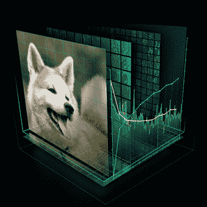

# 英伟达宣布推出一款旨在深度学习和人工智能的超级计算机

> 原文：<https://web.archive.org/web/https://techcrunch.com/2016/04/05/nvidia-announces-a-supercomputer-aimed-at-deep-learning-and-ai/>

# 英伟达宣布推出一款旨在深度学习和人工智能的超级计算机

像谷歌的深度梦和各种有趣的实验等复杂的神经网络系统需要大量的计算能力。英伟达计划将所有的马力都集中在一个盒子里，这个盒子是专门为满足人工智能研究人员的需求而设计的。

NVIDIA 已经有了专门从事深度学习应用的[GPU](https://web.archive.org/web/20230130100805/https://techcrunch.com/2015/11/10/nvidia-launches-new-gpus-for-deep-learning-applications-partners-with-mesosphere/)，所以这是合乎逻辑的下一步。它被称为 [DGX-1](https://web.archive.org/web/20230130100805/http://www.nvidia.com/object/deep-learning-system.html) ，基本上是一个 8 GPU 超级计算集群的花哨外壳。并不是说这有什么错。里面有 8 张特斯拉 P100 卡，每张都有 16 GB 的 RAM，加上 7 TB 的存储空间，可以存储您将在其上训练网络的所有原始数据。有一种叫做 NVLink 混合立方体网格的东西，但是我很确定它是由。

有内置的神经网络训练软件，但许多研究人员和公司会想推出自己的解决方案。无论如何，DGX 1 号都乐意处理数据。像这样的标准化平台消除了构建系统时的猜测，拥有一个像 NVIDIA 这样的大公司来提供支持和定期更新是一个很好的方式来证明您的预算人员的额外成本是合理的。

到底什么是深度学习系统或神经网络还不清楚？简而言之，它们是模拟类似人类的思维过程的程序，通过非常仔细地观察大量的数据，并在组织的多个层次上发现相似和不同之处。

深度学习系统最常用于识别图像中的狗。

其结果是一个系统，可以快速有效地执行任务，如图像分析和物体或模式识别。即使对人工智能和计算机科学领域的人来说，这仍然是一个相当新的问题，所以不要因为你不知道或者我不擅长解释而感到难过。

像 Deep Dream 这样的系统当然会运行在普通的 CPU 之类的处理器上，但是和许多其他数据密集型计算任务一样，并行处理在一周中的任何一天都比串行处理要好。GPU 已经大规模并行化，必须在极其严格的时间限制下处理大量数据，因此它们非常适合超级计算平台。8 个并行 Teslas 没有什么可轻视的(它们产生 170 万亿次)，虽然您可以在拥有更多原始能量的云团上租用时间，但在内部运行您自己的硬件还有很多要说的。(但您可能需要依靠 NVIDIA 进行故障诊断和维护。)

不过，您可能会大吃一惊:DGX 1 型售价为 129，000 美元。没人说未来会很便宜！