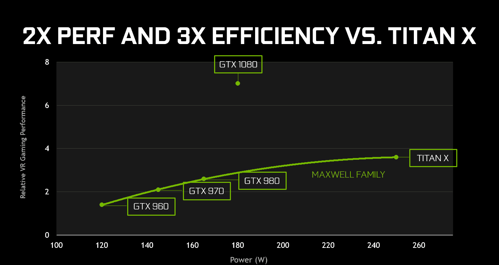

# NVIDIA 凭借其令人印象深刻的新显卡提升了性能并降低了价格

> 原文：<https://web.archive.org/web/https://techcrunch.com/2016/05/07/nvidia-geforce-gtx-1080/>

# NVIDIA 凭借其令人印象深刻的新显卡提升了性能并降低了价格

当你在外面享受周五晚上的时候，NVIDIA 在奥斯汀的 DreamHack 游戏活动上推出了一款令人惊讶的游戏 GPU。

首席执行官黄仁勋走上纽约 Emo 音乐会场的舞台，展示[GeForce GTX 1080](https://web.archive.org/web/20230326091728/http://www.geforce.com/hardware/10series/geforce-gtx-1080)，这是该公司第一款基于 Pascal 的 GPU，它有望实现两倍的性能和三倍的能效

哦，它比 1000 美元的卡便宜 400 美元。

黄称新卡“疯狂”，并补充说，这种表现“几乎是不负责任的”，可能在一定程度上指的是他说该项目投入了“数十亿美元”的两年研发过程。

定于 5 月 27 日发布的 GTX 1080 拥有 9 万亿次浮点运算能力和 8GB gddr 5 x 内存。根据 NVIDIA 的数据，该卡的 Boost 时钟能够超过 1700MHz，但在活动中的虚幻引擎 4 演示将其超过 2000MHz。

该系统旨在满足多显示器超高清游戏和虚拟现实系统日益增长的需求，在降低入门级价格的同时提高性能。

说到这里，该公司还提到了更实惠的 GTX 1070，它将于 6 月 10 日上市，售价为 379 美元。这个更便宜的单元仍然超过了泰坦，拥有 6.5 万亿次浮点运算和 8GB 的 GDDR5 内存。