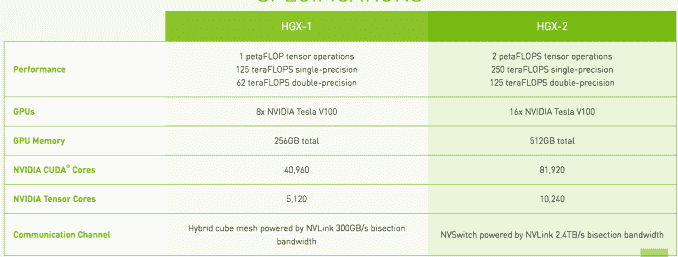
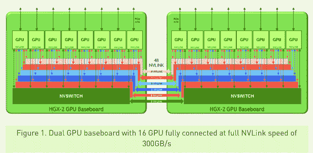

# 英伟达推出庞大的 HGX-2 云服务器，为高性能计算和人工智能技术提供支持

> 原文：<https://web.archive.org/web/https://techcrunch.com/2018/05/30/nvidia-launches-colossal-hgx-2-cloud-server-to-power-hpc-and-ai/>

# 英伟达推出庞大的 HGX-2 云服务器，支持高性能计算和人工智能

Nvidia 昨天发布了一个叫做 HGX-2 的怪物盒子，它是极客梦想的材料。这是一个据称非常强大的云服务器，它将高性能计算与人工智能需求结合在一个非常引人注目的包中。

你知道你想知道规格，所以让我们开始吧:它始于 16x 英伟达特斯拉 V100 GPUs。对于低精度的人工智能来说，这是很好的 2 petaFLOPS，中等精度的 250 teraFLOPS 和需要最高精度的 125 teraFLOPS。它标配了 1/2 TB 的内存和 12 个 Nvidia NVSwitches，能够以每秒 300 GB 的速度进行 GPU 之间的通信。与去年发布的 HGX 1 号相比，它们的容量增加了一倍。

图表:英伟达

英伟达特斯拉数据中心产品的集团产品营销经理 Paresh Kharya 表示，这种通信速度使他们能够将 GPU 本质上视为一个巨大的单个 GPU。“这使得[开发人员]不仅可以获得巨大的计算能力，还可以在他们的程序中以单个内存块的形式访问半 TB 的 GPU 内存，”他解释道。

图形:英伟达

不幸的是，你买不到这样的盒子。事实上，Nvidia 正在严格地将它们分发给经销商，经销商可能会将这些产品打包并出售给超大规模数据中心和云提供商。Kharya 说，对于云经销商来说，这种方法的好处在于，当他们购买时，他们在一个盒子里就有了所有的精度。

“统一平台的优势在于，随着公司和云提供商构建基础设施，他们可以在单个统一架构上实现标准化，从而支持各种高性能工作负载。因此，无论是人工智能，还是高性能模拟，所有工作负载现在都可以在一个平台上实现，”Kharya 解释道。

他指出，这在大规模数据中心尤其重要。“在超大规模公司或云提供商中，他们提供的主要优势是规模经济。如果他们能够在尽可能少的架构上实现标准化，他们就能真正最大限度地提高运营效率。HGX 允许他们做的就是在这个单一的统一平台上实现标准化，”他补充道。

对于开发人员来说，他们可以编写利用底层技术的程序，并在单个机器上以他们需要的精确级别编程。

HGX-2 驱动的服务器将于今年晚些时候从合作经销商处出售，包括联想、QCT、超微和威温。