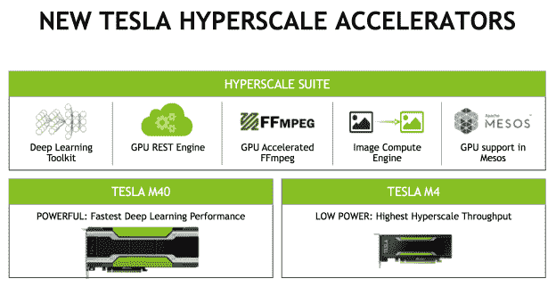
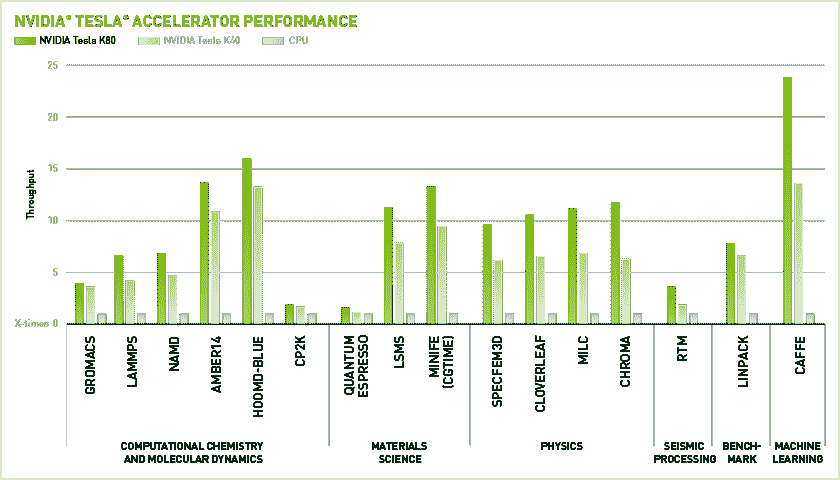

# 英伟达与 meso sphere TechCrunch 合作推出用于深度学习应用的新 GPU

> 原文：<https://web.archive.org/web/https://techcrunch.com/2015/11/10/nvidia-launches-new-gpus-for-deep-learning-applications-partners-with-mesosphere/>

# 英伟达与 Mesosphere 合作推出用于深度学习应用的新 GPU

GPU 只是让你以更高的帧率玩《孤岛危机》的日子已经过去了。许多最具变革性的新计算技术现在都依赖于 GPU 快速并行运行某些算法的能力。

GPU 特别有帮助的一个领域(除了视频编码)是机器学习，NVIDIA 在这方面下了很大的赌注。该公司今天推出了两款新的硬件加速器，以及一套工具，将帮助开发人员和数据中心经理使用这些加速器来运行深度学习软件，以及其上的图像和视频处理作业。

此外，NVIDIA 今天宣布与 Mesosphere 合作，后者是一种以容器为中心的解决方案，用于管理大型数据中心，就像它们是一个资源池一样。NVIDIA 和 Mesosphere 共同希望“让网络服务公司更容易为他们的下一代应用程序构建和部署加速数据中心。”

 由于 Mesosphere 与 NVIDIA 的合作，使用 Apache Mesos(meso sphere 数据中心操作系统的开源主干)的开发人员将能够在数据中心使用 GPU 资源，就像他们使用 CPU 和内存一样。GPU 资源将聚集到一个池中，软件将自动在所有提供兼容 GPU 的不同机器上分配作业。

至于硬件，NVIDIA 正在推出两款产品:M40 和 M4 GPU 加速器。M40 针对机器学习进行了优化，并针对数据中心使用进行了构建和测试。M4 针对类似的用例进行了优化，但侧重于低功耗和视频处理。

包括 AWS 和微软在内的许多公共云供应商，现在要么[提供以 GPU 为中心的虚拟机](https://web.archive.org/web/20221205061417/http://docs.aws.amazon.com/AWSEC2/latest/UserGuide/using_cluster_computing.html)要么[将很快提供这些虚拟机](https://web.archive.org/web/20221205061417/https://azure.microsoft.com/en-us/documentation/videos/azurecon-2015-applications-that-scale-using-gpu-compute/)——在很大程度上，这些数据中心运营商正在押注英伟达。谷歌在内部对机器学习下了很大的赌注，但它还没有在其云平台上提供 GPU 实例。很有可能它很快就会这样做——也许是在专门的机器学习服务的背景下。

