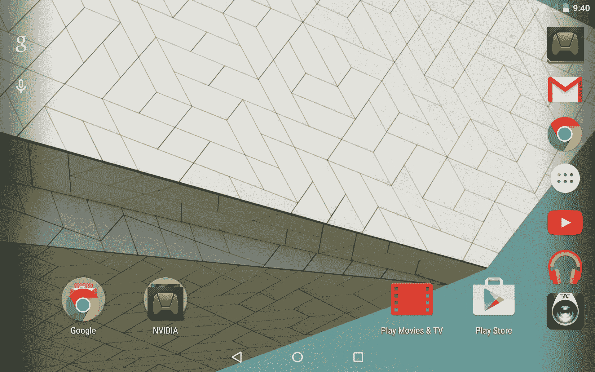
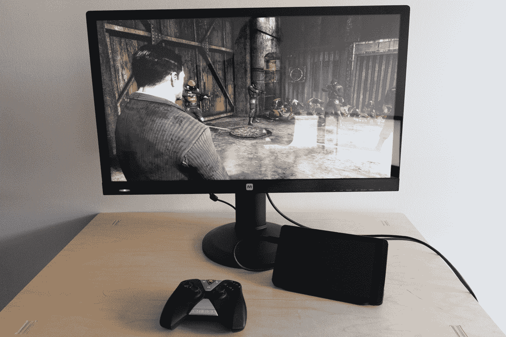

# Nvidia 的 Shield 平板电脑是一款全新的设备，搭载 Android 5.0 和网格流媒体游戏 

> 原文：<https://web.archive.org/web/https://techcrunch.com/2014/11/18/nvidia-shield-tablet-android-lollipop-grid-gaming-review/>

Nvidia 的 [Shield 平板电脑](https://web.archive.org/web/20221006224934/https://beta.techcrunch.com/2014/10/09/nvidia-shield-tablet-review/) 是首批获得 Android 5.0 Lollipop 的非 Nexus 设备之一，今天开始推出。我有机会花了一些时间了解更新和 Grid，Nvidia 的游戏流媒体网飞今天也在北美推出，这两者都为 Shield 平板电脑用户提供了相当大的改进。事实上，这些变化是如此引人注目，特别是在 Grid 提供的情况下，感觉就像你获得了一个带有软件更新的全新设备，Shield Tablet 一开始就是一个强大的表现者，正如你从我们的原始评论中看到的那样。

## 安卓 5.0 棒棒糖

如果你还没有体验过 Lollipop，我只想重申，它是我有幸使用过的最好的移动平台之一。谷歌对设计细节的精心关注也保留在英伟达用来装备其 Shield 平板电脑的风格中，因为这里几乎没有什么偏离。锁屏通知、动画、图标、通知抽屉和设置都是你在 Nexus 设备上所期望的，并且在 Nvidia 的硬件上都能很好地工作。

但 Android 5.0 不仅仅提供了更漂亮的 UI 元素和一些新的软件功能:它还对 Android 背后的核心图形技术进行了内置改进，这意味着 Shield 平板电脑已经令人印象深刻的性能从 OpenGL ES 3.1 和 Android 扩展包中得到提升。Nvidia 声称这意味着移动游戏现在可以与主机和桌面 PC 游戏相媲美，根据即将到来的引擎改进的一些演示，情况似乎是这样的。

通用软件更新还发布了 Shield 的 Dabbler 软件的新的改进版本，该软件现在包括图层以及向 Twitch 直播你的绘画会话，这是一个有趣的用例，允许艺术家根据观众的反馈实时绘制他们的创作。它仍然不是一个具有完全压力敏感性的桌面级数字绘图体验，但它总体上是一个改进很多的应用程序，非常适合在旅途中捕捉草图和想法。

Nvidia 也在 OTA 更新中捆绑了自己的改进，包括在控制台模式下支持 4K 视频输出，如果你手边有一台 4K 电视的话。对于下一代游戏和视频来说，这是一个巨大的改进，但在软件真正展示这一功能之前还需要一段时间——目前，虽然它可以出色地呈现文本和其他分辨率无关的元素，但你会注意到模糊，而其他内容则努力进行增采样。Shield 软件方面的其他改进包括支持 USB Y 形电缆，允许您通过 USB-以太网加密狗连接到以太网，同时为平板电脑充电，以及对内存优化、性能、GPS、Wi-Fi 和更快的电池充电的一般改进。

## 网格流媒体游戏服务

Shield 平板电脑已经是金钱可以买到的最好的移动游戏设备之一，这要归功于不断增长的原生 Android 游戏库，包括新的《半条命 2:第一集》(Half-Life 2:ep1)、Oddworld's Revenge 和该公司似乎致力于继续生产的其他软件，以及它的远程 Gamestream 技术，让你可以玩安装在你主要游戏 PC 上的本地和远程 Wi-Fi 游戏。然而，Grid 完全是另一回事 OnLive 和其他人的梦想实现了，优秀的、全质量的 720p 顶级主机游戏直接流畅地传输到你的设备，延迟低得令人难以置信，几乎没有迹象表明你不是在本地玩。

我测试了 Grid，它最初只在北美提供，在 6 月 15 日之前免费保护用户，在多种无线环境下，连接速度不同。相对于一般的宽带质量和 GameStream-ready 路由器，最低 10 Mbps 的连接和最高 60 ms 的 ping 并没有要求太多，而顶级的也不再奇怪，基本上只需要 5GHz 的 Wi-Fi 信道和 802.11ac 或 n 连接。我从来没有遇到任何流媒体质量或延迟的问题，在某些情况下，性能似乎超过了我令人印象深刻的家用桌面钻机的能力，特别是在视觉要求高的过场动画中。

Grid 在发布时有一个 20 本书的图书馆，并承诺每周二发布新书。这些游戏不是最新和最棒的，但它们非常接近——《边境之地 2》、《阿卡姆城》、《黑暗势力 2》等仍然提供了足够的机会来惊叹 Nvidia 在流媒体游戏服务方面取得的成就。如果你在流媒体游戏刚推出时尝试过，但后来又远离了，这可能不是你所习惯的那种杂乱无章的体验；这就是市场的未来，任何梦想着一个真正的“游戏网飞”的人现在都应该非常兴奋。

## 结果

如果你正在寻找一个理由拿起一个盾牌平板电脑，这个更新是它。如果你正在寻找一些经典游戏而不需要购买每一款游戏，或者如果你只是在寻找一些提供大量选择和最小承诺的东西，那么 Grid gaming 服务本身，以及未来 7 个月左右设备所有者免费订阅的服务，是值得购买的。

抛开网格不谈，Android 5.0 为 Shield 平板电脑提供了很多东西，并再次使它成为这个价格范围内你可以买到的最好的 Android 设备之一，特别是考虑到它比竞争对手的硬件更早尝到了棒棒糖的滋味。通常情况下，新的 Android 硬件似乎一宣布就被遗忘了，但 Nvidia 在确保它们在整个生命周期内继续为设备增加价值方面做得特别好，Shield 平板电脑感觉特别是因为这些新的更新和服务而焕发了活力。