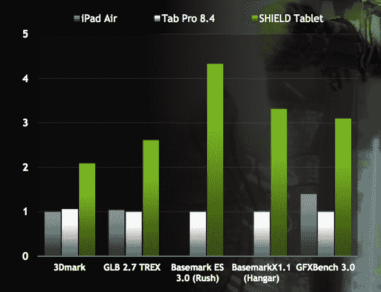

# Nvidia 的 Shield 平板电脑和 Shield 控制器旨在提供不折不扣的移动游戏 

> 原文：<https://web.archive.org/web/https://techcrunch.com/2014/07/22/nvidia-shield-tablet/>

Nvidia Shield 是图形芯片和显卡制造商 T2 Nvidia T3 的首次尝试，但它让该公司尝到了制造不会消失的小工具的滋味，所以现在他们又推出了 Shield 平板电脑，这是一款游戏怪兽，兼作 299 美元的 Android 平板电脑。

英伟达的游戏平板电脑实际上是其第二款 Android 平板电脑硬件——第一款是它在 1 月份首次推出的 Tegra K1 参考设备，旨在展示其新 K1 的强大功能，包括桌面级开普勒架构，以增强游戏功能。Shield 平板电脑也采用了 K1，但它的设计更进一步，背后有更多的动力，还有一个专用的无线配套控制器，称为 Shield Controller。

【YouTube = https://www . YouTube . com/watch？v = vohrddwvqqq]

新的 Nvidia Shield 平板电脑有一个 8 英寸，1920×1200 的原生高清分辨率显示器，两个前置扬声器，以及一个可以用来支撑它作为支架的盖子配件，这显然对游戏场景很有用。据英伟达称，Shield 无线控制器提供低延迟 Wi-Fi 连接，延迟时间与 Xbox 360 控制器大致相同。随后将推出 LTE 选项，Wi-Fi 版本将于 7 月 29 日开始销售，16GB 版本的起价为 299 美元，32GB 内置存储版本的起价为 399 美元，不过这两种选项都通过 MicroSD 提供高达 128 GB 的可扩展内存。

[gallery ids="1032911，1032910，1032906，1032905，1032904，1032903"]

因此，Shield 的平板电脑在价格上与大多数同行具有竞争力，Nvidia 声称，其平板电脑在基准测试和现实游戏性能方面都将大大超过包括 iPad 在内的竞争对手。这是因为带有 Kepler 的 Tegra K1 支持与 GeForce Titan 台式机卡相同的所有高级图形技术，包括 OpenGL 4.4、DirextX 12、Tesselation 等，而所有这些都只消耗一小部分功率。

因为 Nvidia 正在使用 Wi-Fi 进行 Shield 控制器上的无线连接，所以它也可以将音频传输到 gamepad，gamepad 支持高保真耳机，用于多人游戏期间的聊天。Nvidia 可能会成功地将这款平板电脑打造成第一款针对花大量时间在线多人游戏的核心游戏玩家的平板电脑，传统上，这款平板电脑一直由支持以太网和有线控制器的桌面设备牢牢占据。

与 Tegra K1 平板电脑一样，Shield 平板电脑也包括一个内置触控笔，但这次它经过了重新设计。据称，新的 DirectStylus 2 tech 的响应速度是第一代机型的两倍，并具有 GPU 加速的绘画和主动响应，而不是第一代的被动输入模式。这款平板电脑还可以通过其前置摄像头拍摄 500 万像素的照片，并将分辨率高达 4K 的视频输出到兼容的显示器上，此外，它还具有 802.11n Wi-Fi，可以播放来自网飞、Twitch 和 Hulu Plus 等流媒体源的完整 1080p 高清视频。

使用 Nvidia 新的 DirectStylus 2 和原生绘画应用程序完成的绘画。

说到 Twitch，Nvidia 平板电脑是第一个在该平台上支持流媒体游戏的产品，而不是基于一个应用程序接一个应用程序，这就是 500 万像素前置摄像头派上用场的地方。Twitch 支持还与 ShadowPlay 集成，shadow play 是 Nvidia 自己的游戏捕捉工具，可以在 Nvidia 游戏硬件的其他所有者之间共享。

Shield 平板电脑还支持我们在最初的 Nvidia Shield 上看到的许多技术，为了避免混淆，该产品现在被更名为 Shield Portable。因此，Shield Tablet 获得了 GameStream 和 Nvidia Grid 的支持，GameStream 允许用户通过本地 Wi-Fi 从他们的家庭游戏系统播放完整的 PC 游戏，Nvidia Grid 则通过云点播播放游戏——目前仅在北加州处于该计划的初始测试阶段。Shield Tablet 还支持 Nvidia 在 Shield Portable 上推出的控制台模式，该模式允许您使用迷你 HDMI 1.4a 输出端口将平板电脑变成插入电视的家庭游戏控制台。

作为一款家用游戏机，Shield 平板电脑可能会提供一些游戏玩家需要的一切，这要归功于它同时支持多达四个控制器(包括 Wi-Fi Nvidia Shield 控制器和任何与 Android 设备兼容的蓝牙控制器)。它还可以作为网飞等顶级服务的机顶盒，控制器内置麦克风和语音控制功能，类似于亚马逊 Fire TV 和新发布的 Android TV 提供的功能。

Nvidia 当然在 Shield 平板电脑上投入了很多，它还预装了许多应用程序和游戏，包括 Trine 2: Complete Story。但这并不意味着它放弃了之前的尝试；该公司告诉我们，Shield Portable 并没有被放弃，事实上，如果你对这方面的硬件更新感到好奇，建议最好看看这个空间。目前，现有的便携设备用户将在平板电脑发布时获得更新，以支持新的 Shield 控制器、更好的应用程序、改进的屏幕控制等。更便宜的 199 美元 Tegra K1 平板电脑也将继续销售。

299 美元作为这种大小的平板电脑的入门级价格并不算太高，但要获得完整的系统，你需要为每个 Shield 控制器支付 59 美元，为 Shield 平板电脑外壳支付 39 美元，它可以兼作支架。总的来说，对于一款乍一看似乎是伟大的 Android 平板电脑兼令人印象深刻的游戏机来说，这仍然是一笔相当不错的交易。当然，一旦我们有更多的时间来评估该设备及其优点，我们将进行全面的审查。