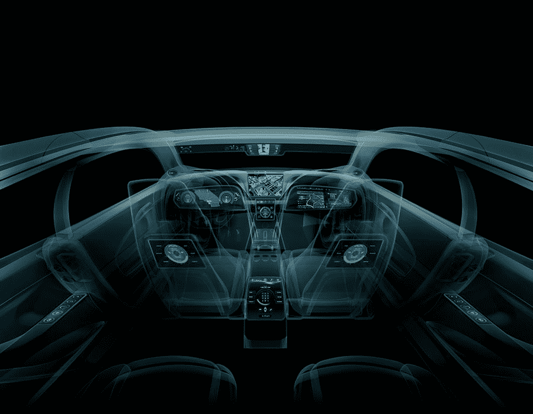

# 英伟达的汽车雄心包括汽车和云中的大脑 

> 原文：<https://web.archive.org/web/https://techcrunch.com/2015/01/07/nvidias-automotive-ambitions-include-big-brains-in-the-car-and-in-the-cloud/>

# 英伟达的汽车雄心包括汽车和云中的大大脑

Nvidia 今年在 CES 上的重点是 [Tegra X1 移动芯片组](https://web.archive.org/web/20221001004722/https://beta.techcrunch.com/2015/01/04/heres-how-nvidias-new-tegra-x1-stacks-up-to-the-k1-and-apple-a8x-on-paper/)，这是一款全新的 SoC，为一系列移动设备提供类似桌面的计算性能，包括智能手机和平板电脑，但也扩展到汽车。Nvidia 已经在汽车领域占据了一席之地，为市场上大多数主要汽车制造商的许多车载信息娱乐系统提供动力。X1 为 Nvidia 提供了一个进一步扩大其汽车业务的机会，不仅大大改善了信息娱乐，而且使我们的汽车比以往任何时候都更加智能和自动化。

Nvidia 的汽车总监 Danny Shapiro 向我们介绍了他的公司对 Tegra X1 的汽车雄心，解释了处理器如何不仅允许汽车制造商建立基于触摸的界面来控制汽车内部环境的各个方面，而且他们正在运输的参考系统如何将两个 X1 配对以获得巨大的本地处理能力，使汽车变得更加智能，结合汽车结构中使用的传感器和摄像头来提供关于汽车周围环境的输入。

这些，结合本地处理能力，以及基于云的数据分析，也可以从其他用户车辆收集知识，意味着由 Nvidia intelligence 驱动的汽车将能够随着时间的推移而增长和学习，变得更加智能，并能够更好地确定它到底看到了什么，事情将如何表现，以及如何对特定情况做出反应。

Nvidia 在汽车方面的工作实际上只是在自动化功能和机器学习方面才刚刚起步，但基于 X1 的系统将很快在全新的 Renovo 超级跑车中上市，价格超过 50 万美元。智能汽车可能处于相对早期的发展阶段，但随着 X1 的推出，Nvidia 在驾驶舱中投入了更多的大脑，以更好地匹配引擎盖下的肌肉。