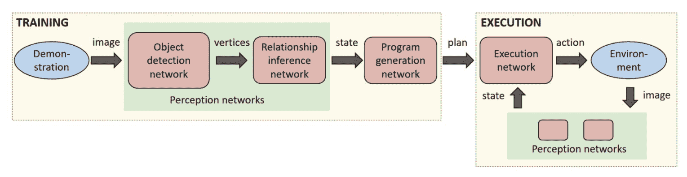
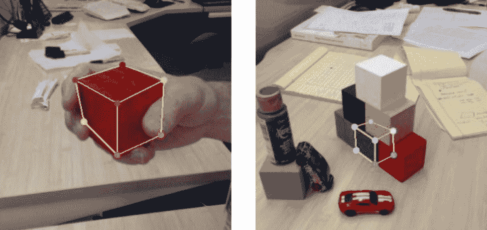

# 英伟达的研究人员通过观察人类来教机器人执行简单的任务

> 原文：<https://web.archive.org/web/https://techcrunch.com/2018/05/20/nvidias-researchers-teach-a-robot-to-learn-simple-tasks-by-observing-a-human/>

工业机器人通常都是一遍又一遍地重复一项定义明确的任务。通常，这意味着在执行这些任务时，要远离脆弱的编程者。然而，越来越多的研究人员现在正在思考机器人和人类如何能够在人类附近工作，甚至向他们学习。在某种程度上，这就是 Nvidia 在西雅图的新机器人实验室的重点，该公司的研究团队今天在澳大利亚布里斯班举行的[机器人和自动化国际会议](https://web.archive.org/web/20221207224441/https://icra2018.org/) (ICRA)上展示了他们最近通过观察人类来教授机器人的一些工作。

Nvidia 的机器人研究总监 Dieter Fox。

正如英伟达(Nvidia)机器人研究高级主管 Dieter Fox(华盛顿大学教授)告诉我的那样，该团队希望让这种下一代机器人能够在接近人类的情况下安全工作。但要做到这一点，这些机器人需要能够检测人，跟踪他们的活动，并学习如何帮助人们。这可能是在一个小规模的工业环境或在某人的家里。

虽然通过死记硬背和教它从错误中学习来训练算法成功玩视频游戏是可能的，但福克斯认为，以这种方式训练机器人的决策空间太大，无法有效地做到这一点。相反，由 Stan Birchfield 和 Jonathan Tremblay 领导的 Nvidia 研究人员团队开发了一个系统，允许他们通过简单地观察人类来教会机器人执行新的任务。

这个例子中的任务非常简单，只需要堆叠一些彩色的立方体。但这也是整个旅程中重要的一步，让我们能够快速教会机器人新的任务。

[https://web.archive.org/web/20221207224441if_/https://www.youtube.com/embed/B7ZT5oSnRys?feature=oembed](https://web.archive.org/web/20221207224441if_/https://www.youtube.com/embed/B7ZT5oSnRys?feature=oembed)

视频

研究人员首先训练一系列神经网络来检测物体，推断它们之间的关系，然后生成一个程序来重复它目睹人类执行的步骤。研究人员表示，这一新系统允许他们在现实世界中通过一次演示来训练他们的机器人执行这项堆叠任务。

这个系统的一个很好的方面是，它生成一个人类可读的描述，描述它正在执行的步骤。这样，研究人员就更容易发现出问题时发生了什么。

Birchfield 告诉我，该团队的目标是让非专家也能轻松训练机器人——没有什么比演示像叠积木这样的基本任务更容易的了。在布里斯班的团队展示的例子中，当人类简单地走上前去，捡起积木并堆叠起来时，一台摄像机会观察到这一场景。然后机器人重复这项任务。听起来很简单，但对机器人来说这是一项非常困难的任务。

为了训练核心模型，该团队主要使用模拟环境中的合成数据。正如伯奇菲尔德和福克斯强调的那样，正是这些模拟让机器人可以快速训练。毕竟，现实世界中的训练需要更长的时间，也可能更加危险。对于这些任务中的大多数，没有标记的训练数据可用于开始。

“我们认为使用模拟是一种强大的范式，可以训练机器人做以前不可能做的事情，”伯奇菲尔德指出。福克斯对此表示赞同，并指出这种模拟需求是 Nvidia 认为其硬件和软件非常适合这种研究的原因之一。毕竟，这个培训过程有一个非常强烈的视觉方面，Nvidia 在图形硬件方面的背景肯定有所帮助。

福克斯承认，这里仍有许多研究有待完成(毕竟，大多数模拟还不是真实感的)，但这方面的核心基础现在已经到位。

展望未来，该团队计划扩大机器人可以学习的任务范围和描述这些任务所需的词汇。

