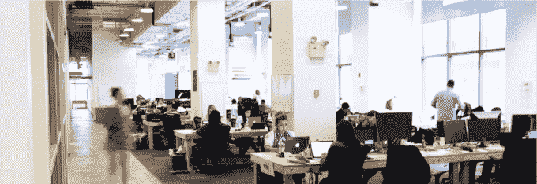

# 纽约孵化器 Grand Central Tech 吸引大量人才第二批 

> 原文：<https://web.archive.org/web/https://techcrunch.com/2015/07/14/nyc-incubator-grand-central-tech-snags-talent-heavy-second-batch/>

创业中心和商业加速器 Grand Central Tech 现在迎来了第二批公司，它们坐落在俯瞰纽约中央车站的巨大办公空间里，在孵化器、合作空间和加速器充斥着早期投资景观的狂野世界中，它有点像一只奇怪的鸭子。

这个为期一年的项目不投资任何现金，不收取任何股权，只需要承诺在公司结束为期一年的免租金联合办公空间后，租用它所占用的 110 万平方英尺(约合 110 万平方米)的巨大建筑中的办公空间。

它的方法使其能够在最新的公司缓存中吸引一些重量级的企业家人才。

“我们的目标是创造最好的技术公司的单点密度，”查尔斯·博内洛说，他和他的高中朋友马特·哈里根共同创立了这个空间。

“企业家们想要的是社区和机会，来帮助他们一起创造巨大的东西。我们将一起工作，我们将建立一流的公司，并以一种提高标准的方式来做这件事，”博内洛说。

在许多情况下，加入大中央计划的公司不需要大中央的现金投资，而是希望利用大中央智囊团在消费品、金融服务、零售和技术行业建立的令人印象深刻的企业合作伙伴和导师网络。

根据哈里根的说法，去年 18 家公司中的公司总共筹集了令人印象深刻的 3500 万美元的融资。对于一批早期创业公司来说，这还不错。

该计划(很难称之为加速器)的赞助商包括微软、谷歌、Intuit、IBM、欧莱雅美国公司、百事可乐北美公司、摩根大通和高盛。整件事都是由亿万富翁、房地产投资者米尔斯坦家族资助的。

大中央项目的独特之处还在于它吸引了一系列企业家和经验丰富的专业人士。

在最后一批入驻的公司中有 Augmate 和 Nagare Membranes，Augmate 是一家将商业应用集成到任何可穿戴设备中的服务开发商，Nagare Membranes 是一家水过滤技术开发商，融资 1050 万美元，由连续创业者 Rob McGinnis 创建。

“GCT 与其他人有很大不同。Bonello 说:“我们试图通过以最优惠的条件提供最好的资源来吸引最好的公司来解决最大的问题。

这个计划似乎在起作用。该公司的最新一批人已经成功吸引了像布拉德·哈格里夫斯这样的连续创业者，他是[大会](https://web.archive.org/web/20221207203410/https://www.crunchbase.com/organization/general-assembly)的联合创始人，他的新创业公司 [Common](https://web.archive.org/web/20221207203410/http://hicommon.com/) ，旨在成功复制像 [Campus](https://web.archive.org/web/20221207203410/http://sfist.com/2015/06/18/housing_startup_campus_to_close_its.php) 和 [Embassy Network](https://web.archive.org/web/20221207203410/https://embassynetwork.com/locations/embassysf/) 这样的创业公司的理念。

哈格里夫斯并不是唯一一个在接下来的一年里走在大中央理工学院大厅里的成功创始人。Marleen Vogelaar 是 Shapeways 的创始人之一，她将把她的新 3D 打印公司 Ziel Fashion 设在办公室里；T2 Gilt group T3 的创始人亚历克西斯·梅班克也是如此，他的秘密创业项目“九月”也将把格兰德中央理工学院作为自己的家。

虽然博内洛和哈里根可能不会要求与 Grand Central Tech 进行股权交易，但该项目的支持者、纽约亿万富翁房地产投资者米尔斯坦房地产公司(New York Properties)确实会从该公司获得大楼四年租金的承诺——如果这些公司负担得起的话。迄今为止，第一批公司中的所有公司都签署了租约。

“我们希望置身于一座 110 万平方英尺的建筑中，里面住满了世界上最优秀的技术公司，他们关心社区，”Bonello 说。

**这是 2015 年所有加入格兰德中心科技的公司。**

*   Backtrace I/O 由 AppNexus 的首席工程师创立，旨在改善软件调试的状态。他们的第一个产品是面向软件工程师的崩溃报告生成和分析服务。
*   **[BAMx Advertising](https://web.archive.org/web/20221207203410/https://www.bam-x.com/#/login?redirect=%2F)**BAMx 是一个通过实时竞价将商家和作者联系起来的交易所，使零售商有可能为编辑列表中每个产品的链接购买竞价。
*   **[Boom shaka laka](https://web.archive.org/web/20221207203410/https://angel.co/boom-shakalaka)**Boom shaka laka 是一家游戏内的幻想体育公司，推出实时投注(例如，亚当·维纳蒂耶里(Adam Vinatieri)会实现这个 50 码的投篮目标吗？)到粉丝的手机，同时还允许他们与其他粉丝竞争。
*   **Code To Work 将雇主与来自不同背景的年轻求职者联系起来，这些求职者通过专有的技能评估程序进行审查。**
*   **[Coin.co](https://web.archive.org/web/20221207203410/https://coin.co/)**Coin.co 专注于向公司和消费者提供比特币支付；这项服务为企业将比特币转换成美元。
*   **[Common](https://web.archive.org/web/20221207203410/http://hicommon.com/)**Common 由 Brad Hargreaves(大会的联合创始人)创立，是为一个仅限会员的社区开发共享生活空间。该公司与业主和当地组织合作，创建住宅社区，提供月租、共享服务、社区活动和管理。
*   **[Concord](https://web.archive.org/web/20221207203410/http://www.concord.io/)** Concord 是一个实时分布式流处理框架，运行速度比 Apache Storm 快。使用 Concord，企业应该能够更快地处理他们的数据并做出反应，无论他们是在进行欺诈检测、广告竞价和服务、内容推荐还是算法交易。
*   Havenly 出售在线室内设计服务，将用户与他们自己的私人室内设计师联系起来，固定费用为 185 美元。使用该应用程序，消费者可以与设计师合作重新装修房间，并通过该应用程序以设计师的折扣购买所有家具。
*   [**别出心裁地**](https://web.archive.org/web/20221207203410/http://innovatively.co/) 别出心裁地正在建造彭博进行研究。该平台利用公共研究数据，帮助企业和中小型企业发现他们在市场、竞争对手和客户中缺少什么。Innovatively 的首批付费试点是在医疗保健和生命科学领域，在这些领域，他们能够以比传统咨询公司快 10 倍的速度周转信息。
*   **[Iobeam](https://web.archive.org/web/20221207203410/http://www.iobeam.com/)**Iobeam 是一个面向物联网(IoT)的数据分析平台。
*   **[liquid text](https://web.archive.org/web/20221207203410/http://liquidtext.net/)**liquid text 是一款用于标注数字内容的软件服务。
*   **[Maven Clinic](https://web.archive.org/web/20221207203410/https://www.mavenclinic.com/)**Maven 是一个健康技术平台，专为女性设计，为健康和保健从业者销售一种简单实惠的视频预约服务。
*   Project September 是一家秘密的社交商务初创公司，由亚历克西斯·梅班克(Gilt 的联合创始人)、莉亚·帕克(Leah Park)和达斯汀·惠特尼(Dustin Whitney)创办。
*   [**贤者食品**](https://web.archive.org/web/20221207203410/http://sage.is/) 贤者制作食品标签由食品专家(营养学家、营养师、食品科学家)标注，关于营养价值的数据通俗易懂。
*   Senvol Senvol 销售一种分析和量化采用增材制造将如何改变企业底线的服务。
*   [**Source3**](https://web.archive.org/web/20221207203410/http://source3.io/) Source3 是一个发布 3D 设计的企业许可和权限管理平台。
*   **[Toymail](https://web.archive.org/web/20221207203410/http://www.toymail.co/)**Toymail 由苹果公司和麻省理工学院的校友创建，他们开发了几种联网硬件产品，Toymail 创造了有趣的物联网玩具，促进了成人(如妈妈、爷爷)和儿童之间的双向信息传递。
*   [**舵手培训**](https://web.archive.org/web/20221207203410/http://www.roninlabs.io/) 舵手培训开发者、工程领导者和商业利益相关者如何通过技术增强培训来构建更好的软件。
*   **[Ziel](https://web.archive.org/web/20221207203410/http://zielmode.com/)**Zeil**是一家从事时尚和 3D 打印交叉领域的预发布公司。**