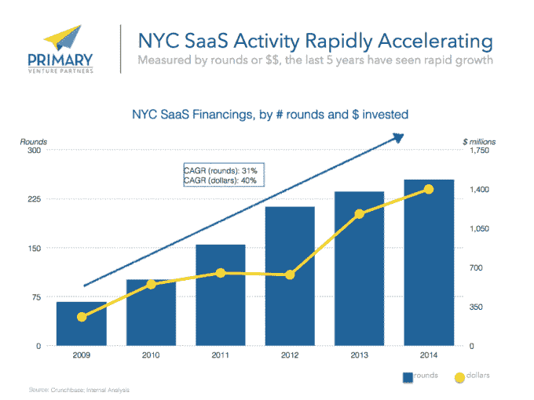
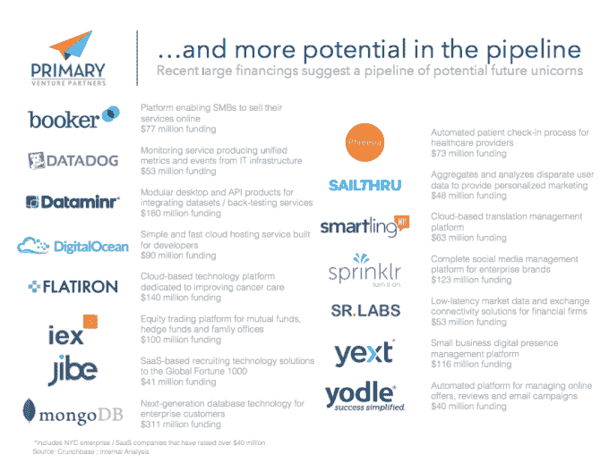
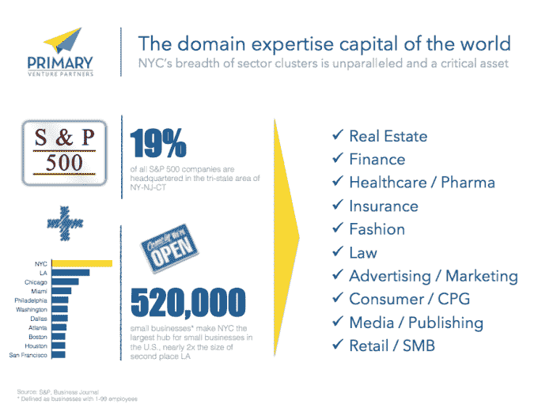

# 纽约成为软件即服务初创公司的中心 

> 原文：<https://web.archive.org/web/http://techcrunch.com/2015/08/27/nyc-rises-as-a-hub-for-software-as-a-service-startups/>

很久以前，讨论软件即服务的重要性成了标榜自己为勒德分子的一个好方法。

企业软件市场已经成为 SaaS 市场，甲骨文、SAP 和微软等历史企业巨头多年来一直在狂热地将自己重新定位为云公司。但是革命意味着改变，是新加入者定义了 SaaS。

自 2004 年第一家真正的 SaaS 企业巨头 Salesforce 上市以来，[美国各地的 SaaS 公司已经创造了超过 2000 亿美元的公开市场价值](https://web.archive.org/web/20230130233524/http://www.slideshare.net/BradSvrluga/nyc-saa-s-presentation-june-2015-final)，为风投支持者带来了一波回报，这也助长了最近私募市场的泡沫。

然而，我们才刚刚开始。而消费者更快地接受了云、社交和移动——仅脸书和 Twitter 的总市值就超过了每家 SaaS 上市公司总市值的一半！––企业行动缓慢(但正在迎头赶上)。

最后，在美国企业中，你再也找不到一位不把云计算放在首位的可信首席信息官了。 [Forrester 估计](https://web.archive.org/web/20230130233524/http://softwarestrategiesblog.com/tag/idc-saas-forecasts/)到 2020 年，这种持续的转变可能会产生超过 1500 亿美元的年度新 SaaS 支出，我们的分析表明，到 2025 年，这一数字将每年增加 3000 亿美元。这相当于超过 1 万亿美元的市值。

迄今为止，SaaS 获奖者主要集中在硅谷，其次是波士顿。

随着市场的不断成熟，随着我们看到 SaaS 在纽约市的蓬勃发展，我们相信纽约市将成为引领下一波企业转型的真正领导者。最终，我们相信纽约市甚至可以挑战我们在湾区的朋友对 SaaS 的领导地位，对最近活动数据的深入研究似乎证实了这一点。

**纽约市 SaaS 活动迅速加速**

为了了解 SaaS 生态系统的温度，我们首先来看看投资活动。以融资轮数或投资金额衡量，趋势很明显——对纽约市 SaaS 区的投资正快速增长。

大苹果和海湾相比怎么样？为了找到答案，我们研究了湾区和纽约市整个科技生态系统的融资情况，以计算每个地区由企业 SaaS 公司组成的整体创业活动的比例。我们的结果显示，早在 2009 年，SaaS 的初创企业就占到了纽约市和湾区总投资活动的 20%左右。

然而，如果我们快进到 2014 年，我们已经看到 SaaS 初创公司在纽约市投资活动中的份额稳步增长，同时在湾区保持稳定。不仅 SaaS 在纽约市的活动在增加，而且它正在戏剧性地从广告技术、消费者和金融科技的传统优势中窃取份额。

**纽约缩小差距**

与湾区相比，更多的 SaaS 公司在纽约获得投资吗？简而言之，答案是否定的……或者更准确地说，还没有。

回顾 2009 年，纽约市 SaaS 公司的投资轮次仅占 SaaS 湾区公司投资轮次的 25%。到 2014 年，这一数字上升到了 50%。总投资美元讲述了一个类似的故事，纽约 SaaS 公司在 2009 年筹集的资金仅为 SaaS 湾区公司的 15%，但到 2014 年增加到 33%。

不管你怎么看，纽约 SaaS 的初创公司正在缩小与西海岸同行的差距。纽约会赶上海湾吗？这似乎有些牵强——尽管差距可能正在缩小，但硅谷的发展速度仍然非常快，几乎没有显示出疲软的迹象。但不管未来 10 年谁会领先，越来越难以否认纽约在市场中日益重要的作用。

**看点**

纽约市 SaaS 生态系统已经取得了一些显著的成功。[医药行业使用的 SaaS 平台 Medidata Solutions](https://web.archive.org/web/20230130233524/https://www.mdsol.com/) ，可以说是第一个在 SaaS 成功上市的垂直行业。Medidata 诞生于哥伦比亚大学的一个研究实验室，在经济衰退最严重的时候上市，目前估值接近 30 亿美元。

我们也看到了一些成功的退出，例如 Salesforce 收购了 [Buddy Media](https://web.archive.org/web/20230130233524/http://www.exacttarget.com/products/social-media-marketing/buddy-media) ，以及谷歌收购了 [TXVia](https://web.archive.org/web/20230130233524/https://techcrunch.com/2012/04/02/google-buys-txvia-banking-on-better-payment-tech-and-100m-customers-for-google-wallet/) 和 [Divide](https://web.archive.org/web/20230130233524/https://www.divide.com/) (披露:TXVia 和 Divide 都是主要的风险投资伙伴投资公司)。

但它着眼于让我们为纽约市作为 SaaS 企业发电站的未来潜力感到兴奋的管道。像 [Datadog](https://web.archive.org/web/20230130233524/https://www.datadoghq.com/) 和 [Digital Ocean](https://web.archive.org/web/20230130233524/https://www.digitalocean.com/) 这样的公司正在 IT 基础设施领域取得惊人的进展，分别为 IT 专业人员实现了大数据分析和云托管的承诺。 [MongoDB](https://web.archive.org/web/20230130233524/https://www.mongodb.com/) 用其开源模型重新定义了数据库的前景。

在社交媒体的世界里，许多企业指望最近加入私人独角兽俱乐部的软件工具来管理他们的社交媒体存在。如果你想理解所有的社交媒体数据，只需看看纽约市自己的 [Dataminr](https://web.archive.org/web/20230130233524/https://www.dataminr.com/) 就可以将这些公共数据集转化为可操作的信号。纵观整个行业，许多总部位于纽约的公司都有望成为大明星。

**为什么纽约将引领 SaaS 的下一代？**

随着 IT 大趋势继续重新定义企业初创公司的成功关键，SaaS 的格局正在迅速变化。如今，Web 和移动本地人在工作人员中所占的比例越来越大，这导致了以企业为中心的应用程序的爆炸式增长，以满足他们对始终在线的移动技术和数据访问的不断增长的需求。在这种环境下，仅仅提供基于云的软件解决方案或移动应用不足以确保成功。最有用的工具是那些根据企业用户的特定需求定制的工具，这意味着结合特定行业的专业知识来开发一个解决方案，真正满足给定用户群的独特需求。

SaaS 的早期由横向应用程序主导——像 Salesforce、SuccessFactors、ServiceNow 和 Workday 这样的公司都通过解决任何垂直市场的客户问题来构建 SaaS 怪兽。在早期，你必须横向发展——在一个给定的纵向市场中，没有足够多的客户对 SaaS 模式感到满意，来建立大型的纵向业务。但随着 SaaS 接受度的激增，我们看到了垂直 SaaS 机会的激增。

我们认为，正是这些纵向机会将在纽约取得特别成功。在今天的 SaaS 市场，成功比以往任何时候都更少取决于克服建立 SaaS 平台的早期技术挑战——这些挑战最好由硅谷的工程实力来应对。今天，我们认为成功更多地取决于对客户的理解和接触，这种动力推动了产品与市场的契合和早期接触客户。

那么，一家羽翼未丰的 SaaS 公司在哪里可以找到自己的最佳定位，以获得该领域的专业知识来开发合适的产品，并获得客户群来销售该产品呢？我让你猜一次…

**纽约市:世界专业知识之都**

简而言之，纽约市专业领域的广度是无与伦比的，是 SaaS 创业企业的重要资产。Medidata 的创立和最终成功在很大程度上是基于其正好位于费城到波士顿制药/生物技术走廊的中间位置。瞄准房地产领域的纽约创业公司在家门口就拥有世界上最大的市场。在金融和保险领域，许多最大的公司都位于曼哈顿 23 平方英里的范围内。

广告、出版、消费品牌和专业服务领域的一些知名企业也挤进了这个领域。标准普尔 500 有五分之一的总部位于纽约市 75 英里以内，SaaS 公司的许多最大的潜在客户就在他们的家门口，似乎不管他们瞄准哪个行业。我们最密切关注哪些行业的垂直机会？关注房地产、医疗保健/制药、消费/CPG 和专业服务等。

但是，瞄准中小型企业的机会如何呢？纽约对这些市场有意义吗？如果你认为拥有旧金山或波士顿 5 倍数量的中小企业意味着机遇，那么答案是肯定的。

这座城市有超过 50 万家这样的企业，目前全国最大的中小企业客户群也在我们的门口。这种客户密度推动了创新，促进了商业模式实验，并使早期客户获取特别有效。这些动力帮助创造了中小企业 SaaS 的成功，如[布克](https://web.archive.org/web/20230130233524/http://www.booker.com/)、[即](https://web.archive.org/web/20230130233524/http://www.namely.com/)、[单平台](https://web.archive.org/web/20230130233524/http://www.singleplatform.com/)、 [Squarespace](https://web.archive.org/web/20230130233524/http://www.squarespace.com/) 和 [Yodle](https://web.archive.org/web/20230130233524/http://www.yodle.com/) 。

**充满人才的混凝土丛林**

强大的人才是任何创业公司的关键考虑因素。纽约的排名很好，因为大量训练有素的毕业生在脸书和谷歌等公司的东海岸校园或一些最大的咨询、银行和律师事务所工作后加入了科技创业公司。许多毕业生从全国各地被吸引到大苹果，寻求文化中心纽约的动态和多样化的生活方式。导致旧金山和波士顿从硅谷和 128 号公路迁回的社会学动力，正引领着世界各地的人才来到这个“世界上最伟大的城市”建立科技企业。由于人才的涌入，自 2009 年以来，纽约市的科技工作岗位增长速度是该市总体工作岗位增长速度的 4 倍。

**向前移动**

这座城市已经建立了强大的本土资本提供者基础，以培育这个不断增长的 SaaS 生态系统。SaaS 的初创公司现在至少有 20 个承诺的种子投资者在他们的本土市场投钱。随着人才基础的不断增长，资本提供商的全面补充，以及直接影响 SaaS 景观垂直化趋势的核心市场动态，我们预计纽约市的地位在未来几年只会加强。

在这一点上，我们唯一悬而未决的问题是，我们不断增长的 SaaS 生态系统能否在纽约社区建立独立的核心租户，在总部设在这里的其他行业领先公司中占据一席之地？

最终，为了挑战湾区的市场领导地位，我们需要一波医疗数据来建立更多支持纽约市平台的支柱。正如 Medidata 联合创始人兼总裁 Glen de Vries 对我说的，“东海岸的技术场景，纽约已经成为中心，是基于来自现有行业的人，并决定使用技术来重塑他们。这与技术专家寻找业务创新的模式形成了鲜明对比。这就是为什么纽约是垂直 SaaS 的完美平台。我们确信 Medidata 不会是这里唯一的上市垂直 SaaS 公司，我们预计整个生态系统将蓬勃发展。”

*在*[*slide share*](https://web.archive.org/web/20230130233524/https://www.slideshare.net/slideshow/embed_code/key/GDVuE2NjRWlcdW)*上查看我们在纽约市 SaaS 的完整演示。*