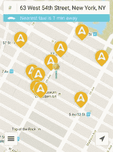

# 纽约出租车正在测试一款名为 Arro TechCrunch 的类似优步的应用

> 原文：<https://web.archive.org/web/https://techcrunch.com/2015/08/28/nyc-taxis-are-testing-an-uber-like-app-called-arro/>

# 纽约出租车正在测试一款名为 Arro 的类似优步的应用

黄色出租车和优步汽车之间的战斗即将白热化。

据 [Crains New York](https://web.archive.org/web/20221205204728/http://www.crainsnewyork.com/article/20150827/BLOGS04/150829899/meet-the-taxi-industrys-last-best-hope-to-survive-uber-age) 报道，一款名为 Arro 的新应用正在纽约地区的 7000 辆黄色和绿色出租车中进行测试，允许潜在乘客电子呼叫常规出租车，而不是优步。这款应用将在几周内全面推出，并推广到该市所有的 2 万辆绿色和黄色出租车。

Arro 应用程序与优步几乎相同，允许用户设置特定的取车位置，并将用户的姓名和位置发送给司机。一旦附近的出租车被分配了车费，用户将收到司机的姓名和汽车 ID，这样他们就可以找到合适的出租车。

但是 Arro 和优步有一个很大的区别:没有激增的价格。

尽管优步的应用程序在需求高的时候收费较高，比如除夕或几乎任何下雨的时候，Arro 与黄色和绿色出租车的集成不会发生这种情况。

许多应用程序都试图模仿优步在出租车方面的做法，但都失败了，但 Arro 告诉 Crains，由于与 Creative Mobile Technologies 的合作，它有更好的机会，Creative Mobile Technologies 是一家技术提供商，可以在纽约市许多出租车上的小视频屏幕上处理支付和娱乐。

同样的技术也存在于驾驶室的前面，这将允许司机在不集成智能手机仪表板的情况下收取 Arro 费用，就像优步司机那样。

优步和 TLC 已经打了一场持久战，市长比尔·白思豪最近试图限制新优步司机的数量。长话短说，[那个计划进行得不太顺利](https://web.archive.org/web/20221205204728/https://beta.techcrunch.com/video/uber-wins-nyc-fight-against-de-blasio-crunch-report/518961366/)。

但是 Arro 的引入可能会给优步带来(至少是一些)竞争，自 2010 年成立以来，其价值已经超过了[500 亿美元](https://web.archive.org/web/20221205204728/https://beta.techcrunch.com/2015/07/31/uber-reportedly-raises-new-funding-round-now-valued-at-over-50-billion/)。