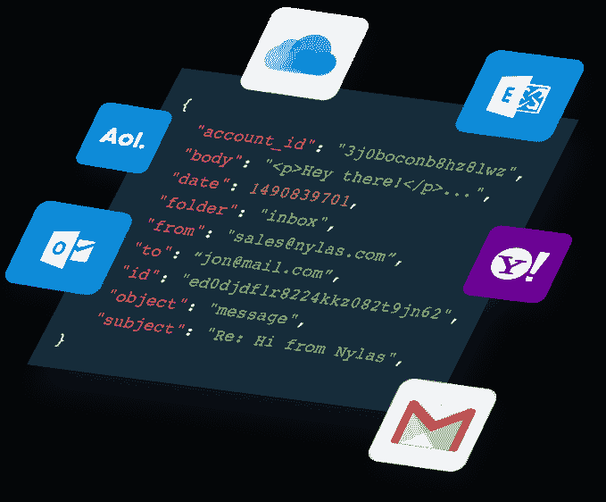

# Nylas 获得 1600 万美元的 B 系列扩展电子邮件 API 工具 

> 原文：<https://web.archive.org/web/https://techcrunch.com/2018/08/22/nylas-scores-16m-series-b-to-expand-email-api-tool/>

帮助开发者通过 API 将电子邮件内容整合到应用程序中的初创公司 Nylas 今天宣布获得由 Spark Capital 领投的 1600 万美元 B 轮融资。

其他投资者包括 Slack Fund、Industry Ventures、ScaleUp 以及现有投资者 8VC、Great Oaks Capital、Rubicon Venture Capital 和约翰·钱伯斯的个人基金。今天的投资使总筹资额达到 3000 万美元。

Nylas API 的工作方式与 Stripe 或 Twilio 类似，但不是用几行代码帮助开发人员连接支付或通信，而是帮助他们连接电子邮件、日历和联系信息。任何这样的 API 背后的想法都是为了让那些在应用程序核心目的之外的特定领域缺乏专业知识的开发人员能够轻松访问特定类型的功能。

公司首席执行官格莱布·波利亚科夫说，在 Nylas 之前，如果没有大量的技术争论，真的没有一种有效的方法来连接到电子邮件系统。“每个使用互联网的人都有一个电子邮件地址，邮箱、日历和地址簿中存储着大量数据。到目前为止，企业还不能有效地利用这些数据，”他告诉 TechCrunch。

公司联合创始人兼首席技术官克里斯汀·斯潘(Christine Spang)表示，从任何应用程序连接到这种类型的信息似乎是一种必备的能力，但大多数公司都回避全面的方法，因为这很难做到。

“我们基本上为每个电子邮件系统的本地协议构建了适配器:Gmail、Microsoft Exchange、开源 IMap 服务器以及不同 IMap 实现中可用的所有不同扩展。Spang 解释说，关键的部分是，有了这些适配器，我们可以与后端提供商如 Google、GoDaddy 和 Yahoo 进行对话。

照片:尼拉斯

这种功能在很多情况下对开发人员很有用，例如从销售人员和客户之间的电子邮件交流中提取 CRM 工具的数据，或者围绕几个人的日历和一个适用于他们所有日程的开放会议室协调会议。

该公司已成立五年，目前有 35 名员工，在纽约和旧金山设有办公室。有了新的资金，他们预计到年底这个数字会翻一番，因为它增加了工程和建立了销售和营销团队。虽然到目前为止，大部分营销都是来自开发商，但他们希望通过直接向公司营销来扩大客户群。

目前有 200 名客户和数千名开发人员在使用该产品。客户包括康卡斯特、现代、新闻集团、Salesloft 和 Dialpad。