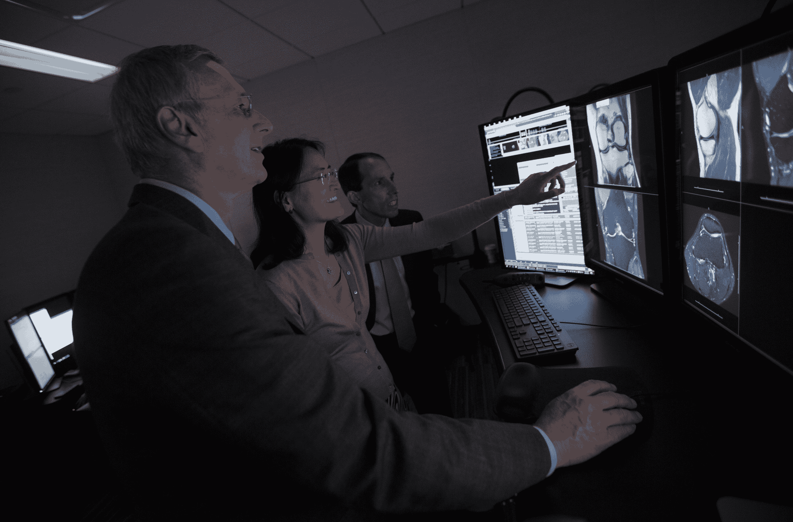

# NYU 和脸书联手用人工智能技术增强核磁共振扫描

> 原文：<https://web.archive.org/web/https://techcrunch.com/2018/08/20/nyu-and-facebook-team-up-to-supercharge-mri-scans-with-ai/>

磁共振成像在医学领域是一个非常有价值的工具，但它也是一个缓慢而繁琐的过程。完成一次扫描可能需要十五分钟或一个小时，在此期间，病人，也许是一个孩子或一个非常疼痛的人，必须完全安静地坐着。NYU 一直在研究加速这一过程的方法，现在正与脸书合作，目标是通过应用基于人工智能的成像工具将核磁共振成像时间缩短 90%。

从一开始就将这项工作与人工智能在医学成像领域的其他常见用途区分开来是很重要的。X 射线，或者实际上是 MRI 扫描，一旦完成，可以通过物体识别系统检查异常，为医生节省时间，甚至可能捕捉到他们可能错过的东西。这个项目不是关于分析已经创建的图像，而是首先加速它的创建。

核磁共振成像需要这么长时间的原因是因为机器必须创建一系列 2D 图像或切片，其中许多必须堆叠起来才能形成 3D 图像。有时只需要一小部分，但是为了达到完全的保真度和深度——比如扫描脑瘤——需要大量的切片。

FastMRI 项目始于 2015 年，由 NYU 的研究人员发起，旨在研究创建与传统扫描质量相似的图像的可能性，但只收集正常所需数据的一小部分。

把它想象成扫描一张普通的照片。你*可以*扫描整个东西……但是如果你只扫描每隔一行(这被称为“欠采样”)，然后智能地填充丢失的像素，它将需要一半的时间。机器学习系统越来越擅长这样的任务。我们自己的大脑一直在这样做:你现在有盲点，里面有东西，你没有注意到，因为你的视觉系统正在智能地填补空白。

左边收集的数据可能和右边一样“欠采样”,缺失的数据在后面补上

如果人工智能系统可以被训练来填补 MRI 扫描中仅收集最关键数据的空白，那么患者必须坐在成像管中的实际时间将会大大减少。这对病人来说更容易，而且一台机器可以处理比每次全扫描多得多的人，使扫描更便宜，更容易获得。

NYU 医学院的研究人员三年前就开始了这项工作，并发表了一些早期结果，表明这种方法至少是可行的。但是像核磁共振扫描一样，这种工作需要时间。

“我们和其他机构已经在使用人工智能解决这类问题方面迈出了一些小步，”NYU 大学高级成像创新和研究中心主任丹·索迪克森解释说。“感觉是，在第一次尝试中，通过相对简单的方法，我们可以比其他当前的加速技术做得更好——获得更好的图像质量，可能会进一步加速一定的百分比，但还不是很大的倍数。”

因此，为了推动该项目，索迪克森和 NYU 的放射学家正在与脸书的人工智能专家及其人工智能研究小组(FAIR)合作。

NYU 医学院放射科主任 Michael Recht 医学博士、高级成像创新中心研究副主席兼主任 Daniel Sodickson 医学博士和人工智能主任 Yvonne Lui 医学博士检查核磁共振成像

“我们这里有一些伟大的物理学家，甚至一些热门的数学家，但脸书和费尔有一些世界上领先的人工智能科学家。所以这是互补的专业知识，”索迪克森说。

虽然脸书不打算建立一个医学成像部门，但 FAIR 拥有相当广泛的授权。

“我们正在寻找既有影响力又有科学趣味的问题，”FAIR 的拉里·齐特尼克说。基于人工智能的现实意象的创造或再创造(通常称为“幻觉”)是一个主要的研究领域，但这将是它的一个独特应用——更不用说可以帮助一些人了。

他解释说，有了病人的核磁共振数据，生成的图像“不需要仅仅是似是而非，但需要保留同样的缺陷。”因此，填补空白的计算机视觉代理需要能够识别的不仅仅是整体模式和结构，还需要能够保留甚至智能地扩展图像中的异常。不这样做将是对原始数据的大规模修改。

幸运的是，核磁共振成像仪在产生图像方面非常灵活。例如，如果你通常从 200 个不同的位置进行扫描，告诉机器做一半的扫描并不困难，但是在一个或另一个区域有更高的密度。其他成像设备如 CT 和 PET 扫描仪就没这么温顺了。

即使经过几年的工作，这项研究仍处于早期阶段。毕竟，这些事情不能操之过急，医学数据存在伦理方面的考虑，而且很难获得足够的数据。但是 NYU 研究人员的基础工作已经有了初步结果和强大的数据集。

Zitnick 指出，因为人工智能代理需要大量数据来训练达到有效水平，所以从一组，比如说，500 次 MRI 扫描到一组 10，000 次扫描是一个重大变化。有了前一个数据集，你也许可以做一个概念验证，但有了后一个数据集，你可以做出足够精确的东西来实际使用。

今天宣布的伙伴关系是 NYU 和脸书之间的，但双方都希望其他国家也能加入。

“我们正在公开解决这个问题。我们将全部开源，”兹尼克说。人们可能会期望学术研究不会减少，但当然，大量的人工智能工作，特别是这些天在闭门造车。

因此，作为一个合资企业，第一步将是定义问题，记录数据集并发布它，创建基线和度量标准来衡量他们的成功，等等。与此同时，这两个组织将定期会面和交换数据，并通过实际的临床医生运行结果。

“我们不知道如何解决这个问题，”兹尼克说。“我们不知道我们是否会成功。但这正是它的乐趣所在。”