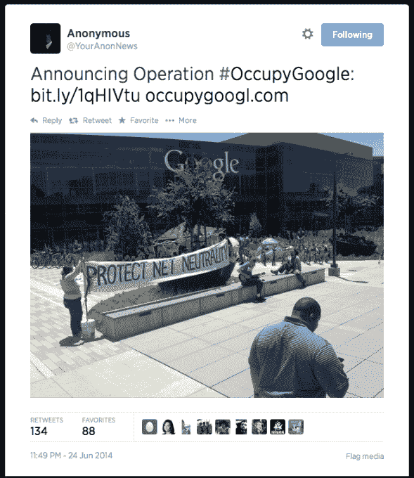

# 网络中立抗议者在谷歌总部被捕 

> 原文：<https://web.archive.org/web/https://techcrunch.com/2014/06/25/occupygoogle-arrests/>

一小群支持网络中立的积极分子在谷歌山景城总部外发起抗议，自称“占领谷歌”，他们似乎已经被加州警方逮捕。

使用[#占领谷歌](https://web.archive.org/web/20221007191732/https://twitter.com/hashtag/OccupyGoogle?src=hash)推特标签的推文表明，大约 12 名活动人士因侵犯私人财产而被逮捕。**更新:**占领谷歌告诉 TechCrunch，有 10 人在抗议中被捕。他们的开庭日期定在 8 月 8 日。

下面的 ustream 视频似乎显示了一个人[被逮捕的过程，这个人](https://web.archive.org/web/20221007191732/https://twitter.com/punkboyinsf)一直在记录警方逮捕活动人士的过程——显然是在他自己被逮捕之前:

人们因未经许可留在私有财产上而被逮捕并不是什么新闻，但警方对这场看起来相当低调的抗议活动采取的行动规模——并非真正针对谷歌这家企业实体本身——似乎有些不相称。

当天早些时候，活动人士在谷歌总部外搭起帐篷，竖起支持网络中立的横幅。甚至有一个带着吉他的家伙…

他们还建立了一个网站，呼吁谷歌在 7 月 15 日结束的[公众意见征询期](https://web.archive.org/web/20221007191732/https://beta.techcrunch.com/2014/05/15/fccs-proposed-net-neutrality-rules-pass-3-2-enter-4-month-comment-period/)支持游说联邦通信委员会的公共活动，从而帮助捍卫互联网自由和网络中立。

争论的焦点是美国上诉法院在一月份[的一项裁决](https://web.archive.org/web/20221007191732/https://beta.techcrunch.com/2014/01/14/fcc-open-internet-order-struck-down/)，该裁决推翻了 [FCC 的开放互联网令](https://web.archive.org/web/20221007191732/https://beta.techcrunch.com/2010/12/01/fcc-lays-out-net-neutrality-plans-who-could-be-against-an-%E2%80%98open-free%E2%80%99-internet/)——赋予诸如威瑞森、康卡斯特和 AT & T 这样的互联网服务提供商根据他们支付的连接费用来限制网络服务的能力。(又名:“有线电视公司乱搞”，以[引约翰·奥利弗](https://web.archive.org/web/20221007191732/https://beta.techcrunch.com/2014/06/03/watch-john-olivers-brilliant-concise-primer-on-net-neutrality/)。)

如果你的口袋像谷歌一样装满了黄金，一个多速互联网，为大众提供慢速通道，为最有钱支付互联网服务提供商的人提供快速通道，可能不会导致太多不眠之夜。但这显然让初创公司处于明显的劣势，因为它们缺乏现有互联网巨头的巨大资源。

这也意味着互联网不再是一个公平的竞技场——因为它使数字服务的经济向成熟的实体倾斜(必须说，像谷歌)。

现在，谷歌通常是网络中立的强烈倡导者，但占领谷歌的抗议者认为，在这个关键时刻，该公司可以做更多的事情来支持这项事业——因此他们占领了山景城总部。

他们呼吁谷歌关闭其主页一天并链接到 FCC 的请愿书，并在其网站上添加请愿书的快捷按钮。

该组织在其网站上写道:

> 今天，互联网再次受到攻击，这一次是由 ISP 谁希望利用内容提供商和消除网络中立。尽管谷歌和其他大公司如网飞、亚马逊和微软已经站出来支持维护一个自由开放的网络，我们相信还可以做得更多。
> 
> 尽管我们中的许多人担心谷歌对世界的影响会产生更大的影响，就监控和与军事技术的联系而言，我们不是来抗议谷歌的。
> 
> 拥有巨大力量的谷歌有维护互联网价值观的社会责任。我们鼓励谷歌就网络中立问题进行严肃、诚实的对话，并与我们站在一起，支持一个没有审查、歧视和接入费用的互联网。

TechCrunch 联系谷歌时，谷歌拒绝就逮捕事件置评。

当被问及是否要求警察介入并赶走抗议者时，该公司也未置评。

谷歌 [I/O 2014 开发者大会](https://web.archive.org/web/20221007191732/https://beta.techcrunch.com/2014/06/25/google-io-2014-keynote-live-blog/)今天上午开幕。一系列不同的[直接反对谷歌的抗议活动计划在 I/O](https://web.archive.org/web/20221007191732/https://beta.techcrunch.com/2014/06/24/people-are-going-to-dress-up-like-star-wars-characters-in-sf-tomorrow-to-protest-google/) 举行，目标是科技产业对三藩市的经济影响。

【主[照片](https://web.archive.org/web/20221007191732/https://twitter.com/occupygoogl/status/481685700069163008/photo/1)经 [@Occupygoogl](https://web.archive.org/web/20221007191732/https://twitter.com/occupygoogl/status/481685700069163008/photo/1)