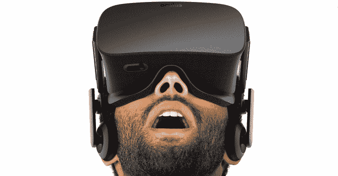

# Oculus 应用商店将需要预先批准、舒适度评级、税收 

> 原文：<https://web.archive.org/web/https://techcrunch.com/2015/06/12/oculus-app-store/>

Oculus 不想让你呕吐或者吓死你。首席执行官 Brendan Iribe 告诉我，因此当其改版的应用商店为 2016 年 Q1 消费者 Rift 耳机发布时，它将审查游戏和体验的安全性。

昨天，Oculus 举行了一场新闻发布会，发布了将配备 Xbox 控制器和光学传感器的消费者 Rift 耳机，展示了一些即将推出的[旗舰游戏](https://web.archive.org/web/20221205183834/https://beta.techcrunch.com/2015/06/11/oculus-games/)，并预览了其 [Oculus Touch](https://web.archive.org/web/20221205183834/https://beta.techcrunch.com/2015/06/11/oculus-touch/) 手持运动控制器。

以下是 Oculus 展示的所有设备:

[gallery ids="1170920，1170922，1170923，1170921，1170395，1170423，1170437，1170478，1170485"]

演示结束后，我采访了 Oculus 的首席执行官，询问他的公司将如何与第三方硬件和软件开发商合作。

## 所有人的运动跟踪

新的 Oculus Rift 传感器摄像头可以跟踪 Rift 耳机上一系列 led 的移动，很快就会跟踪第三方硬件的移动

Oculus 正在制造自己的硬件，但将兼容广泛的外部外设。Oculus SDK 将允许第三方设备向耳机传递数据，但它们也可以搭载 Rift 的传感器。

Rift 跟踪你头部运动的方式是在耳机上覆盖一系列传感器摄像头可以识别的小 LED 标记。该公司也将它们安装在新的 Oculus Touch 运动控制器上。但 Iribe 告诉我，外部开发人员将能够在标记中覆盖他们的设备，这将使 Oculus 传感器也能跟踪他们。

裂缝内部的白点是由 Oculus 传感器跟踪的 led，用于将物理运动转化为 VR

Iribe 表示，Oculus 仍处于与开发者交谈的规划阶段，但他告诉我“对其他人来说，制作与相同跟踪系统一起工作的第三方控制器真的很容易。我们将为整个跟踪系统、耳机系统和音频系统提供完整的 API。”

在这段视频中，您可以近距离体验新的 Rift 耳机、跟踪传感器和 Oculus Touch 控制器:

## 预批准，就像苹果的应用商店

至于软件，Oculus 宣布正在与 EVE 的 CCP Games、knights Games 和 Insomniac Games 等大型游戏工作室合作，并将向独立游戏开发商投资 1000 万美元。但是把游戏等体验拿到用户手里的过程是怎样的？

Oculus 与 CCP Games 合作，准备让夏娃瓦尔基里成为 Rift 的旗舰游戏之一

Iribe 证实，Oculus 将预先批准通过其应用商店提供的所有应用程序。他告诉我“我们将监控内容，并确保它符合我们制定的政策，这是一个安全、干净的环境，每个人都可以知道、喜欢和信任，就像其他流行的应用程序商店一样……你需要首先获得批准。”

这使得它更像苹果的应用商店，尽管 Google Play 最近也转向了批准模式。通过这种方式，Oculus 可以让它不分发任何可能让人们对虚拟现实产生反感的内容。

## “这不会让你生病”

作为批准过程的一部分，体验将被给予“舒适”评级，这表示它们是否更有可能或更少可能使某人眩晕或惊吓他们。Iribe 强调，Oculus 是一个开放的平台，人们将能够在其官方 Oculus Home 应用商店之外获得体验。这些可能比 Oculus 发行的更令人毛骨悚然。

Oculus 的 Home 演示显示，大气的角色扮演游戏 Chronos 获得了“最舒适”的舒适评级

然而，对于 Oculus 官方渠道的体验，Iribe 说“我们将对它们进行舒适度评级，这样你就能真正知道你会得到什么。”这可以使裂缝对于像 Iribe 说的那样有高度恶心倾向的人来说更加安全。他们可以知道坚持更平静的体验，如观看音乐会或探索放松的风景，而不是驾驶宇宙飞船。

考虑到恐惧，可以避免有人心脏病发作，因为一个虚拟的怪物从他身后跳出来。该商店还将包括用户对体验的评论。Oculus 本质上将成为自己的娱乐软件审查委员会，该机构对视频游戏进行年龄分级

Iribe 解释说,“从迷失方向的角度来看，有些东西会很舒服，不会让我感觉不好……它不会像过山车一样疯狂地移动。但如果它真的非常非常强烈，我们确实想警告人们注意这一点。”

警告会告诉人们，像这样放松的经历对每个人来说都是舒适的

## 虚拟现实税

Oculus 的首席执行官还表示，公司的应用商店计划采用类似于其他流行平台的盈利策略。虽然 Oculus 还没有正式宣布，但 Iribe 说“你可以想象这是一个非常标准的商业模式。”如今的标准是苹果和谷歌对其平台上销售的应用和应用内购买征收 30%的税。

Iribe 先发制人地证明了这种税收的合理性，他说“建设、管理和维护这个商店需要大量的费用和工程。它不会自己发生。你实际上必须支持它。有各种各样的信用卡交易费用……所以我们打算以类似于其他运作良好的公司的方式来经营一种。”

Oculus Home 应用商店

Iribe 没有具体说明 Oculus 将承担的确切份额，但告诉我所有内容都将在 Rift 在 Q1 上市之前揭晓。虽然开发人员可能不愿意放弃一部分收入，但这使得他们和 Oculus 之间的激励措施一致，因此双方都希望尽可能多地销售 VR 体验。作为最知名的 VR 平台，Oculus 很可能是开发者找到最大受众的地方。即使 HTC 或索尼的其他 VR 平台试图降低 Oculus 的价格，开发者也会去他们可以规模化销售的地方。

## 系上安全带是安全的

Oculus 的可见性意味着它有责任管理 VR 生态系统。如果它允许在没有适当提醒的情况下，在其平台上出现令人恐惧、恶心的体验，它可能会让人们对虚拟现实永远犹豫不决。

Iribe 总结道:“在虚拟现实中，子弹飞向你实际上是非常非常激烈的，越真实，就越像真实生活，你不会真的想在现实生活中被击中。”“我们真的已经习惯了 2D 显示器，因为我们的大脑在说‘别担心，别担心，这是安全的。’一旦你戴上虚拟现实，你的大脑不再这么说，它就不一定是在显示器上的舒适体验，我们会在这周围发出警告。"

