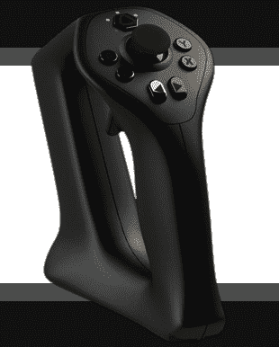
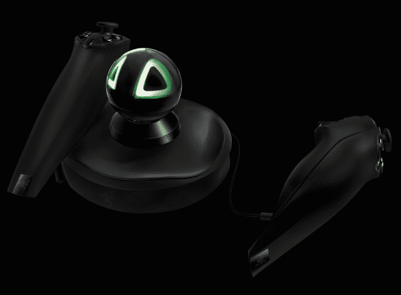

# 谣言:Oculus 将发布一款手持虚拟现实控制器[更新:尚未发布，即将发布]·tech crunch

> 原文：<https://web.archive.org/web/https://techcrunch.com/2014/09/19/oculus-controller/>

# 谣言:Oculus 将发布一款手持虚拟现实控制器[更新:还没有，但即将发布]

[Oculus](https://web.archive.org/web/20221207102037/http://www.oculus.com/) 的耳机可以让你在虚拟现实中四处看看，但需要与非官方的控制器集成，以移动化身、发射武器或输入其他命令。但在明天的 [Oculus Connect 虚拟现实会议](https://web.archive.org/web/20221207102037/https://www.oculus.com/connect/)上，有消息称 Oculus 有望发布官方控制器或控制器行业标准，让开发者更容易构建更复杂的游戏。关于会议的重大新闻，一些开发商已经被置于 NDA 的控制之下，尽管消息来源无法证实细节。然而，有四个消息来源告诉 TechCrunch，游戏板是洛杉矶虚拟现实社区中流传的东西。

[更新日期:2014 年 9 月 20 日下午 12:45 PST:Oculus 今天没有展示手持控制器，而是展示了其新的新月湾功能原型耳机(DK2 的继承者)和 Oculus Platform VR 应用市场。然而，当一位消息人士获得新月湾的演示，并告诉 Oculus 的一名员工他们希望有一个手持控制器时，该员工回答说“它来了。”]

Sixense STEM 系统无线虚拟现实控制器

一位开发人员告诉我们，新 Oculus SDK 中的代码暗示着某种官方控制器或 API 正在将 Rift 耳机连接到游戏手柄上。考虑到今年早些时候 [Oculus 收购了设计 Xbox 360 控制器和 Kinect 运动传感器的 Carbon Design](https://web.archive.org/web/20221207102037/https://beta.techcrunch.com/2014/06/24/oculus-acquires-carbon-design-the-team-that-designed-the-xbox-360-controller/) ，这个消息很有道理。我们已经联系了 Oculus 进行置评。

现在，一些开发人员使用被黑的控制台视频游戏控制器或第三方虚拟现实控制器，如[six sense STEM，将头部运动以外的输入输入到 Oculus 中。昨晚在洛杉矶的 TechCrunch 虚拟现实会议上，我尝试了下面演示的光剑游戏，感觉](https://web.archive.org/web/20221207102037/https://beta.techcrunch.com/2013/09/12/the-sixense-stem-brings-your-hands-and-feet-into-virtual-reality/)[six sense STEM](https://web.archive.org/web/20221207102037/http://sixense.com/)很自然，也很容易上手(真的)。很清楚为什么 Oculus 会正式支持这类体验。

[YouTube = http://www . YouTube . com/watch？v = 1b 1c wqig7c # t = 21]

Oculus 可能会发布自己设计的输入设备。这可能看起来像一个传统的 Xbox 控制器，可能有也可能没有运动控制，或者像两个手持 Wii 双截棍，这将允许更真实地挥舞物体，如手枪，剑，或弓箭，就像 [Survios“全息甲板上的僵尸”](https://web.archive.org/web/20221207102037/http://survios.com/games/)。

或者，Oculus 可能会简单地为 Sixense 等第三方构建的可以连接到 Rift 的控制器创建一个标准，就像苹果去年在 iOS 7 中推出的[游戏控制器 MFi 标准一样。然后，它可能会展示由合作伙伴构建的这些控制器的示例。](https://web.archive.org/web/20221207102037/https://developer.apple.com/library/ios/documentation/ServicesDiscovery/Conceptual/GameControllerPG/Introduction/Introduction.html#//apple_ref/doc/uid/TP40013276)

Sixense Razer Hydra 控制器

由于 Rift 已经使用面向用户的摄像头来检测头部运动，控制器可以搭载在同一平台上，以识别用户如何移动输入设备。

一个官方的输入设备或平台可以统一一些分散的虚拟现实空间，鼓励开发者投资建设游戏、艺术和社交应用，这些应用可以在 Oculus 硬件上工作，连接到个人电脑和移动产品，如[三星的虚拟现实耳机](https://web.archive.org/web/20221207102037/https://beta.techcrunch.com/2014/09/03/samsung-gear-vr-galaxy-note-4/)。这种信心对于打造旗舰体验至关重要，这种体验可以将主流消费者吸引到虚拟现实提供的其他维度。

*太平洋时间 9 月 20 日上午 9:30 回到 TechCrunch，观看 Oculus Connect 大会的直播，看看有什么东西揭开了面纱。*

*凯尔·拉塞尔补充报道*