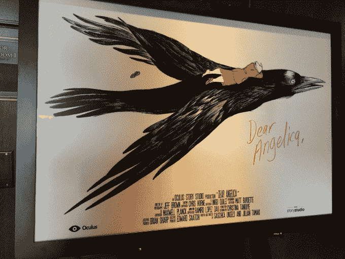
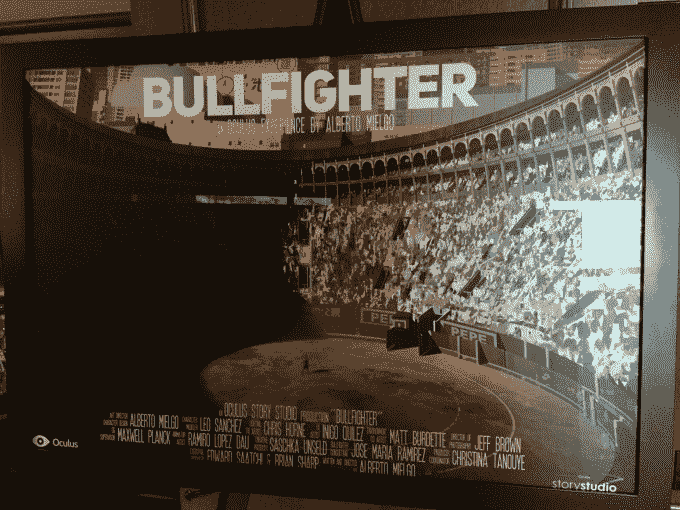
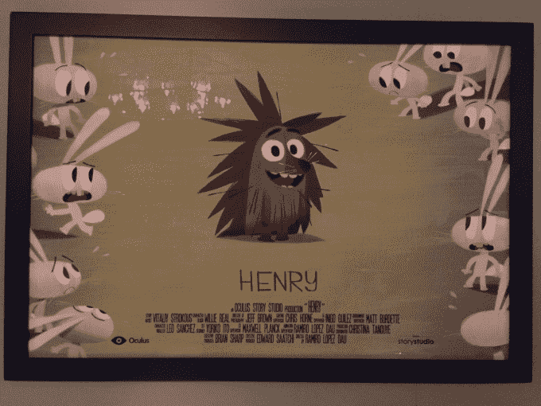
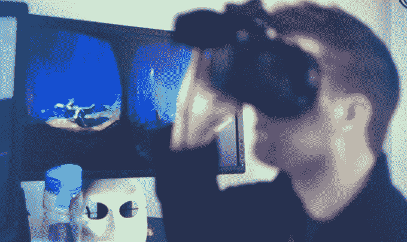
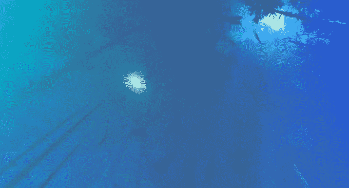
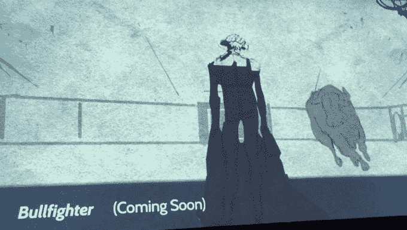

# Oculus 的第一部内部 VR 电影《迷失》很可爱，令人身临其境，但几乎没有互动 

> 原文：<https://web.archive.org/web/https://techcrunch.com/2015/01/26/oculus-lost-review/>

Oculus 刚刚首映了其[故事工作室](https://web.archive.org/web/20221210070006/https://beta.techcrunch.com/2015/01/26/story-studio/)的首个虚拟现实影院体验“Lost ”,旨在向电影制作人展示虚拟现实的叙事潜力。这种体验的特点是一只巨大的机器人手在黑暗的森林中四处搜寻它的尸体。它证明了一个简单的，角色驱动的故事可以在一个沉浸式的环境中讲述。然而，尽管这部电影很可爱，但它并没有太多地推动虚拟现实的极限。

所有的动作都发生在你面前，头顶上只有一个场景。没有太多东西可以扫描环境。它仅仅是勉强的互动，不需要你在基本框架之外跟随动作。如果你看向别处，迷失就会继续。你一直被困在一个地方。

虽然森林在虚拟现实中感觉身临其境，但电影作为电影也可以很好地工作，考虑到故事工作室的观点，这有点失败。

除了《迷失》，Oculus 的皮克斯高管领导的故事工作室还有五种体验正在进行中，包括:《亲爱的安吉丽卡》(Dear Angelica)，它让观众置身于漫画中；《斗牛士》(斗牛士)，它让你站在斗牛场上，面对一头愤怒的公牛；以及《亨利》(Henry)，它通过一只喜欢气球的刺猬，展示了虚拟现实中喜剧和移情的潜力。像《斗牛士》的阿尔贝托·米尔戈这样的外部导演将被用来监督故事工作室的项目。

正如我今天早上在[故事工作室](https://web.archive.org/web/20221210070006/https://beta.techcrunch.com/2015/01/26/story-studio/)上发布的故事中所详述的，电影制作人不太确定如何在虚拟现实中建立体验。工作室的目标是开创叙事虚拟现实，并与电影制作人和公众分享见解和经验。

《迷失》将于今天在圣丹斯电影节上向媒体和来宾放映。最终，该计划是在今年晚些时候推出第一款消费级 Oculus Rift 的同时，公开发布 Lost，可能通过 Oculus 的体验店进行。

## 迷失的故事

《迷失》的叙述是这样的(剧透警告):你出现在一个黑暗的森林里，萤火虫在你周围飞来飞去，满满的月光透过树林闪闪发光。在该功能唯一的互动部分，当一只好奇的闪电虫跟着你时，你可以摇头晃脑。

你被留在这个场景中，听着夜晚森林中不祥的寂静。当你等待某事发生时，悬念就产生了。就像虚拟现实中任何让人想起恐怖电影的东西一样，人们很容易担心有什么东西可能会偷偷溜到后面吓到你。

当机械化的哔哔声开始在树林中回响时，你只能假设你将面对一个可怕的机器人。但是从植物群中跌跌撞撞出来的是一个巨大机器人的断手，它具有一只迷路的狗的个性。它嗅来嗅去，在它注意到你之前绕着圈子搜寻线索。当它接近时，你会想要后退一步。因为它正在 Oculus Crescent bay 上播放，允许几英尺的运动跟踪，你实际上可以。

一个男人看着迷失。在屏幕的背景中，你可以看到《迷失》大部分情节发生的空地。

一旦那只手看了你一眼，它就会跌跌撞撞地回到你前面的空地上。突然，它开始发出更强烈的哔哔声，并挥动它的“尾巴”，将它连接到机器人手腕上。在远处，你听到隆隆声，如果你转头看，你会看到一个巨大的机器人笨重地穿过森林，碾碎脚下的树木。

当它越来越近，穿过树枝，你被从上面飘落下来的树叶淋到。这个机器人高高耸立，令人满意地利用了它慢慢抬头看的能力。一旦与它的手重聚，钢铁巨人会把它巨大的发光笑脸压向你。“罗先生”,它用一种奇怪的、生锈的声音抱怨道。屏幕变暗。

为了确保我抓住了所有的东西，我跑了三次迷路。在故事工作室制片人爱德华·萨奇的要求下，我坐下来做了最后一次演示。多亏了 Crescent Bay 高超的头部跟踪技术，你实际上可以一直到达森林地面，透过灌木丛或凝视植物。萨奇告诉我，“几个月来，我们一直站着看《迷失》。后来有一天，我们收到了 Saschka(un seld，Story Studio 的创意总监)发来的一封电子邮件，信中说“试试盘腿坐下吧。”“很快，爬来爬去成了《迷失》创作者们的首选方式。

## 许多边界有待突破

萨奇解释说，“我们在虚拟现实中看到的许多东西感觉就像没有角色的空布景，只是你所处的环境。”这就是为什么他认为《迷失》是成功的，即使它没有利用 VR 的每一个怪癖。“最容易被忽略的东西是最重要的:我们在 VR 里讲了一个故事。”早期的电影也很简单。

就波兰而言，《迷失》配得上那些制作《迷失》的皮克斯家伙们。动画是华丽的，流畅的，时尚的。这肯定会让电影制片厂和导演们相信，AAA 级优质虚拟现实体验具有像《迷失》的机器人一样大的潜力。这是皮克斯的经典把戏，让你以为会发生可怕的事情，然后用可爱轰炸你。

不过，《迷失》只是偶尔聪明地利用了环视四周的能力。令人失望的是，如果你把目光从这个动作上移开，它只会继续下去，而没有你，但是没有别的东西可以真正看。没有办法改变你的有利位置，探索你周围的环境。虽然萤火虫对你的动作做出反应是一种令人愉快的触摸，但它不会从根本上改变体验。

抬头看《迷失》的结尾，你会看到一个巨大的机器人，它发光的眼睛在洒满月光的树林中跳跃

如果《迷失》是你看到的第一部 VR，你肯定会觉得它令人印象深刻。萨奇告诉我“没有人记得物理硬件。他们记得他们建立的联系。你是在艺术作品中，而不是在硬件演示中。”

但它不会让熟悉虚拟现实的人大吃一惊。与克里斯·米尔克令人惊叹的新艺术作品[诗句](https://web.archive.org/web/20221210070006/http://www.sundance.org/projects/evolution-of-verse)的演变相比，它没有传达虚拟现实如何传输我们思想的无限可能性。

故事工作室团队和大多数 VR 内容创作者一样，还在尝试。Oculus 首席执行官布伦丹·伊里贝(Brendan Iribe)在演示开始时说，这只是“早期”，“我们只是触及了表面”，“前面还有很长的路要走”。尽管如此，我还是希望看到更多对 3D 空间和 360°视角的创新使用，而不仅仅是设置场景和一些头部倾斜。

刚接触虚拟现实的电影制作人可能会学到一点如何跳出传统的矩形框架。但是那些手或完整的机器人从灌木丛中出现的场景可以用传统的电影剪辑来代替。

“我们已经尝试了电影的方法，但我们需要忘记我们所知道的关于电影的一切，从头开始，”Unseld 在《迷失》首映式上说。“它不是像 IMAX 那样的影院增强。这是完全不同的东西。”好吧，那就拿出来。

希望未来的故事工作室制作能给观众一些体验上的代理，让他们离开铁轨去探索，把复活节彩蛋藏在外围，并以多个动作点为特色，这样你就不能一下子得到整个故事。这些概念对电影制作人来说确实是陌生的。如果 Story Studio 能够证明他们是如何增强讲故事能力的，这将真正让艺术家们动心。

