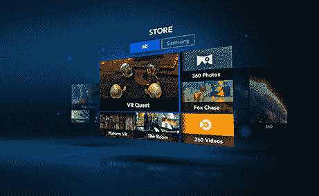

# 面向虚拟现实应用的“Oculus 平台”市场将于今年秋季推出 

> 原文：<https://web.archive.org/web/https://techcrunch.com/2014/09/20/oculus-platform/>

Oculus 今天在 Oculus Connect 大会上宣布了“Oculus Platform”商店，供开发者分发他们的虚拟现实应用和体验。从今年秋天开始，在 Oculus 制造的[三星 Gear VR](https://web.archive.org/web/20221206202533/https://beta.techcrunch.com/2014/09/03/samsung-gear-vr-galaxy-note-4/) 上，Oculus Share marketplace 的这一改造将允许用户在虚拟现实中浏览 Oculus 平台，并下载应用程序、游戏和娱乐体验。

最终，将会有适用于 Rift、iOS、Android、Windows Phone、Chrome、Firefox、Safari 和 Internet Explorer 的 Oculus 平台版本。Oculus 平台可能成为开发者销售他们构建的虚拟现实体验的第一种方式，通过创建这个市场，Oculus 可以将生态系统整合到其移动和基于 PC 的虚拟现实耳机中。

产品副总裁 Nate Mitchell 在 Connect 大会上首次亮相 Oculus 平台，此前首席执行官 Brendan Iribe [发布了新的 Crescent Bay 功能原型](https://web.archive.org/web/20221206202533/https://beta.techcrunch.com/2014/09/20/oculus-connect-announcements/)—DK2 的继任者。[你可以在这里查看新月湾的所有新闻、特写和我们的实践。](https://web.archive.org/web/20221206202533/https://beta.techcrunch.com/2014/09/20/oculus-connect-announcements/)

Oculus 平台让你坐在一个蓝色全息甲板风格的空间里，上面有你可以玩的不同游戏的浮动瓷砖。你可以环顾四周，用目光选择一个应用或体验，然后点击 Gear VR 的触摸板进入。转过头，你可以看到游戏、艺术应用、社交和其他类型的虚拟现实体验的不同组合。

Oculus 将在平台中发布一些自己的应用程序，包括 Oculus Cinema 和 Oculus 360 照片和视频，用户可以在那里观看电影，并查看为 VR 拍摄的图像和视频剪辑。Oculus 还将开源这些应用程序，以帮助开发者学习如何为市场构建。该平台将充当 Oculus 耳机的发射器，允许人们快速跳跃并尝试不同的体验。

[ **太平洋标准时间下午 4:35 更新**:在与 Oculus 联合创始人兼产品副总裁 Nate Mitchell 坐下来谈过之后，我们获得了关于 Oculus 平台未来的新细节。第一，目标是最终给 VR 开发者一个赚钱的途径。米切尔告诉我，Oculus 从 VR 应用开发者那里得到的最大问题是，他们何时能够出售他们的体验。他相信这将创造“一个改善生态系统的循环”。如果他们能够超级成功(赚钱)，他们可以再投资于发展，这是最好的事情。”为开发者创造一个伟大的市场是 Oculus 聘请 Jason Holtman 担任平台负责人的主要原因，Jason Holtman 将 Valve 的 Steam 在线游戏商店变成了游戏社区的最爱。

然而，当 Oculus Platform 今年秋天作为三星 Gear VR 的 Oculus 主屏幕首次亮相时，它将不允许支付。相反，开发者将只被允许“免费赠送东西”，米切尔说。“我们希望为开发者提供一种尽快获得内容反馈的方式。”这样，当 Oculus 准备让他们卖钱的时候，他们就物有所值了。

然而，一个悬而未决的问题是，这将如何在 iOS 上发生。虽然米切尔宣布一个原生的 Oculus 平台应用程序将进入 iOS，但他说这个消息有点为时过早，因为 Oculus 还不知道苹果将允许什么。蒂姆·库克的公司历来限制应用程序中的应用程序商店，这正是 Oculus 平台在三星 Galaxy Note 4 的 Android 上的工作方式。理想情况下，Oculus Platform 将能够销售用户可以下载到 iphone 上的应用程序，然后通过将手机插入 VR 耳机作为屏幕来播放，就像在三星 Gear VR 上一样。但是苹果可能不会允许。相反，iOS Oculus Platform 应用程序可能更像是一个社交门户，在那里你可以 ping 朋友与你一起玩 VR 游戏，或者发现新的 VR 应用程序以另一种方式下载。]

正如我们在苹果早期的智能手机应用商店中所看到的，从长远来看，聚集足够数量的开发人员开发一种新型设备会有很大的回报。通过构建带有新月湾的顶级耳机和运行应用程序的平台市场，Oculus 今天为成为虚拟现实的苹果手机、iOS 和应用商店进行了强有力的竞标。