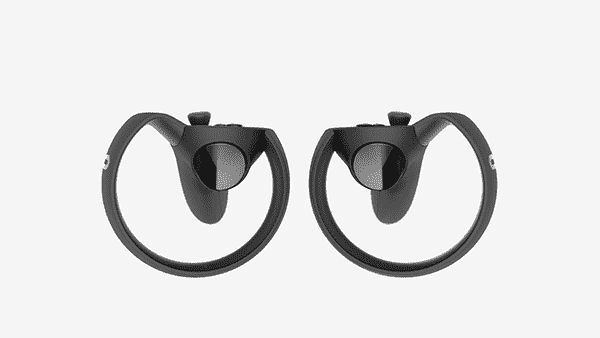

# Oculus 将触摸控制器的发布时间推迟到 2016 年下半年 

> 原文：<https://web.archive.org/web/https://techcrunch.com/2015/12/31/oculus-pushes-back-touch-controller-launch-to-second-half-of-2016/>

# Oculus 将触摸控制器的发布时间推迟到 2016 年下半年

有时时间会悄悄逼近你，你不得不把事情往后推。对于硬件创造者来说，这是一个丑陋的现实，但它确实发生了。

今天，Oculus 宣布其[触摸控制器](https://web.archive.org/web/20221209072431/https://beta.techcrunch.com/2015/06/11/oculus-touch)将于 2016 年下半年发货，而不是在 Rift 之后立即发货，Rift 仍将于 2016 年在 Q1 上市，预购将“很快”到来

Oculus 创始人帕尔默·卢奇(Palmer Luckey)在推特上发布了该公司一篇博客文章的链接，围绕“做对”而不仅仅是发布的重要性来定位事情:

正如我们[在 6 月](https://web.archive.org/web/20221209072431/https://beta.techcrunch.com/2015/06/11/oculus-touch)中所写的，被称为“半月”原型的触摸控制器将让你在虚拟现实体验中拿起物体，开枪，或指向东西。

下面是[全贴](https://web.archive.org/web/20221209072431/https://www.oculus.com/en-us/blog/update-on-oculus-touch-ship-date/):

> 在完善 Touch 的道路上，我们决定在发布之前需要更多时间，我们将在 2016 年下半年推出 Touch。预售将在发布前几个月开放。
> 
> Rift 将如期在 Q1 上市，预购活动将很快启动。
> 
> 在触摸硬件方面，我们在人体工程学方面取得了重大进步，我们正在实施许多改变，使触摸更加舒适、可靠和自然。我们还在实施改进手势识别的更改。
> 
> 我们还输出了大量的预生产运行，这意味着我们可以在需要的开发人员手中获得更多的触摸硬件。
> 
> 将会有大量突破性的新内容与 Touch 一起推出。我们在 9 月份的 Oculus Connect 2 上分享了一些早期预览，但我们已经迫不及待地向你展示接下来会发生什么。
> 
> 对 Touch 的反馈令人难以置信地积极，我们知道这个新的时间线将产生一个更好的产品，一个将为 VR 输入设置标杆的产品。我们感谢你的耐心和承诺触摸将值得等待。

预订将在触摸控制器预定发货前几个月开放。