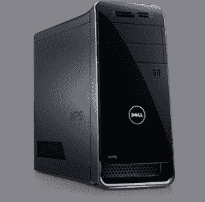
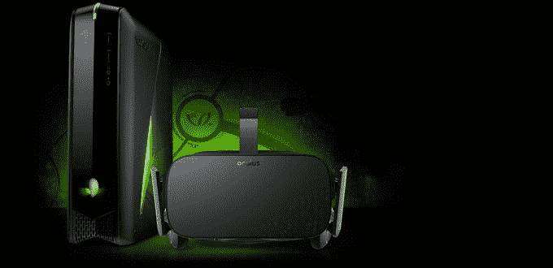
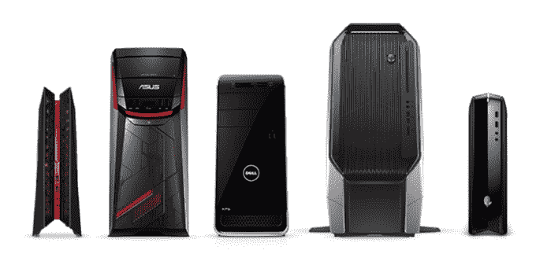
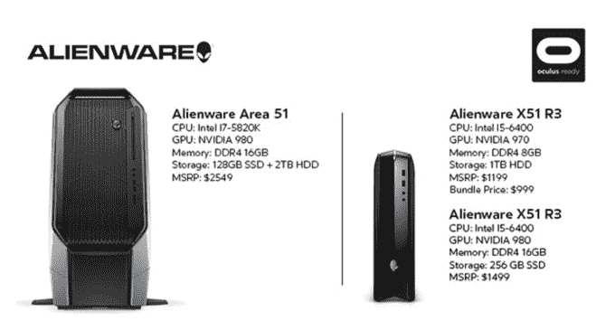
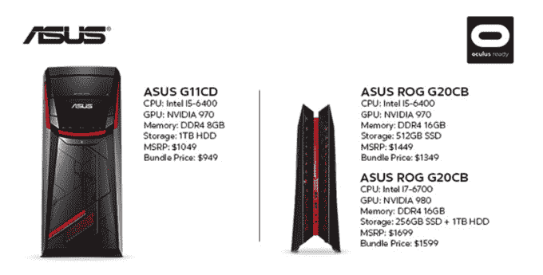
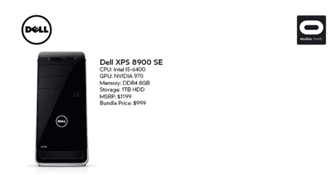

# 来自华硕、外星人、戴尔的 Oculus-Ready PC 套装下周预售 1499 美元 

> 原文：<https://web.archive.org/web/http://techcrunch.com/2016/02/09/oculus-ready-pc/>

# 来自华硕、外星人、戴尔的 Oculus-Ready PC 套装下周预售 1499 美元

Oculus 希望能够轻松获得潜入虚拟现实所需的一切。由于与华硕、T2、外星人和戴尔的合作，Oculus 将于 2 月 16 日上午 8 点开始预售 Oculus-ready PC 套装，价格为 1499 美元。捆绑购买可以让人们在购买电脑时享受 100 到 200 美元的折扣。

捆绑包包括 Oculus Rift，一台足够强大的游戏 PC，运动传感器，Xbox One 控制器，遥控器，并推出游戏 EVE:瓦尔基里创始人包和幸运的故事。他们会在四月发货。

这一声明让我们更清楚地知道人们实际使用 Rift 需要支付多少钱，不带 PC 的 Rift 售价为 599 美元。这将是一款绝对高端的产品，可能比休闲媒体发烧友更吸引铁杆 PC 和游戏机玩家。

捆绑包的价格与 Oculus 帮助制造的 99 美元的三星 Gear VR 耳机有很大的区别，这款耳机可以在三星 Galaxy 手机上运行，价格约为 600 美元。这使得 Rift 捆绑包的价格增加了一倍。

消费者可以从下周开始从[百思买](https://web.archive.org/web/20230129072824/http://www.bestbuy.com/site/clp/oculus-rift-vr-offer/pcmcat748301736879.c?id=pcmcat748301736879)、[亚马逊](https://web.archive.org/web/20230129072824/http://www.amazon.com/Oculus-Rift-Certified-G11CD-WS51-Desktop-Bundle/dp/B01BHFI4XG)和[微软商店](https://web.archive.org/web/20230129072824/http://www.microsoftstore.com/store/msusa/en_US/cat/PC-Gaming/categoryID.68289300)预购捆绑包。任何已经预购 Rift 的人也可以升级获得一台电脑，并使用下周将出现在他们订单页面上的优惠代码获得折扣。如果你不确定你现有的电脑是否能运行 Rift，你可以[查看这个信息页面](https://web.archive.org/web/20230129072824/https://developer.oculus.com/blog/powering-the-rift/)或者运行这个[可下载的兼容性检查工具](https://web.archive.org/web/20230129072824/http://ocul.us/compat-tool)。

现在的问题将是，Oculus 是否能找到足够多的人在这个价格点上购买 Rifts，以使开发者为它制作必备的游戏变得值得。随着众多 VR 头戴设备制造商在未来一年加入竞争，它们之间将对第三方开发商的游戏和内容展开激烈竞争。

无论哪个能推动最多的销售，都可能成为开发者建造的第一个地方，从这个意义上说，Oculus 显然正在努力成为 VR 的 iOS。

 

