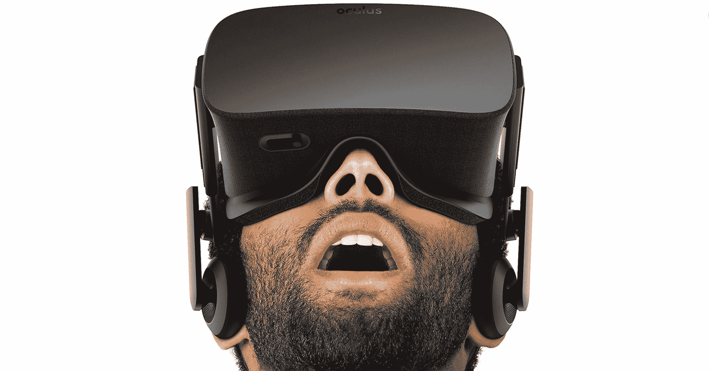

# Oculus Rift 演示将于 5 月 7 日开始选择最佳购买商品，并有“少量”可供购买 

> 原文：<https://web.archive.org/web/https://techcrunch.com/2016/05/02/oculus-rift-best-buy/>

# Oculus Rift 演示将于 5 月 7 日开始选择最佳购买商品，有“少量”可供购买

埃尔维斯·考斯特罗曾有一句名言，写音乐就像“在建筑上跳舞”——或者可能是马丁·穆尔、劳瑞·安德森或弗兰克·扎帕，但这真的跑题了。

关于虚拟现实的报道也有类似的警告。你真的需要努力去得到它。零售可能是这项技术推广的一大部分，而且没有比蓝色 polo 衫电子产品天堂百思买更好的起点了。

5 月 7 日^至日，部分地点[将获得 Oculus Rift](https://web.archive.org/web/20221005223228/https://www.oculus.com/en-us/blog/oculus-rift-retail-experience-kicks-off-at-best-buy-locations-may-7/) 的演示版，这是由商店的英特尔体验显示器提供的。“选择”真的是这里的关键词。事实上，只有 48 个地点将开始使用耳机。

百思买也在同一天提供“少量”Rifts 出售，所以准备好你的推肘，因为数量“极其有限”，而 Oculus 正在努力满足期待已久的耳机的预购。

那些还没有准备好支付现金的人可以通过 Oculus 的 Live 工具安排一次演示，这将找到附近的一家参与商店。今年夏天晚些时候将会有更多的 spots 获得他们的 Rift 演示。