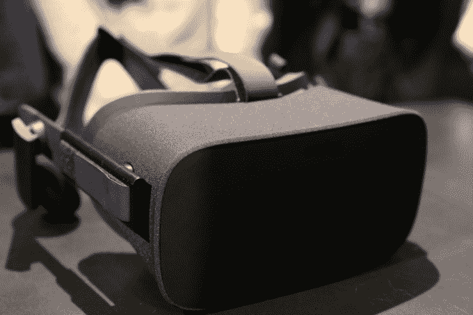
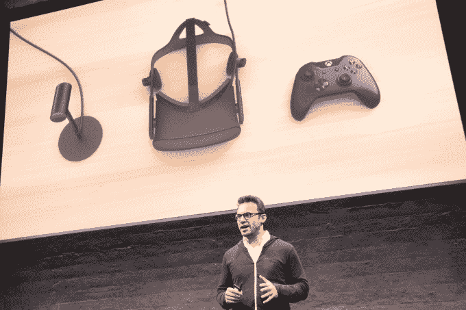
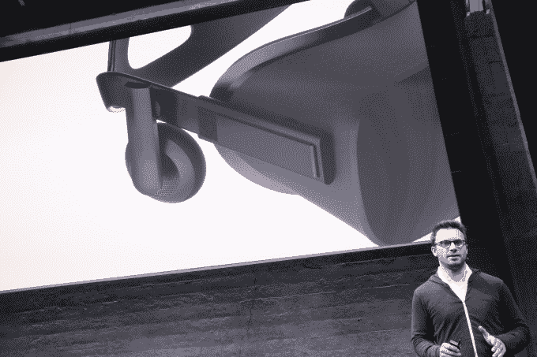
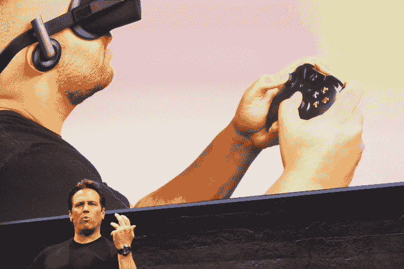
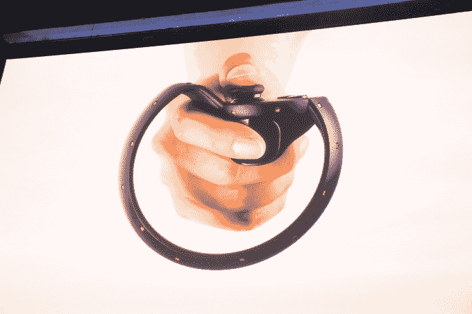
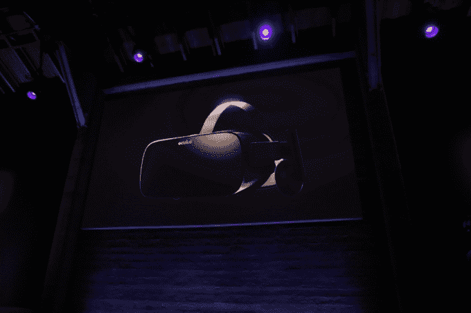
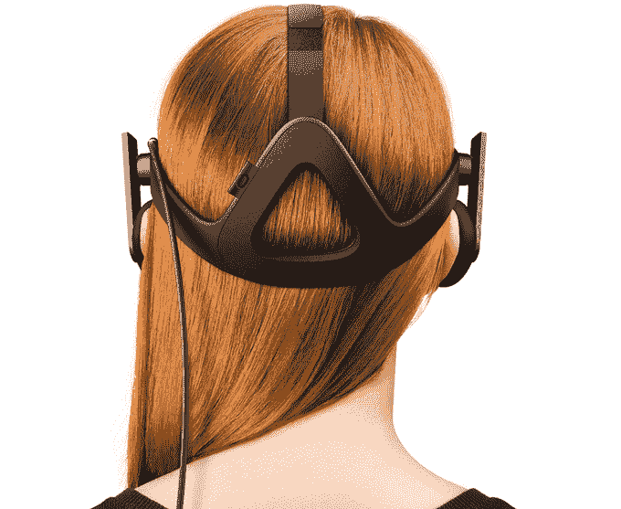

# Oculus 推出带 Xbox One 手柄的消费者 Rift 耳机

> 原文：<https://web.archive.org/web/https://techcrunch.com/2015/06/11/oculus-rift-consumer/>

这不是开发工具包。Oculus 今天向世界首次展示了其 [Rift 消费者虚拟现实耳机](https://web.archive.org/web/20230405052700/https://www.oculus.com/en-us/rift/)，该耳机将配备无线 Xbox One 控制器。它还配备了一个小型的桌面摄像头，可以观察裂缝上的一系列 LED 标记，以跟踪你的头部运动。

与微软的合作也将使 Rift“原生”与 Windows 10 兼容，并可以在耳机中玩 Xbox One 游戏。

消费者 Rift 耳机

完整的 Oculus Rift 包

我们[在博客上直播了今天的新闻发布会](https://web.archive.org/web/20230405052700/https://techcrunch.com/2015/06/11/oculus-rift-special-event-live-blog/)，如果你想要详细报道的话。

Rift 足够轻，可以单手握持，其黑色物质织物包裹的框架包含两个有机发光二极管屏幕和集成的可移动耳机。它是为了让人们戴上眼镜而设计的，接触到你脸部的部分可以更换。一个可调节的滑块可以让你为不同大小的脸改变眼睛镜片之间的距离。

下周，人们将可以在 E3 试用新的 Rift，也可以看看 Oculus 的 Oculus Touch 手持运动跟踪触觉控制器的原型。

重量足够轻，可以用一只手握住，并有织物覆盖以确保安全

可拆卸耳机

Rift 配备了一个摄像头，用于跟踪耳机上的 LED 标记，以转换头部的运动

裂缝是为了让你在里面戴上普通眼镜而设计的

配备 Xbox 控制器将使 Rift 立即准备好玩更复杂的游戏。

Oculus 首席执行官布伦丹·伊里贝(Brendan Iribe)在开幕当天表示:“我们希望彻底改变游戏，改变我们体验娱乐的方式。我们开始着手最终实现虚拟现实的梦想。”他指出，2D 屏幕将我们与发自内心的数字体验分开，但 Oculus 让人们“跨越了那个门槛”。它让我们在任何地方体验任何事情。”

内含的控制器可能是当天最大的公告。Oculus 之前从未有过这样的控制器，这迫使人们建立第三方控制器的变通办法，或者将体验限制为只是四处看看或者像三星 Gear VR 侧面那样点击一个小触控板。

有了控制器，你就可以玩像第一人称宇宙飞船射击游戏伊夫瓦尔基里一样的 [Oculus 游戏。Oculus 正在与一系列开发商合作，包括 EVE 的 CCP Games、gurness Games 和 Insomniac，以便在 Rift 早期推出杀手级游戏。](https://web.archive.org/web/20230405052700/https://techcrunch.com/2015/06/11/oculus-games/)

Oculus 还希望规模较小的开发者为 Rift 制作游戏，因此它计划改造其 Oculus Share 应用商店。作为其中的一部分，Oculus 表示将投资超过 1000 万美元来加速独立游戏的开发。

Oculus 联合创始人兼产品副总裁内特·米切尔(Nate Mitchell)表示，Oculus 正在升级 Oculus Home 门户网站，当你戴上耳机时，你就可以登陆该网站。你可以浏览体验，并在购买前看到游戏的预览。Home 还可以让你看到朋友们都在玩什么。

除了更传统的游戏， [Oculus Touch](https://web.archive.org/web/20230405052700/https://techcrunch.com/2015/06/11/oculus-touch/) 将允许真正的 VR 优先游戏，在那里你可以拿起物体，向人们挥手，或者瞄准并发射虚拟枪支。【T2

Rift [预购将于今年晚些时候开始，并于 2016 年发货 Q1](https://web.archive.org/web/20230405052700/https://techcrunch.com/2015/05/06/oculus-rift-consumer-vr-system-pre-orders-start-later-this-year-ships-q1-2016/)。此次发布是一个巨大的里程碑，发生在 Oculus Kickstarted 第一个开发套件三年后，以及被脸书收购一年后。Oculus 与三星合作创建了 mobile Gear VR，你可以将三星 Galaxy 作为屏幕和处理器放入其中。这更像是对消费级虚拟现实的介绍。但是现在我们知道 Oculus 的旗舰耳机长什么样了。

与此同时，其他 VR 头戴设备制造商也在冲刺，准备好他们的设备。HTC 的 Vive、Avegant Glyph 和索尼的 Morpheus 预计将于今年或明年初上市。游戏和电影体验开发商突然出现，为耳机开发内容。

甚至还有虚拟现实加速器，如[罗森堡风险投资公司的](https://web.archive.org/web/20230405052700/https://techcrunch.com/2015/01/30/vr-as-medicine/)河。人们的期望是，虚拟现实及其姐妹技术增强现实可以使娱乐和包括教育和治疗在内的许多其他领域现代化。

本周末在 E3，Oculus 预计会发布更多公告。但是现在，我们知道明年很多人会把什么绑在脸上。

