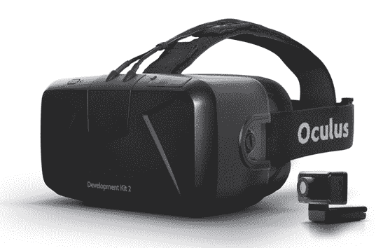

# 凭借 45，000 份预订单，新款 Oculus Rift 将于 7 月 14 日左右开始到货 

> 原文：<https://web.archive.org/web/https://techcrunch.com/2014/07/01/oculus-rift-dk2-shipping-date/>

# 有了 45，000 份预订单，新款 Oculus Rift 将于 7 月 14 日左右开始到货

早在 3 月份，Oculus 正在开发的第二代虚拟现实耳机的预购价格为 350 美元。没有人知道新耳机将于何时真正在 T2 上市，除了“七月的某个时候”。

Oculus 粉丝论坛上有消息称，该公司将在今天宣布更多细节，果然不出所料:该公司刚刚[宣布](https://web.archive.org/web/20230216115051/https://developer.oculusvr.com/forums/viewtopic.php?f=18&t=10044&p=129463#p129463)首批 DK2(开发者工具包#2)耳机将于 7 月 14 日那周开始到货。

坏消息是:即使有甜蜜的脸书现金支持，他们也无法跟上预购——所以如果你没有提前收到订单，你可能要等一段时间了。Oculus 已经收到了超过 45，000 份 DK2 的预购订单，但预计本月只会发货 10，000 件耳机。

公司创始人 Palmer Luckey [之前提到过](https://web.archive.org/web/20230216115051/http://vrfocus.com/archives/1467/12-5k-rift-dk2s-sold-first-36-hours-oculus-confirms/)仅在前 36 个小时就有大约 12500 份预订单；换句话说，甚至一些在第二天*拿到订单的人在接下来的几周内都拿不到耳机。*

供参考:当 Oculus“耗尽材料”来建造他们的第一代 Rifts 时，他们已经卖出了大约 50，000 台。随着 45，000 台预购，第二代开发套件已经超过了第一代。