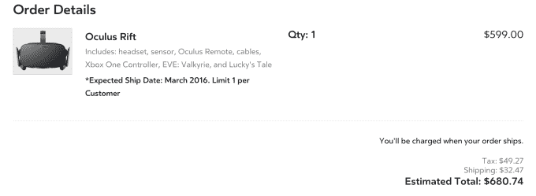

# 面向消费者的 Oculus Rift 耳机售价 599 美元，将于 3 月开始发货 

> 原文：<https://web.archive.org/web/https://techcrunch.com/2016/01/06/oculus-rift-headset-priced-at-599-for-consumers-ships-in-march/>

# Oculus Rift 耳机面向消费者的售价为 599 美元，将于 3 月份开始发货

这是一个漫长的等待，但消费者版本的 Oculus Rift 虚拟现实耳机的价格标签今天终于得到了确认——它的价格为 599 美元(加上运费)。

我们知道，因为 TC 编辑马修·潘扎里诺刚刚设法订购了一台…

这款耳机在英国的定价是 499 英镑。Oculus 表示，它最初将运往 20 个国家，并将于 4 月开始在“指定零售商的有限地点”出售。[今天早上开始预售](https://web.archive.org/web/20221206122312/https://beta.techcrunch.com/2016/01/04/oculus-rift-pre-orders-will-open-on-wednesday/)。

请记住，你还需要拥有一台能够支持 Rift 的 PC，才能进入它的 VR 游乐场——因此，如果没有，你需要考虑额外的成本。Oculus 表示，它将在 2 月份开始提供所谓的“Oculus Ready”PC plus Rift 套装供预购，起价为 1，499 美元。

还证实了:消费者裂痕计划发货的月份——也就是三月。此前 Oculus 曾表示，预计这款耳机将于 2016 年在 Q1 上市。因此，它仍然保持在轨道上，尽管——**更新**——预购网站现在说 Rift 已经售完，直到五月，所以它是*开始在 Q1 发货*。

(当然，没有可供预订的单元数量，我们无法了解这个新生阶段对这个小发明的兴趣的任何有用信息——无论 Oculus 对虚拟现实社区“[潜伏者](https://web.archive.org/web/20221206122312/https://twitter.com/PalmerLuckey/status/684778563862544385)”的说法如何。)

正如[之前证实的](https://web.archive.org/web/20221206122312/https://beta.techcrunch.com/2015/12/31/oculus-pushes-back-touch-controller-launch-to-second-half-of-2016/)，头戴式耳机的触摸控制器将让佩戴者通过拾取虚拟物体等方式与他们在虚拟现实中看到的东西进行互动，但它不会与 Rift 同时发售。

但在 Rift 预购结账过程中，有一个选项可以让控制器“排队”，然后进入 Oculus 帐户注册页面。然后，触控控制器将按照这些注册的顺序提供。(Oculus 表示，在套件发货之前，它不会从买家那里收取任何费用。)

该公司此前曾表示，触摸控制器将于今年下半年推出，因此“适当的沉浸式虚拟现实”的梦想在今年的大部分时间里也将继续遥不可及。虚拟现实——真是一个玩笑……与此同时，Rift 的早期用户将不得不使用耳机附带的 Xbox One 控制器(以及两款捆绑游戏)。

尽管 Oculus 预购网站使用了脸书的 CDN，但该网站显然[一直在努力](https://web.archive.org/web/20221206122312/https://twitter.com/delta407/status/684772750150385664)争取早期用户同时点击以确保裂缝。经过几个月的炒作，以及太平洋时间上午 8 点整开始预购的指示，价格飙升是不可避免的，但有点奇怪的是，昂贵的后端基础设施显然无法应对…

**更新:** Oculus 创始人 Palmer Luckey 在推特上对预购网站的困境做了一点解释——指责潜在的信用卡欺诈者…

那么 600 美元对于 VR 的早期采用者来说是不是太多了呢？时间会证明一切。它肯定比 Oculus 的开发套件版本贵得多，后者的售价为 350 美元。当然，不难发现人们在 Twitter 上抨击价格点，但是——我的两个意见——它永远不会为主流定价，因为虚拟现实不是主流技术。至少在可预见的未来不会。luckey[自己也说了同样多的话。](https://web.archive.org/web/20221206122312/http://www.ft.com/cms/s/2/dae861ee-b275-11e5-b147-e5e5bba42e51.html)

600 美元还能买什么？

*   一部高端智能手机
*   至少有六款非常便宜的安卓手机
*   六个三星 Gear VRs
*   差不多，但不完全是，两块苹果手表
*   十个 Fitbit Zip 活动跟踪器
*   不到 6 股脸书股票(以当前股价计算)