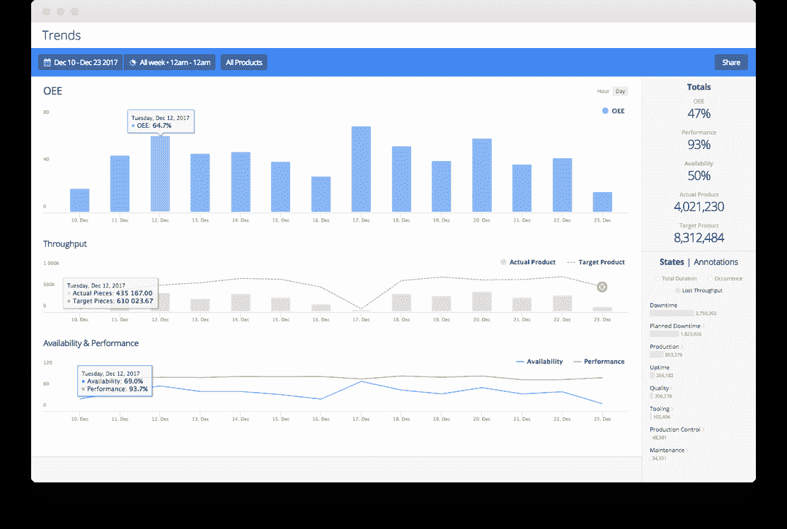

# Oden Technologies 筹集 1000 万美元将数据分析引入制造业 

> 原文：<https://web.archive.org/web/https://techcrunch.com/2018/07/02/oden-technologies/>

提供制造业数据分析的工业物联网初创公司 Oden Technologies 已完成 1000 万美元的 A 轮融资。

本轮由欧洲风险投资公司 Atomico 牵头，继[最近投资 CloudNC](https://web.archive.org/web/20221210071148/https://techcrunch.com/2018/06/07/cloudnc/) 后，[似乎正在加快其“工业 4.0”投资战略](https://web.archive.org/web/20221210071148/https://medium.com/startup-grind/data-ai-robots-atomicos-take-on-industry-4-0-4bd4c14717bf)。一些现有投资者也参与其中，包括 EQT Ventures 和 Inbox Capital。值得注意的是，Atomico 创始人兼首席执行官 Niklas Zennströ也是 Skype 的联合创始人，他已经加入了 Oden Technologies 董事会。

Oden Technologies 最初成立于伦敦，但现在总部位于纽约，它将自己定位为一家工业 4.0 公司，已经建立了自己的工业物联网硬件和“大数据架构”，为任何规模的制造商提供一个平台，通过云分析和优化工厂生产。

简而言之，Oden 设备可以插入几乎任何类型的制造机器，而其“软件适配器”可以整合生产线上现有企业资源规划(ERP)系统和质量控制软件的数据。然后，这些数据被实时上传到 Oden 的云分析平台，以向制造商提供完整的生产画面，包括实时工厂车间监控。

那么，为什么这很重要呢？本质上，可改造的 Oden 设备和由此产生的数据分析使现有的工厂车间更加智能。这包括发现制造缺陷或可能导致缺陷的机器性能下降方面的能力，以及更广泛地说，进一步优化生产量和正常运行时间的方法。

其结果是减少浪费(想想看:需要丢弃或最终被客户退回的产品)，以及更普遍地提高效率，帮助技术驱动型工厂保持竞争优势。

在与 Oden Technologies 联合创始人兼首席执行官 Willem Sundblad 的通话中，他表示，公司的使命是帮助制造商实现“完美生产”，不仅要制造更好的产品，还要让它们更快、更便宜、更少浪费。

传统上，制造商无法获得正确的数据和见解来提高工厂的效率和生产力。然而，随着大数据、云服务和新的工业物联网硬件的碰撞，这正在迅速改变，也是奥登经营的确切空间。

就 Oden 的设备捕捉的数据而言，Sundblad 解释说，它通常由与机器过程、健康、零件/产品的处理和质量相关的指标组成。“原始数据大多存在于机器中，但我们会对其进行分析，以提供答案，”他表示。

此外，Oden 还捕捉材料的熔化压力、材料熔化时的温度曲线、了解产品质量的尺寸读数以及冷却水箱的水温等信息。其他数据点包括机器内部运动部件的每分钟转数、电机的电机负载和生产速度，等等。

“我们分析和处理这些数据，以便客户了解他们在产品上放了多少多余的材料，质量是否合格，如果不合格，原因是什么，当情况变坏或将变坏时发出警报，并(进行)趋势分析，以优化产品。这一切都回到了客户的投资回报上，而投资回报总是来自于更长的正常运行时间、更少的废品和更高质量的产出”。

Atomico 的 Zennströ回应了这些观点，认为制造业迄今为止仍未受到数字技术的“相对影响”。因此，它仍然有效率低下的主要领域。“IIoT、大数据分析、云计算和机器学习的结合标志着工业的一个新时代，”他说。这将见证工业 4.0 技术不仅能提高效率和减少浪费，还能实现更小的批量、更个性化的产品和更大的产品创新。

与此同时，奥登表示，它将利用新的资金进一步扩大其在纽约的 R&D 和工程团队，并在伊利诺伊州、俄亥俄州和得克萨斯州的制造中心建立新的销售团队，以加快客户增长。

该公司最近还聘请了哥伦比亚大学兼职副教授 Deepak Turaga 担任其数据科学副总裁。他将帮助 Oden 进行机器学习和人工智能工作，之前曾在 IBM 担任杰出的研究人员和人工智能第一 ML 和规划小组的经理。