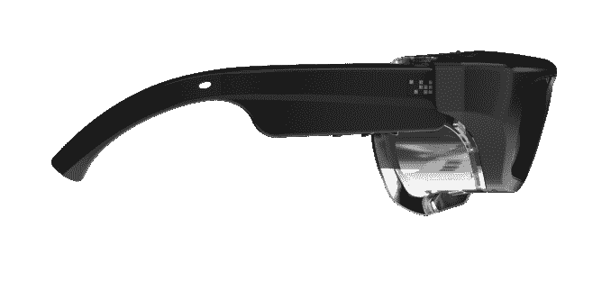

# ODG 推出针对“危险场所”优化的企业级 AR 智能眼镜 

> 原文：<https://web.archive.org/web/https://techcrunch.com/2017/04/04/odg-unveils-new-ar-smart-glasses-optimized-for-hazardous-locations/>

ODG 可能已经展示了将智能眼镜戴在消费者脸上的雄心，但该公司没有忘记其企业客户的特殊和高度独特的需求。

今天，这家增强现实公司发布了一款专为需要更高级防护眼镜的商业客户优化的眼镜模型。R-7HL(HL 代表危险场所)是为那些工作环境更极端的工人设计的；ODG 特别详细说明了“石油勘探和生产、能源、采矿、公用事业、化工生产和制药”，作为新耳机优化的一些行业。

新设备基于该公司当前一代 R-7 的架构，但大部分都必须重新设计，以达到 ODG 合作伙伴所需的耐用性水平。该公司告诉我，其现有客户群中约有 50%来自这款新耳机最适合的行业。

在 CES 上，ODG 拉开了几款下一代旗舰产品的帷幕，即 R-8 和 R-9，但由于现有的供应链，该公司告诉我，尽早获得 R-7 的加固版比等到面向企业的 R-9 的产量增加更有意义。ODG 很难跟上对其 R-7 产品的需求，该产品自推出以来就一直延期交货。

该公司曾一度在 2014 年被微软收购，但最终卖给了他们[、1.5 亿美元的专利](https://web.archive.org/web/20221207181704/https://beta.techcrunch.com/2014/03/27/microsoft-paid-up-to-150m-to-buy-wearable-computing-ip-from-the-osterhout-design-group/)，今年将是忙碌的一年。该公司希望今年在 Q2 推出面向企业的 R-7HL 和 R-9 耳机，同时在今年下半年的某个时候发布其 prosumer 产品 R-8。

去年 12 月，该公司筹集了第一轮外部资金，[在由 21 世纪福克斯公司牵头的首轮融资中获得了 5800 万美元](https://web.archive.org/web/20221207181704/https://beta.techcrunch.com/2016/12/01/smartglasses-maker-odg-scores-58m-in-series-a-led-by-21st-century-fox/)。

虽然微软(Microsoft)、Magic Leap、Meta 等许多公司都在开发“混合现实”设备，这些设备可以主动绘制他们所在房间的空间地图，但 ODG 今年发布的产品更加简单，可以作为免提、平视显示器，可以轻松访问，并提供 Android 平板电脑的功能，尽管它覆盖了真实世界。ODG 正致力于构建能够主动绘制房间几何形状的模型，并由于两款设备都运行最新的 Snapdragon 835，因此为其新模型带来了有限的位置跟踪。

与其他许多在该领域获得头条新闻的公司不同，ODG 多年来一直在向真正的客户提供增强现实眼镜，这些客户已经看到了将 AR 带入工作场所的效用。

R-7HL 将于 2017 年第二季度末开始发货，售价为 3500 美元。