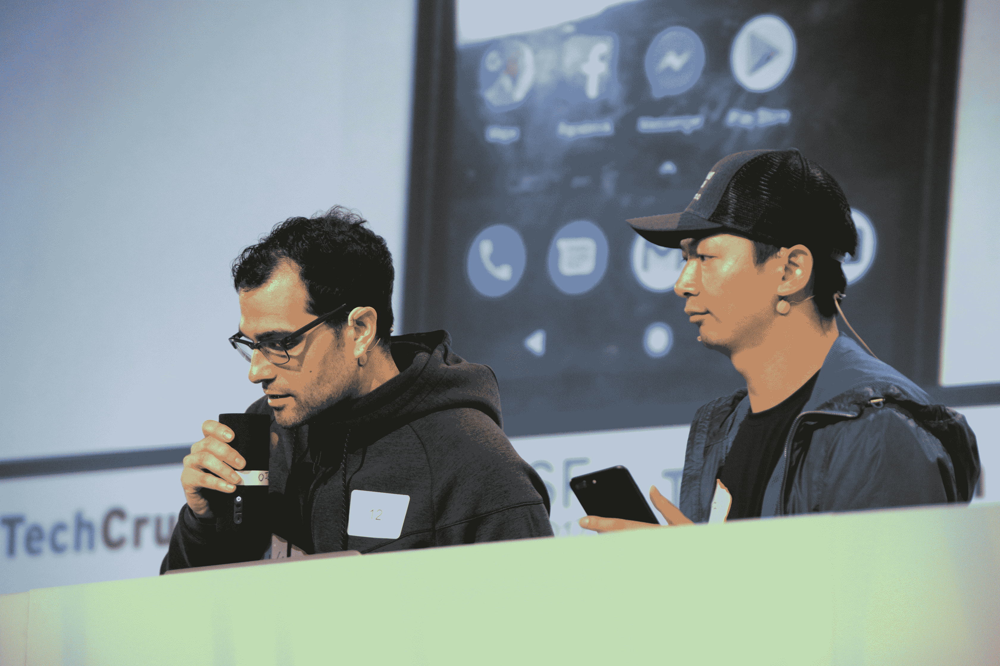

# Odis 将 Alexa 语音命令引入音乐制作 

> 原文：<https://web.archive.org/web/https://techcrunch.com/2017/09/17/odis-brings-alexa-voice-commands-to-music-production/>

# Odis 将 Alexa 语音命令引入音乐制作

可以说，家庭录音室比其他任何单一元素都更能给音乐行业带来革命性的变化。曾经需要专用空间和数万美元的会议现在可以在自己舒适的家中单独录制。当然，卧室录音的缺点是经常没有人在旁边帮忙。

Odis 是在旧金山 Disrupt hackathon 过去 24 小时开发的，它将亚马逊回声变成了工作室助手。使用该应用程序，音乐家可以在给定的轨道上创作，而不必在电脑和麦克风之间来回跑动。一个简单的命令，如“Alexa，播放[在此插入曲目名称]”将启动备份曲目，因此音乐家可以做他们的事情。

Odis 是一个四人团队的产品。Tim Street、Ardon Bailey 和 Nagkumar Arkalgud 是 Capital One 的同事，他们从西雅图飞来参加黑客马拉松。第四个人马特·罗森塔尔在活动开始时加入了团队，并帮助执行了这个想法背后的大部分程序。

至于名字——那只是一个简单的误用。“奥蒂斯是我曾经加入的一个团队中的一员，”贝利解释道。“我告诉 Nagkumar 我们应该叫它‘Otis ’,他拼错了，我们就用了。愿诸神保佑纳库玛的天才。”

由于 24 小时黑客马拉松的原因，该应用程序本身相当简单，但它相当通用。Odis 与 MIDI 接口，这意味着它将与绝大多数音乐程序一起工作，而不仅仅是今天演示中使用的 Logic。这种与应用程序交互的方式也可以用于各种不同的非音乐应用程序、制作等。

该团队表示，他们计划在黑客马拉松今天结束后继续开发这个项目。