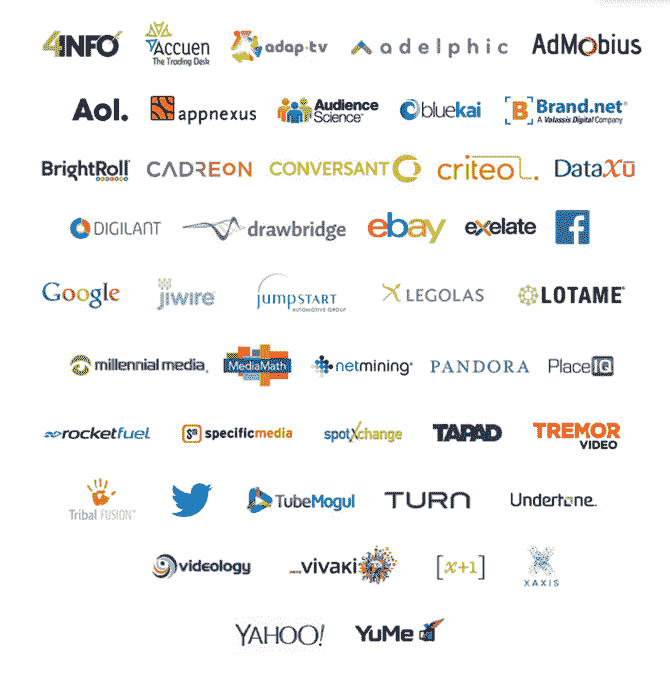

# Datalogix 筹集了 4500 万美元的 C 轮融资，将线下购买数据传输给脸书和 Twitter 

> 原文：<https://web.archive.org/web/https://techcrunch.com/2014/05/28/offline-purchase-data/>

# Datalogix 筹集了 4500 万美元的 C 轮融资，用于向脸书和 Twitter 传输线下购买数据

社交网络必须证明投资回报才能让广告商购买更大的活动，所以他们转向 Datalogix，告诉他们广告何时推动实体销售。Datalogix 已经成为脸书和 Twitter 货币化引擎的关键一环，使其能够筹集到由 Wellington Management Company 牵头的新一轮 4500 万美元的 C 轮融资。该公司表示，自 2013 年 4 月以来，收入增长了 50%。

这一轮由现有投资者 IVP 加入，使 Datalogix 获得了 8650 万美元的资金，加上上个月从 Breyer Capital 筹集的一轮未披露的融资。去年四月，它为[筹集了 2500 万美元。](https://web.archive.org/web/20221207212826/https://beta.techcrunch.com/2013/04/25/datalogix-offline-purchase-data/)

下面是 Datalogix 的离线购买测量的工作原理。您使用您的 Safeway 卡(或另一种杂货店忠诚卡)购买高露洁牙膏打折。Datalogix 通过对您的个人身份信息进行哈希处理，将这些信息匿名转发给脸书。

脸书可以让竞争对手牙膏品牌佳洁士向你投放定向广告，因为它知道你是牙膏买家。佳洁士购买价值 2 美元的广告，目标受众是牙膏购买者，其中包括你。你们中的一些人开始购买佳洁士，平均每个月在佳洁士上的花费增加到 10 美元。然后，脸书可以告诉佳洁士，它在广告上花费的每 2 美元可以获得 8 美元的投资回报，这就说服了佳洁士购买更多的脸书广告，赚取社交网络的钱。

有些人可能害怕这种跟踪，他们可以在这里使用 [Datalogix 的选择退出工具](https://web.archive.org/web/20221207212826/https://www.datalogix.com/privacy/)。但最终，他们可能还是会在网上看到广告，所以如果你愿意牺牲一些隐私，这些广告可以是相关的和有帮助的，而不是错误的恼人的目标。

如果你需要这个勇敢的丹佛创业公司的力量的证据，只需看看它的合作伙伴名单，包括谷歌，雅虎，易贝，和更多的巨头。Datalogix 与其他广告数据提供商竞争，如 [Epsilon](https://web.archive.org/web/20221207212826/http://www.epsilon.com/) 、 [Acxiom](https://web.archive.org/web/20221207212826/http://www.acxiom.com/) 和甲骨文的 [BlueKai](https://web.archive.org/web/20221207212826/http://www.bluekai.com/) 。

凭借稳定的收入和充足的增长空间，Datalogix 可能会进行 IPO。[华尔街日报最近报道](https://web.archive.org/web/20221207212826/http://blogs.wsj.com/digits/2014/05/23/ad-data-miner-datalogix-taps-banks-for-possible-2014-ipo/)该公司正在与高盛、德意志银行和巴克莱银行就支持 7500 万美元的首次公开募股进行谈判。

Datalogix 计划用这笔钱开发更广泛的受众和测量产品套件。Datalogix 可以帮助公司锁定特定产品的正确客户，并衡量这些广告是否真正影响了他们的购买模式。像脸书、T2、推特这样的社交网络可以利用这些数据来说服广告商，他们的活动正在发挥作用，应该会增加他们的支出。

企业厌倦了在模拟广告上花钱，却不知道它是否真的能推动销售。随着广告转向采用复杂跟踪技术的数字媒体，Datalogix 正在将营销从猜谜游戏转变为一门科学。