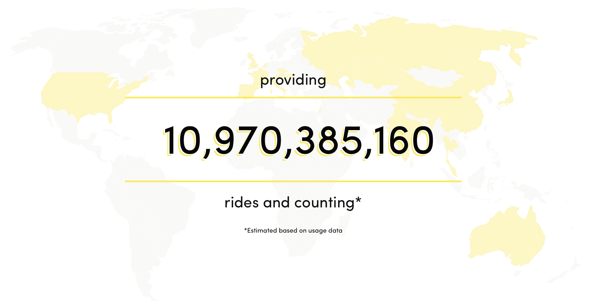

# Ofo 关闭许多国际市场以专注于盈利

> 原文：<https://web.archive.org/web/https://techcrunch.com/2018/07/19/ofo-shuts-down-many-international-markets-to-focus-on-profitability/>

中国自行车共享公司 Ofo 正在进入一个新阶段。经过一段时间的积极增长后，该公司正在回顾其国际市场，并专注于最有前途的市场。

几周前，该公司发布了一份新闻稿，强调了中国以外的一些优先事项。作为这一举措的一部分，Ofo 联合创始人兼首席执行官戴威将直接负责国际市场。

“在国际战线上，这是一个新的战略阶段，”Ofo 法国总经理兼 EMEA 劳伦特犬舍负责人告诉我。"该公司想把重点放在最成熟、最有前景的市场上。"

因此这意味着 Ofo 将在一些国家完全停止运营，如澳大利亚、奥地利、捷克、德国、印度和以色列。

与此同时，也有一些市场运行得相当好。新闻稿特别强调了新加坡、美国、英国、法国和意大利。但即使你从更细的层面来看，Ofo 也将专注于一些特定的城市。

正如 [Quartz](https://web.archive.org/web/20230225042541/https://qz.com/1331368/bike-sharing-company-ofo-is-dramatically-scaling-back-in-north-america/) 和 [Forbes](https://web.archive.org/web/20230225042541/https://www.forbes.com/sites/bizcarson/2018/07/18/ofo-bikes-us/#3a9e6f3f2785) 所强调的，Ofo 在美国小城市并没有获得巨大成功。“在美国，一些市场比其他市场表现更好，他们将专注于这一点，”Kennel 说。该公司将缩减规模，专注于最重要的城市，而不是在几十个美国城市运营。

例如，在法国，Ofo 只在巴黎可用。数字令人鼓舞，该公司每天用 2500 辆自行车处理 5000 至 10000 次骑行。

“在巴黎，我们跨越了一个重要的里程碑，证明我们的商业模式是可持续的，”Kennel 说。"我们的收入涵盖了我们所有的运营和维护成本."这还不包括偶尔购买新自行车的投资。

总的来说，Kennel 对剩下的市场相当乐观。通过专注于有限的几个城市，该公司可以在每个市场进行适当的投资。在欧洲，Ofo 将专注于英国、法国和意大利。

就像在美国一样，Ofo 也在减少英国和意大利的城市数量。该公司最近关闭了在诺里奇和 T2 谢菲尔德的服务。在意大利，T4 进行了内部重组，公司停止了在中型城市瓦雷泽的运营。

继摩拜单车[被美团](https://web.archive.org/web/20230225042541/https://techcrunch.com/2018/04/03/chinese-bike-sharing-pioneer-mobike-sold-to-ambitious-meituan-dianping-for-2-7b/ "its acquisition by Meituan for $2.7 billion in April")收购后，摩拜单车最近宣布[停止在中国要求](https://web.archive.org/web/20230225042541/https://techcrunch.com/2018/07/04/mobike-unveils-first-initiatives-since-acquisition-by-meituan-including-no-longer-requiring-deposits/)押金。Ofo 在中国注册仍然要求退押金，但在欧洲没有。

摩拜单车的财大气粗增加了 Ofo 的压力。Ofo 需要找到一种可持续的商业模式，以成为一家长期可行的独立公司。“它对国际市场有影响，但也对中国的内部组织有影响，”肯奈尔说。

Ofo 不想对每个市场的情况进行评论。所以很难确切知道 Ofo 还在哪里运营，计划在哪里缩减规模。在 Ofo 的网站上，你可以找到一张地图，上面标有它声称经营的所有市场。我看着这张地图，列出了 21 个国家，并试图找出当地发生了什么。

这不是一个完美的列表，但它很好地概述了公司正在发生的事情。

据我所知仍在正常运行:

*   中国
*   法国(巴黎)
*   日本
*   马来西亚
*   葡萄牙(小型操作)
*   新加坡
*   泰国

缩减操作:

*   意大利:[内部重组](https://web.archive.org/web/20230225042541/https://milano.corriere.it/notizie/cronaca/18_luglio_18/milano-bici-gialle-crisi-vandali-abusivi-conti-non-tornano-ofo-taglia-manager-d0552e58-89ee-11e8-8bbc-b107b233a106.shtml)，关闭瓦雷泽专注米兰
*   西班牙:在少数几个城市(马德里、巴伦西亚、马贝拉、格拉纳达)可以使用，但最近[在马德里](https://web.archive.org/web/20230225042541/https://www.elindependiente.com/politica/2018/07/04/pinchazo-del-uber-de-las-bicis-en-madrid-la-app-se-retira-en-tres-distritos-por-robos/)缩减了规模，自行车更少，服务区域更小
*   英国:专注于伦敦(可能还有剑桥和牛津)，同时关闭在[诺里奇](https://web.archive.org/web/20230225042541/https://www.bbc.co.uk/news/uk-england-norfolk-44780649)和[谢菲尔德](https://web.archive.org/web/20230225042541/https://asia.nikkei.com/Spotlight/Sharing-Economy/Alibaba-backed-Ofo-shrinks-overseas-bike-sharing)的运营
*   美国:缩减一些主要城市的规模，比如纽约、西雅图和圣地亚哥

正在关闭:

不清楚:

*   匈牙利:应用程序中的服务不可用
*   哈萨克斯坦:应用程序中的服务不可用
*   俄罗斯:应用程序中的服务不可用

**更新:** Ofo 给我发来了以下声明:“Ofo 已经做出战略决策，专注于国际优先市场。我们在过去一年的快速扩张让我们有机会更好地了解全球业务。我们现在的重点是我们的优先市场和走向盈利。我们仍在与当地市场就未来计划进行沟通。这仍是一个持续的过程。调整尚未最终确定。”