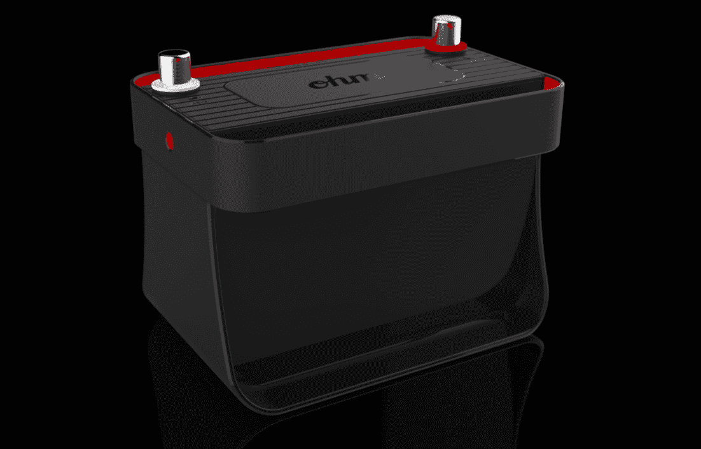
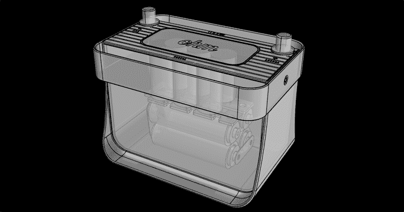

# Ohm 是一种更智能、更轻便的汽车电池，可与您现有的汽车配合使用

> 原文：<https://web.archive.org/web/https://techcrunch.com/2015/08/12/ohm-is-a-smarter-lighter-car-battery-that-works-with-your-existing-car/>

虽然你可能不到万不得已不会想到它们，但汽车电池——帮助启动汽车汽油发动机的笨重盒子——相当可怕。

他们毫无征兆地死去，让你束手无策。它们和小孩一样重，很难更换，而且会消耗你的汽油里程。它们充满了对地球有害的垃圾材料。

然而，它们背后的技术在过去几十年里并没有真正改变。

欧姆是 YC 大学 2015 年夏季班的一员，他想要改变这种状况。它更轻、更智能，是现有电池的替代产品。

大多数汽车电池重约 40 磅，铅板占了一半以上的重量。

欧姆完成了工作，而进来时只有 *6* 磅。

怎么会？

Ohm 引入了一个更现代的两部分系统，而不是铅板:一个 [EDLC](https://web.archive.org/web/20230222130709/https://en.wikipedia.org/wiki/Electric_double-layer_capacitor) 超级电容器能够释放足够的能量启动你的引擎，一组较小的电池( [LiFePO4](https://web.archive.org/web/20230222130709/https://en.wikipedia.org/wiki/Lithium_iron_phosphate_battery) ，不含有毒重金属)在引擎关闭时保持供电。

欧姆的电池装置的物理足迹最终比铅酸电池装置小得多——但由于他们希望这种东西能够在现有的汽车上工作，而不会在引擎盖下反弹，他们将它塞进了一个盒子里，使欧姆与其他任何汽车电池的大小大致相同。(具体来说，它与 35 组电池安装在同一个空腔中)

他们没有浪费额外的空间，而是用它来引入另一个技巧:聪明。

我们都知道开着灯醒来发现电池没电的痛苦。欧姆的内置电路监控超级电容器的潜在输出；如果它快要到达不能启动你的车的时候，它会自动关闭。你的灯将会熄灭，收音机将会静音——但是一旦你转动钥匙，一切都会立刻恢复生机，不需要跳跃启动。

哦，而且它的寿命(7 年)是铅酸电池(3-4 年)的两倍左右。

那么坏处是什么呢？肯定有不好的一面，对吧？

有一个:只要你关掉引擎，你就不能开你的灯和/或音响。欧姆的电池储备在 10 安培小时；大多数铅酸汽车电池在 45 安培小时左右。如果你可以在引擎关闭的情况下用现有的电池运行你的音响三个小时，那么用欧姆表运行它不到一个小时。

不过，多亏了前面提到的内置智能，你永远不会运行太久，以至于电池没电而告终。

该公司告诉我，它的目标是 200 美元左右的价格点——如果你走进当地的汽车零部件商店，这将是你通常为电池支付的高端价格(120 美元至 180 美元)。然而，考虑到欧姆的寿命大约是它的两倍，这个价格最终还是行得通的。

但是当谈到像汽车电池这样的东西时，人们会计划得那么远吗？许多人，如果不是大多数，只是说“我不知道，给我什么是负担得起的，并在我的车上工作。”

考虑到这一点，欧姆首先专注于高性能汽车市场。这些家伙会撕掉他们的乘客座椅，以在赛道上获得微小的性能提升——因此，将他们的乘坐重量再减轻约 30 磅的想法可能是一个受欢迎的想法。

有兴趣了解更多信息吗？Ohm 目前正在进行私人 beta 测试，大约有 12 台设备在野外使用。他们计划在下个月左右推出众筹活动。