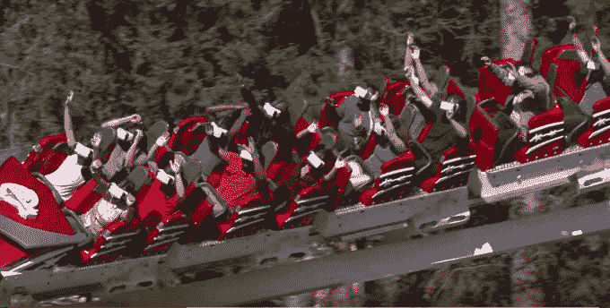

# 旧时代过山车和新时代虚拟现实 

> 原文：<https://web.archive.org/web/https://techcrunch.com/2016/09/21/old-timey-roller-coasters-and-new-timey-virtual-reality/>

这是下面这篇文章的音频版本，应该如何阅读。

**(Play it while you read for an extra special experience)**

[soundcloud URL = " https://API . soundcloud . com/tracks/278731270？secret _ token = s-aFrEe " params = " color = ff 5500 & auto _ play = false & hide _ related = false & show _ comments = true & show _ user = true & show _ reports = false " width = " 100% " height = " 166 " iframe = " true "/]

地点是加利福尼亚州的魔法山。那是一个炎热的夏日——就像我祖父在烈日下辛苦劳作，在丛林中铺设沥青时所忍受的日子一样。有一天，你可以啜饮冰冷的柠檬水，它会提供一个前所未有的缓刑——一个远离烈日的凉爽假期。

我们听说，戴上虚拟现实耳机同时乘坐过山车是有史以来最新、最有趣的事情之一。我的邻居小吉米·约翰逊对我说，那时在老农夫湾的泥地里玩耍更有趣，我觉得难以置信，因为那些肮脏的泥地里是一种享受。我不能只相信他的话，所以我必须亲自检验一下。

过山车是公园里过去最受欢迎的东西。在黄金年代，它曾被称为“革命”。现在添加了一个虚拟现实耳机，经过广泛的市场研究，他们决定将其称为…“[新革命](https://web.archive.org/web/20221204132658/https://www.sixflags.com/magicmountain/attractions/vr/overview)”这是一个如此新颖且极具创意的名字，以至于当我听到它时，它让我想起了在我姑姑格兰达的葡萄园里盛开的雏菊。我姑姑格兰达已经死了。葡萄园是个汉堡王。

当我们踏上过山车之旅时。我和我的两个朋友乔，被称为“双时乔”，亚沙德，被称为“耶耶亚沙德”，都得到了一个三星 Gear VR 耳机。耳机需要固定在我们的头上。有许多带子。列车员问亚沙德是否准备好要走了。他用他的签名“是啊是啊”作为回应然后他们开始把我们扣进杯垫里，这让我想起了不忠的乔被绑在那头公牛上，差点赢得牛仔竞技表演。但他没有，因为他是个不忠的人——一个骗子。

我们三个校准我们的耳机，优化我们的焦点，过山车开始了它的旅程。虚拟现实耳机让我们置身于一架战斗机飞行员喷气式飞机中，随着过山车的实际运动而上下翻转。轨道上有传感器，知道我们在旅程中的位置，所以不管你是在过山车的前面还是后面，每个人都有相同的体验。让我想起了那次我们在阿巴拉契亚抓到一只野生骆驼，然后骑着它去我们的露营地过夜。

旅程结束了，但我暗暗怀疑旅程并没有真正结束。我跑到垃圾桶，抓起一个垃圾袋，在吐出我的牛油果吐司和胡萝卜汁的潮人早餐的边缘完成了我的旅程。幸运的是，我只是干呕，我的旅程现在结束了。

后来，我问公园的经营者，是否有人以前在乘车途中生病过。她说:“没有，从来没有。”所以我是 VR 过山车史上第一个生病的人。我将带着这个与众不同的头衔进入坟墓。

这是一次很棒的经历，如果你有机会尝试的话。动手吧。因为正如我爷爷常说的。“在你安定下来给自己找个老婆之前，你最好先去坐个 VR 过山车男孩。”哦爷爷，我们多么想念您。

*根据真实故事改编。
**视频演职员表:**
编剧:乔·佐尔诺斯基&铁托·哈姆泽
拍摄:乔·佐尔诺斯基&亚沙德·库尔卡尼
编辑:乔·佐尔诺斯基
特别鸣谢:苏卡彭特&六旗魔山