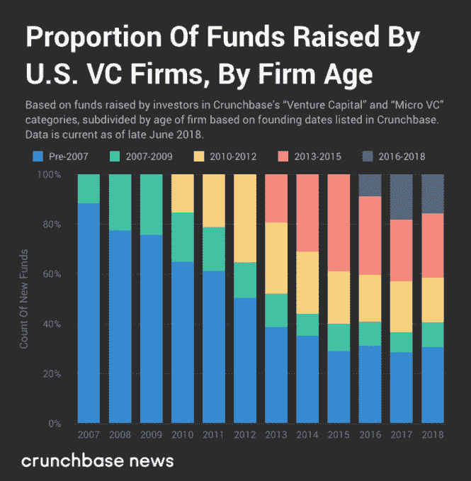
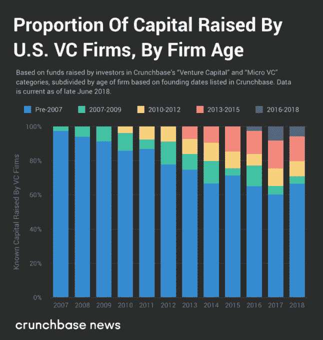
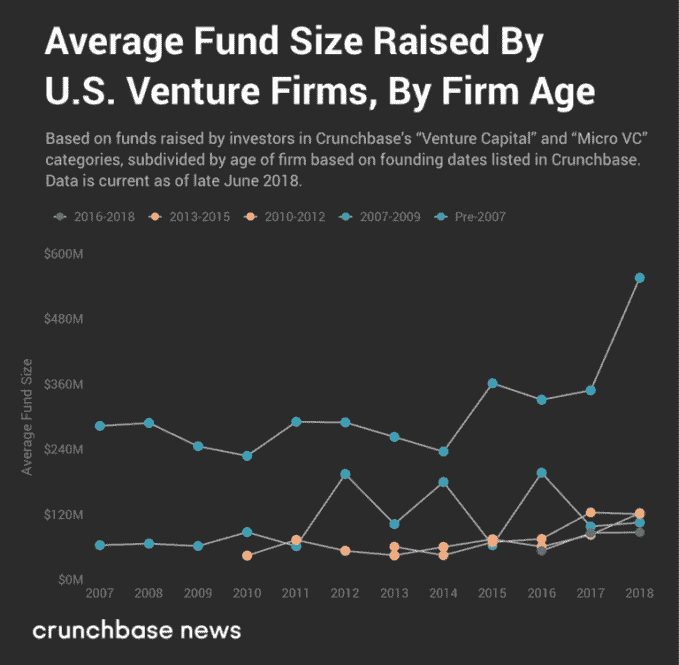

# 尽管有新的进入者，但老牌风投公司在融资方面仍占据稳固地位

> 原文：<https://web.archive.org/web/https://techcrunch.com/2018/07/01/old-vc-firms-hold-entrenched-position-in-fundraising-despite-fresh-entrants/>

杰森·罗利是《金融时报》的风险投资和科技记者

[Crunchbase News](https://web.archive.org/web/20221207214912/https://about.crunchbase.com/news/)

.

More posts by this contributor

周二，有消息称，红杉资本(Sequoia Capital)已经关闭了 60 亿美元，最终可能成为一只 80 亿美元的全球范围增长阶段基金。Crunchbase 新闻[报道了那次融资](https://web.archive.org/web/20221207214912/https://news.crunchbase.com/news/late-stage-drives-sequoia-capitals-growing-funds/)，但根据媒体报道和我们查阅的监管文件，还发现红杉资本有可能通过专注于中国、美国和印度的基金再融资数十亿美元。

除了其第三个“全球增长”投资工具的庞大规模之外，红杉这样的老牌公司筹集大笔资金并不令人惊讶。但不足为奇的事实表明了风险资本融资的一个重要趋势。这就是我们今天要探讨的趋势。

## 新钱对旧钱

以下是我们的发现:较老的*公司*募集了较大的*资金*，似乎占了美国风险公司募集资金的大部分。

根据 NVCA 2018 年年鉴( [PDF](https://web.archive.org/web/20221207214912/https://bitly.com/NVCA2018Yearbook) )，2017 年，首次风投基金经理在 36 只新基金中筹集了 34 亿美元，创下至少自 2004 年以来的最高金额。同样来自年鉴:2017 年创下了活跃 VC 投资人数量的纪录，创下历史新高。(话虽如此，但“首轮”投资者的数量已较之前的峰值大幅下降。)

下图显示了随着时间的推移，新公司(及其基金)的爆炸式增长，这次使用的是来自 Crunchbase 的基金数据。(要了解更多关于我们正在使用的数字，请查看本文末尾。)

从 2014 年到 2018 年上半年，2007 年之前成立的风险公司筹集的资金数量平均约为同期新筹集资金的 30%。

也就是说，如下图所示，在过去的十年里，老牌“机构”公司筹集了大部分的有限合伙人资金。

虽然上面的图表中没有显示出来，但这里有一些其他的统计数据。在我们 2007 年至 2018 年上半年的数据集中，所有公司筹集的资金中，50%是由 1999 年或更早成立的公司筹集的。

总资本的整整三分之一是由 1990 年前成立的公司筹集的。许多历史最悠久的公司——如[新企业联合公司](https://web.archive.org/web/20221207214912/https://www.crunchbase.com/organization/new-enterprise-associates)(成立于 1977 年)[加速公司](https://web.archive.org/web/20221207214912/https://www.crunchbase.com/organization/accel-partners)(成立于 1983 年) [IVP](https://web.archive.org/web/20221207214912/https://www.crunchbase.com/organization/institutional-venture-partners) (成立于 1980 年)和红杉资本(成立于 1972 年)——筹集了大量资金。

为什么会这样？尽管 2007 年前的公司在融资总额中所占比例较小，但它们通过筹集更多资金，保持了融资优势。在过去的十年里，这些基金的规模显著增加，如下图所示。

另外，在 2007 年至 2009 年间成立的公司的平均基金规模的激增与安德里森·霍洛维茨筹集新的“平行”基金的时间相吻合，在过去的三只基金中，每只基金的价值为 15 亿美元。

毫无疑问，H1 2018 年的飙升至少部分要归功于红杉资本(Sequoia Capital)的全球增长基金，但今年许多其他老牌风险公司筹集了大笔资金:

根据我们发现和报道的 SEC 文件，有很强的理由相信像 [SOSV](https://web.archive.org/web/20221207214912/https://news.crunchbase.com/news/sosv-targets-250-million-for-fourth-flagship-fund/) 、 [DCM Ventures](https://web.archive.org/web/20221207214912/https://news.crunchbase.com/news/dcm-ventures-targets-750-million-for-ninth-flagship-fund-per-sec-filing/) 、 [Foundry Group](https://web.archive.org/web/20221207214912/https://news.crunchbase.com/news/sec-filing-indicates-brad-felds-foundry-group-may-raise-750-million-biggest-fund-yet/) 和其他公司正在集体筹集数十亿美元的干粉，这些干粉可能在未来一两年内上市。换句话说，随着时间的推移，这些老牌公司可能会继续坚守阵地，推高平均基金规模。

## 更大的资金和膨胀的期望

过去，我们研究过不断膨胀的基金规模，以及它们投资的轮次。我们已经提到这些指标如何反映了对初创公司及其投资者的高且不断增长的期望，但从未解释过为什么会这样。

风险基金的平均投资周期为 10 年，有时还会有一到两年的展期。正如企业家 Tomer Dean 在 TechCrunch 的一篇文章中所解释的那样，要想跑赢相对“安全”的公开股票市场(在美国，公开股票市场平均每年升值约 7%)，风险投资公司的目标应该是回报至少是最初投资于基金的资本的三倍。10 年后，这大约是 12%的回报率。

本周，在 T 公司收购 AppNexus 公司的新闻发布会上，风险投资人 Semil Shah 写道，即使像 AppNexus 这样的“好”退出也会给现代风险投资基金带来潜在的经济挑战。换句话说，如果一家风险投资公司拥有一家以 20 亿美元退出的公司 16%的股份，它将从退出中获得 3.2 亿美元。沙阿回忆了一次与种子风险投资人的会面，后者告诉沙阿，他们公司的每笔投资都有“一个 RTF 幻数’，每笔交易都会被分配一个目标退出值，在该值时，基金将在那笔交易中‘完整’——想法是你希望每笔潜在的$B+结果都能回报基金。”比方说，对于一只以 1.5 亿美元起家的基金来说，3.2 亿美元的支出是很大的。对于一个 5 亿美元的基金来说，这有点令人失望。

当基金变得更大时，在所有条件相同的情况下，基金回报的幻数也变大。为了补偿，投资者相应地投入更多的资本。至少在创业市场的某些领域——最引人注目的是在踏板车创业领域——估值已经相应增长。

但是，如果一个风险投资者需要找到回报不是一次而是三次的交易，随着时间的推移，这个已经很高的要求会变得更高。

### 方法学

我们引用的 NVCA 数据由 PitchBook 提供给 NVCA。

对于我们的图表，我们使用了稍微清理过的 Crunchbase 的[基金](https://web.archive.org/web/20221207214912/https://www.crunchbase.com/search/funds)数据，我们按照筹集这些基金的美国“风险投资”和“微型风险投资”公司的成立日期对其进行了丰富和细分。

Crunchbase 的资金数据是通过新闻报道和监管文件，以及风险公司和 Crunchbase 用户提供的数据自动收集的。和任何数据集一样，它也有漏洞和不一致的地方。