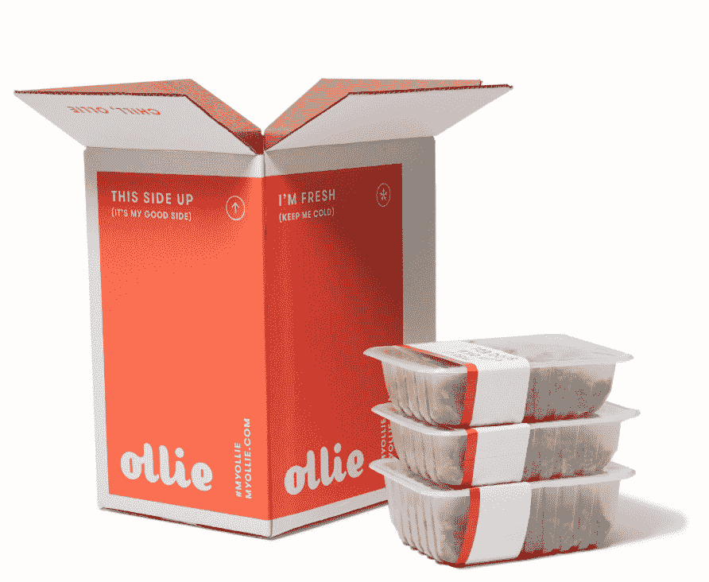

# 奥利筹集 440 万美元成为狗粮 TechCrunch 的代言人

> 原文：<https://web.archive.org/web/https://techcrunch.com/2016/10/05/ollie-raises-4-4m-to-deliver-date-night-meals-to-dogs-on-the-regular/>

鸡肉、豌豆、牛肉、红薯和蓝莓，在像海斯谷和格林威治村这样的地方，40 美元一餐的东西——从今天开始，也是狗粮的东西。

由 Alex Douzet、Gabby Slome 和 Randy Jimenez 创办的新公司 Ollie，旨在通过为狗提供类似于 T2 小枝或 T4 枫树的东西来扰乱高级宠物食品市场。在由 [Primary Ventures](https://web.archive.org/web/20221225234049/http://www.primary.vc/) 和 [Lerer Hippeau Ventures](https://web.archive.org/web/20221225234049/http://lererhippeau.com/) 共同领导的 440 万美元新一轮融资中，有 [Canaan Partners](https://web.archive.org/web/20221225234049/http://www.canaan.com/) 和其他人的参与，Ollie 希望为全国的狗主人提供定制、健康和天然的食物。

就像人类一样，吃正确的食物对狗的健康和幸福至关重要。令人震惊的统计数据[不难发现](https://web.archive.org/web/20221225234049/http://petcha.com/pet_care/overfeeding-pets-increases-diabetes-by-up-to-900-percent-study-says-trending/)描述了宠物患糖尿病、癌症和肝衰竭的上升趋势。

为了解决这个问题，奥利团队正在使用真正的原料来生产适合人类食用的狗粮。该公司还使用在线档案来管理营养需求，以调节份量。

“我们了解这条狗，”杜泽说。“我们捕捉诸如品种、活动标签、狗是否阉割等信息，并基于这些信息，我们有一种算法来计算每天的卡路里需求，并将其与我们发送的食物类型相匹配。”

有了这些信息，该公司每隔两周向狗主人运送一份食物。每只狗的在线资料可以随时更新，所以如果你的狗体重增加或减少，可以很容易地重新计算饮食需求。

在任何时候，奥利团队都在纽约和宾夕法尼亚两地工作。该公司使用 Keystone 州的第三方 USDA 厨房来生产饭菜，并一直让员工在现场以确保质量。

近年来，按需模式已经变得有点陈腐，但在奥利的案例中，有生物学基础来证明它的合理性。因为该公司每两周运送一次新餐，所以不必添加防腐剂来防止食物变质。

奥利感到自豪的是，他们的食物是如此有营养，他们只需添加少量的补充剂，以满足 AAFCO 巴塞尔的要求。重要的是要记住，一些狗可能仍然需要在特定领域的推动，如果他们有特定的条件或素质。兽医克雷格·埃瑟林顿博士强调了这一点。“你可以有很棒的食材，但不能有均衡的饮食。”

在人类世界，关于科技泡沫的猜测似乎暂时得到了缓解，但在狗的世界——商业正在蓬勃发展。优质狗粮市场已经成长为一个 130 亿美元的市场，而且没有停止的迹象。两位数的增长吸引了大量的狗创业公司，但很少有公司达到了标志着成熟、饱和市场的规模。奥利最接近的竞争对手之一 [PetPlate](https://web.archive.org/web/20221225234049/https://www.petplate.co/) 就是这种情况。两家公司垄断市场的方式略有不同。PetPlate 的菜单比 Ollie 多一些，但是送货仅限于东北部。

Primary Ventures 的合伙人本孙(Ben Sun)表示:“奥利从一开始就抱着成为一个国家的心态。“一些其他企业首先在本地推出送货服务，这很有趣，但很难在全国范围内推广。”

现在，你可以通过联邦快递在美国大陆的所有 48 个州找到奥利。价格从每磅 3 美元开始，平均每磅 6 美元左右，这取决于你特定的狗的需要。这一价格肯定高于其他制造商的非优质产品，但还没有接近超过一些优质冻干产品的价格，这些产品的价格可能超过每磅 15 美元。

奥利推出了两款产品，一款鸡肉和一款牛肉狗粮。在未来，该团队希望猫也能获得高质量的食物。兰迪是团队中唯一的猫主人，他正带头努力让宠物世界恢复和平与秩序。