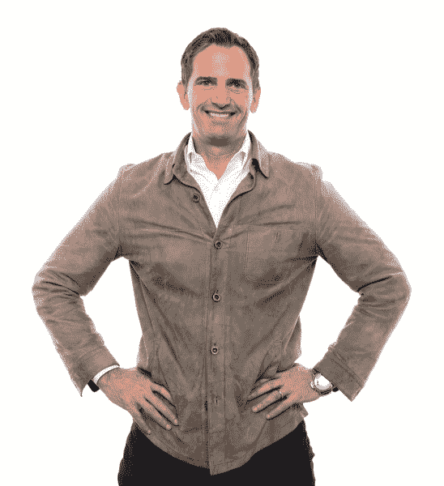

# 奥利在拥挤的空间里建立了一个突破性的品牌:

> 原文：<https://web.archive.org/web/https://techcrunch.com/2016/06/08/olly-has-built-a-breakout-brand-in-a-crowded-space-heres-how/>

维生素和风险投资可能看起来不是最自然的搭配，但近年来许多相关公司已经吸引了科技投资者的资本，包括生产粘性维生素的 SmartyPants 和补充品公司 Elysium Health，该公司将前风险投资家 T2 视为联合创始人。

尽管如此，竞争对手可能很难赶上成立两年的[奥利](https://web.archive.org/web/20221209125730/https://www.olly.com/)，这是一家 30 人的公司，其甜味维生素以橡皮糖的形式提供，并包装在有趣、醒目的容器中，正在越来越多的货架上销售。事实上，这家盈利的初创公司最初是一家在线订阅服务公司，现在只有 3%的收入来自在线销售，其余来自零售商店塔吉特、CVS 和 GNC。(Safeway、Kroger 和 Albertsons 也将在年底前推出 Olly vitamins。)

为了了解 Olly 维生素是如何如此迅速地变得无处不在的，我们采访了首席执行官布拉德·哈灵顿，他与清洁产品公司[Method](https://web.archive.org/web/20221209125730/http://methodhome.com/about-us/)(2012 年末[收购](https://web.archive.org/web/20221209125730/http://www.nytimes.com/2013/01/17/business/smallbusiness/a-founder-of-the-soap-maker-method-discusses-its-sale.html?_r=0))的联合创始人埃里克·瑞安共同创建了 Olly。对于任何对创造新品牌感兴趣的人来说，这本书值得一读。

**TC:麦肯锡称，全球补充剂市场是一个 820 亿美元的市场。但是也很拥挤。是什么让你和 Eric 认为还有竞争的空间？**

BH: Eric 从商人的角度对这个类别感兴趣。他在像塔吉特百货这样的大规模商家中呆了很长时间，观察可能已经成熟的不同类别的产品，你可能会走在过道上说，“嗯，那是显而易见的。”品牌不多，大多数产品都是成分驱动的，所以你不知道该选什么。

事实上，我和埃里克在博尔德，我们站在一家商店的过道上，陌生人会走过来问他们应该服用多少毫克的锌，我们和他们一样目瞪口呆。所以我们想，让我们简化这一点，让一切都与最终利益相对比的单个成分。

你马上就决定要软糖了吗？

BH:事实上，我对药片感到恶心，我在一家公司工作，那里所有的营养品都是较大的药片。这让我很难使用自己的产品。与此同时，我们想开发一些人们每天都想吃的东西。

在我们进行开发的过程中，事情变得越来越多，去年我们推出了 20 种不同的产品，包括 16 种胶质形式的产品和 4 种可吞咽的软胶囊。当数字开始出现时，我们看到软凝胶跌到了底部，所以现在我们(只)生产软糖。

** TC:你是做订阅业务起家的，但你并不推荐，貌似。为什么？**

BH:很难规模化。你必须考虑获得新客户的成本以及你能保持新客户多久，鉴于在线广告世界，现在的收购价格往往非常高。因此，在打造品牌时，你必须能够承受(这些成本)。建好之后，就更容易了。但是需要长寿。

**TC:与此同时，你已经设法搞清楚了零售。有什么教训吗？**

BH:我们首先在 Target 推出，这是一年的独家新闻。做独家频道一直是我们的策略。举例来说，现在我们正在与 GNC 合作一家专卖店，GNC 真正酷的地方是你有带窗户和行人的店面，所以从品牌的角度来看这很棒。我们还与 CVS 独家合作，这是我们目前的药品[商店]渠道。

GNC 和 CVS 来找我们，这很令人兴奋。但我们基本上是在试图控制我们的增长，以确保我们雇佣了合适的人，而不是过快地消耗我们的资金。

说到资金，你已经筹集了多少，你会很快回到市场吗？

BH:我们已经从 Obvious Ventures、Base Ventures、[雅虎第一任首席执行官]蒂姆·库格尔、[前李丁丁咖啡首席执行官]帕特·欧德阿和其他一些高净值个人那里筹集了 1150 万美元。我们正在努力*而不是*筹集更多资金。我们一开始就获得了广泛的分销渠道，我们在第一年就实现了盈利，而且现金流和成功还在继续。

**TC:你的营销策略是什么？**

BH:我们在 2016 年保持一切数字化和实体店，但我们希望在 2017 年大规模开启营销，尽管我们仍在试图弄清楚我们的认知游戏将会是什么。我们真的想创造一个连接生活方式和千禧一代的标志性品牌。

谁在设计这些产品，它们在哪里生产？

BH:它们大部分是在印第安纳州制造的，在佛罗里达州的一些工厂生产。我们有一位首席医疗官，他曾是希夫营养公司(Schiff Nutrition)的内科医生，希夫营养公司是 Airborne 公司的子公司，于 2012 年以 14 亿美元的价格被收购。他带来了实用主义医生的观点。我们的创新副总裁是一名自然疗法医生；她带来了东方医学的观点。我们还有营养学博士。这是一个小团队，但他们开发我们的产品很快。我们有 25 种产品，到 9 月份我们将有 35 种产品。

你的顾客大多是女性吗？

BH:我们大约 80%的顾客是女性。

**TC:你是如何防止你们的产品互相蚕食的？许多看起来非常相似。**

BH:这肯定是一门艺术。例如，我们的女性(浆果味)多种维生素浆果做得非常好。这是我们第二畅销的产品。我们所做的是(避免影响其销售)开发了一个以植物营养素为中心的系列，人们在饮食中从蔬菜和水果中缺失了这些营养素。这种复合食品弥补了很多这些不足，但它没有解决植物营养方面的问题，所以我们生产了一种“超级食物”复合食品，它含有豆瓣菜、羽衣甘蓝和木瓜的成分，价格较高。所以你在这两者之间创造了一个区别，你[看到]不同的买家。

你最畅销的产品是什么？

BH:这是我们的睡眠产品。它实际上也是塔吉特百货在该类别中最畅销的产品。它的基本成分是褪黑激素，可以让你入睡，它与氨基酸 L-茶氨酸混合，有助于镇静大脑，所以这种组合可以让你入睡并保持睡眠。我们做的每件事都是混合在一起的，所以一加二大于三。

你的维生素中也含有大量的糖。我碰巧是糖的忠实粉丝，但它当然会让人上瘾。使用它会让维生素更容易上瘾吗？

BH:每剂含有两克糖。如果我们生产无糖咀嚼片，那可能也不会是一个很好的体验。我们希望建立良好的习惯，如果你必须放一点糖来创造这些习惯，我不认为这有什么错。