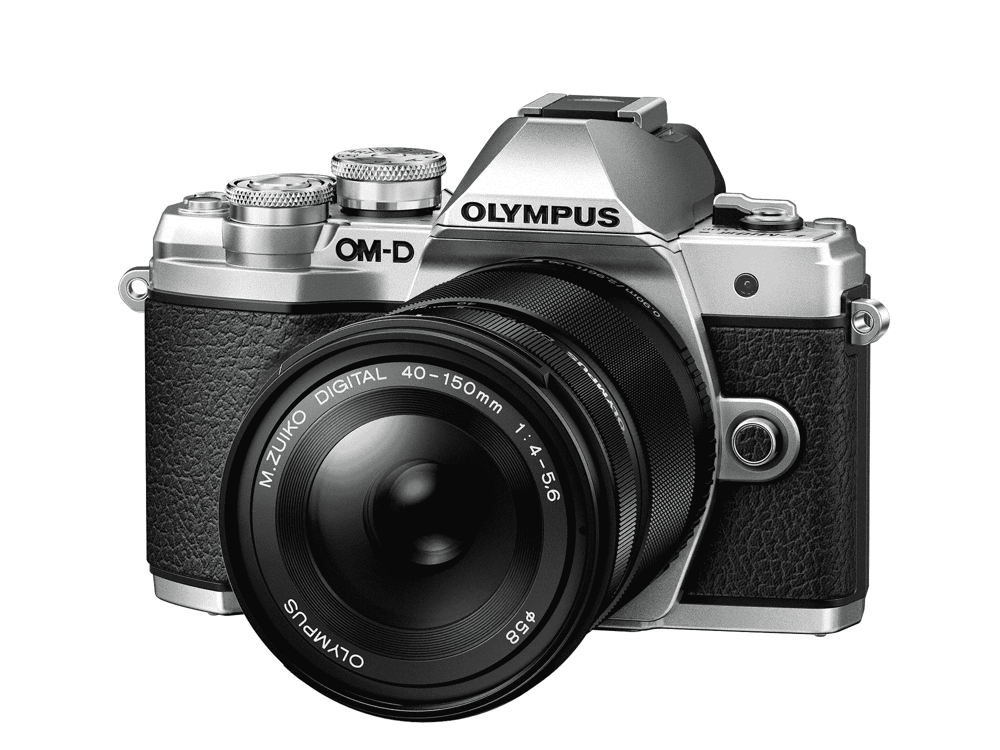
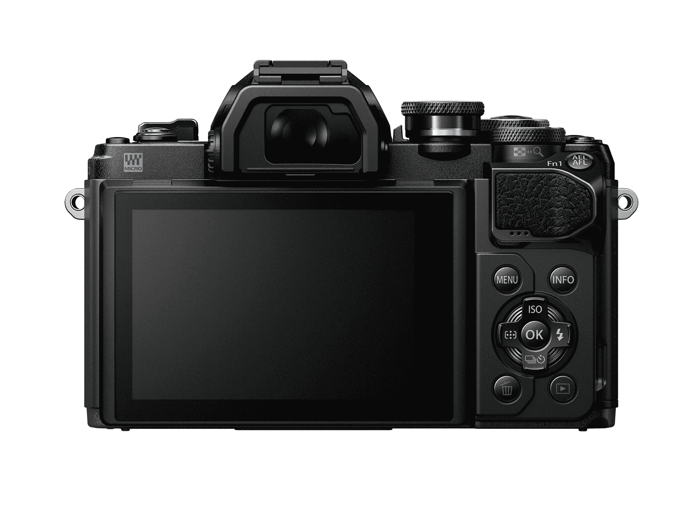

# 奥林巴斯用 E-M10 Mark III TechCrunch 为初学者出价

> 原文：<https://web.archive.org/web/https://techcrunch.com/2017/08/31/olympus-makes-a-bid-for-beginners-with-the-e-m10-mark-iii/>

奥林巴斯制造了非常好的无反光镜相机。我使用第一代 OM-D 已经很多年了，我认识几个 TechCrunch 的员工，他们非常信任他们的产品。在发布 E-M10 系列的最后一款相机两年后，该公司又推出了 Mark III，为廉价的可更换镜头相机带来了几个关键的补充。

当然，“预算”是情人眼里出西施。这套系统的机身起价为 650 美元，机身和配套镜头的起价为 800 美元。请注意，这比奥林巴斯产品线的下一步产品 E-M5 马克 2 号便宜 450 美元左右。没有人说过跟踪所有这些相机型号会很简单。

然而，该公司试图让从智能手机到严肃的独立相机的过渡变得更容易。本质上，奥林巴斯希望智能手机上摄像头的普遍存在将实际上推动更多人使用他们的产品，而不是过去几年市场的持续侵蚀。该公司将这一概念融入到相机的新闻材料中，称“希望从智能手机相机升级到可更换镜头系统的消费者将立即受益于 OM-D E-M10 Mark III 的 5 轴图像稳定功能。”

这感觉有点像一场败仗，希望 Instagram 等应用的流行能够推动人们对 800 美元的相机系统产生更多兴趣，但你不能责怪该公司的尝试。因此，这款相机为初学者提供了各种拍摄辅助模式，包括自动、场景、高级照片和艺术滤镜，后者是 Instagram 滤镜的可更换镜头相机版本。

这款相机还内置 Wi-Fi——在这一点上，这几乎是这类相机的标准功能。尽管上传到社交媒体需要将相机连接到安装了奥林巴斯图片分享应用的手机上。菜单系统也几乎是这类相机的标准配置，也就是说，它没有你习惯的智能手机那么直观。如果有人能破解这门课中摄像机的代码，他们就真的有所发现了。

不言而喻，有很多事情你可以用 E-M10 做，即使是最先进的智能手机相机也做不到。当然，有很多人在谈论手机摄像头将赶上相机摄像头这一似乎不可避免的一天，但我们肯定还没有到那一天——尤其是交换镜头的能力。这款相机还借用了广受好评的高端相机 E-M5 的 TruePic VIII 图像处理器。

新的 E-M10 还带来了更快的自动对焦，拥有 121 个自动对焦点，并能够在 4K 录制。机身也进行了一些重新设计，以使其更容易握持，尽管该公司仍保持了经典的电影相机风格设计，这有助于该系列在竞争中脱颖而出。

新相机将于 9 月下旬上市。