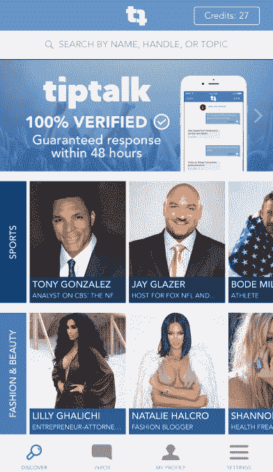
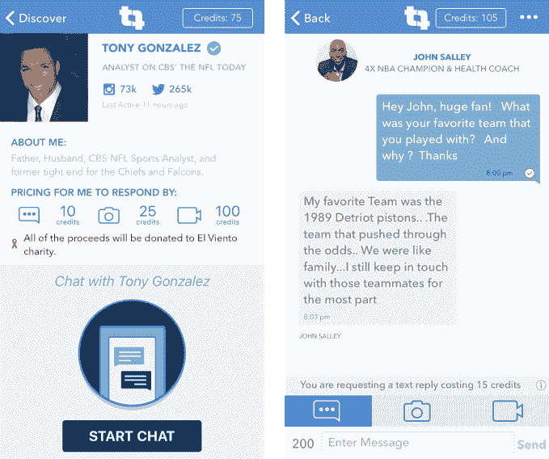

# 用 tip talk TechCrunch 给名人发短信或视频

> 原文：<https://web.archive.org/web/https://techcrunch.com/2016/03/28/omg-im-like-your-biggest-fan/>

名人回复他们没完没了的粉丝电子邮件从来都不值得——直到现在。让他们为私人文本、照片或视频回复设定价格。他们的想法是，在休息时间里，他们可以与观众建立更深的关系，同时赚到足够多的钱来吸引他们至少几秒钟的注意力。

考虑到每当一个真正的名人或网络明星在社交网络上发帖时，公众评论卷轴就会亮起，可能会有一部分人愿意为一对一的时刻付费。对于那些擅长赢得粉丝但难以赚钱的影响者，如中层音乐人和 Instagram royalty，TipTalk 可以打开一条将他们的热情转化为职业的道路。

只需下载 [TipTalk iOS 应用](https://web.archive.org/web/20221207083030/https://itunes.apple.com/us/app/tiptalk/id1062079647?mt=8)，购买 1 美元信用点，选择一个明星，请求价格不断上涨的文本或照片或视频回复，发布您的问题或请求，然后等待回复。你可以询问生活小贴士、他们的意见、给爱人一个惊喜的生日信息、建议合作或者只是滔滔不绝地说你有多爱他们。

有影响力的人自己定价。目前该应用上不太知名的人物通常收取 20 美元一条短信、50 美元一张照片和 100 美元一段视频的费用。他们可以从多达 100 个入站请求的队列中挑选，发送他们的回复并收取他们的钱。他们获得 50%，而苹果保留 30%的税收，TipTalk 获得 20%。粉丝在 48 小时内没有得到回应就可以退款，所有明星都验证是自己。

这个想法源于联合创始人欧文·德弗里斯(Owen DeVries)与一位 Instagram 明星的对话，这位明星收到了来自粉丝的数十万条信息。他们每周回复两到三封。德弗里斯问，如果他们得到报酬，他们会回复多少，这位明星说，他们会用所有的空闲时间做这件事。

网络明星通常求助于品牌代言，而音乐家和其他艺术家则在社交网络上推广他们的商品。但 TipTalk 可以介于两者之间，让他们在不向所有人发送垃圾邮件的情况下赚取现金。

TipTalk 目前的影响者并不完全是你所说的名人。拥有 46 名成员的美国人名列前茅，其中包括奥运会滑雪金牌得主博德·米勒、《花花公子》年度玩伴贾德·妮可、《橘子郡的真实主妇》明星格雷琴·克里斯汀·罗西和金·卡戴珊性爱录像中的男主角雷·J。为了吸引观众和收入，它需要吸引家喻户晓的名字，而不是这些一线明星。

现在，最接近 TipTalk 的事情将是昂贵的演唱会前见面会，或者电子竞技明星或色情摄像女孩如何在他们的公共流中为捐款的人大喊大叫。 [YouNow](https://web.archive.org/web/20221207083030/https://www.younow.com/) 、 [Clarity.fm](https://web.archive.org/web/20221207083030/https://clarity.fm/) 等也在该领域进行了尝试。但 TipTalk 通过预先定价的菜单将这种体验带到了网上，私下里，并使其异步，这样对双方都很方便，即使互动不那么生动。

联合创始人兼首席技术官扎卡里·梅拉梅德称 TipTalk 为“影响者的时间和知识的市场”。供应已经存在，但巨大的需求和适当激励的缺乏造成了 TipTalk 可以弥合的脱节。

在一个媒体免费或容易复制的世界里，很难证明你喜欢什么，粉丝们希望与他们的英雄有独特、亲密的体验。在旅游巴士和机场跑道上，你可以想象名人在 [TipTalk](https://web.archive.org/web/20221207083030/http://www.tiptalkapp.com/) 上发出回应，将追随者变成铁杆支持者，并一直中饱私囊。