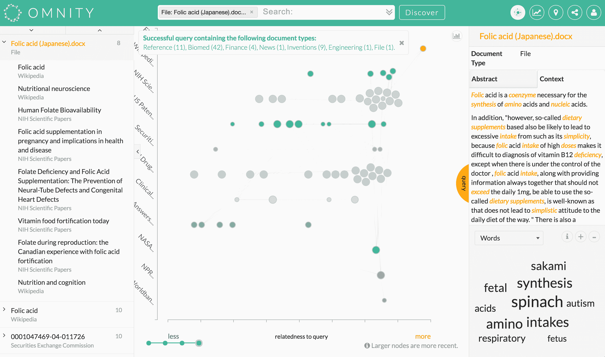

# Omnity 搜索引擎找到与您相关的文档——不考虑语言 

> 原文：<https://web.archive.org/web/https://techcrunch.com/2016/12/14/omnity-search-engine-finds-documents-relevant-to-yours-regardless-of-language/>

随着大量已发表的研究、专利、白皮书和其他书面知识的出现，你甚至很难合理地确定自己是否了解某个主题或领域正在发生的事情。Omnity 是一个搜索引擎，通过提取你给它的文件的要点，并从数百万的库中找到相关的文件，使它变得更容易——现在支持 100 多种语言。

这个过程简单而免费，至少对于 Omnity 收集的面向公众的数据库来说是如此，这些数据库包括美国专利、SEC 文件、PubMed 论文、临床试验、国会图书馆收藏等。

你上传一份文件或文本片段，系统会扫描它，寻找最不常用的单词和短语——这些单词和短语通常表明主题、实验类型、使用的设备等事项。然后，它在自己的库中查找具有相似或相关短语的文档，这些短语以暗示相关性的方式出现。

例如，假设你把一种食品添加剂在某种老鼠身上的临床试验结果放进去，发现它导致了某种状况。Omnity 将返回描述该添加剂在小鼠或其他动物身上的其他测试的文档，或者产生该条件的无关测试，而不需要您指定重要方面或深入研究。您的文档和结果之间的相似之处和联系也以一个漂亮的图表呈现出来。

Omnity 的这一部分已经运行了一段时间，但昨天该公司宣布，它正在扩展其系统，以涵盖 100 多种语言。所以你可以用中文、俄文、阿拉伯文等提交研究论文或文件。—它将以跨语言的方式执行相同的过程，并返回相关的结果。

这个过程同样适用于其他语言的文档，但是 Omnity 知道法语中的短语相当于英语中的短语，尽管它可能没有掌握翻译过程的微妙之处。它仍然知道，并且仍然返回正确的文档。

目前，该数据库主要集中在英文知识库上，但首席执行官 Brian Sager 在一封电子邮件中告诉 TechCrunch，该公司“正在进行国际扩张。启用单个外语文档是这一过程的第一步，随着时间的推移，我们将增加非英语文档。”

这项服务是免费的，所以你可能想知道这些人是如何赚钱的。和许多其他公司一样，私人客户买单。公共网站是诱饵，显示该系统与一个大的——目前为 15tb——数据库一起工作。但该系统也可以在公司内部部署，例如在一家律师事务所，该事务所必须跟踪数百万份文件和法庭案件，并准备好供即时调用。

Sager 写道:“单个企业客户可能拥有数百 TB 到数十 Pb 的数据，比所有公开文件的总和还要大 1000 倍或 10000 倍。”“这是我们收入模式的重点，交叉连接和自动分类大规模定制摄取的文档。”

这种方法在某些方面类似于 Semantic Scholar，这是另一种基于机器学习的搜索引擎，它从文本中提取意义，使文档更容易搜索和分类，但 Omnity 的方法更抽象一些。

“Omnity 制作数学方程，描述离散文档中罕见词的统计模式，不考虑工作邻近性，也不考虑语法或语法内容，”Sager 写道。另一方面，语义学者理解语法的方式和我们一样，并用它从文本中提取意义。

这是一个有趣的并列:两个人工智能驱动的搜索引擎，尽管有相似之处，但仍然非常不同。或许这是对下一代搜索的展望。