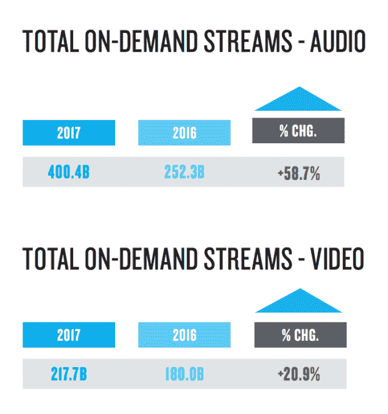

# 尼尔森 TechCrunch 表示，点播流媒体现在占据了音频消费的大部分

> 原文：<https://web.archive.org/web/https://techcrunch.com/2018/01/04/on-demand-streaming-now-accounts-for-the-majority-of-audio-consumption-says-nielsen/>

根据尼尔森本周发布的年终音乐报告，随着流媒体的持续增长，2017 年美国专辑销量下降。该报告发现，包括数字和实体在内的专辑销量去年下降了 17.7%，至 1.6915 亿张，低于 2016 年的 2.055 亿张。与此同时，流媒体再次飙升，引领了整个音乐行业的增长，这主要归功于点播音频流比去年大幅增长了 58.7%。

总体而言，2017 年点播音频流超过 4000 亿，而 2016 年为 2520 亿，包括视频在内的整体点播流超过 6180 亿。这使得音乐行业在 2016 年的总量增长了 12.5%。

尼尔森还表示，点播音频流现在占音频消费总量的 54%，高于 2016 年的 38%和 2015 年的 22%。

值得注意的是，这使得 2017 年点播音频首次占据了音频消费的大部分*。

点播音频流现在也在 2017 年有史以来第一次超过了所有其他所有权格式，包括实体和数字专辑销售和其他数字轨道等价物。

点播流媒体的增长甚至导致 2017 年总数字量增长了 20.5%，尽管数字专辑和曲目购买量有所下降。随着视频和音频的结合，点播流媒体在过去一年增长了 43%。

不足为奇的是，尼尔森发现音频流在工作日更受欢迎，而视频流在周末最受欢迎。

流媒体的增长也在其他方面塑造着音乐市场。

例如，R&B/嘻哈音乐在流媒体消费者中的受欢迎程度——就像即将上市的 Spotify 网站上的那些人一样，在 Spotify 网站上， [RapCaviar 已经成为音乐领域最有影响力的播放列表](https://web.archive.org/web/20221230200007/http://www.vulture.com/2017/09/spotify-rapcaviar-most-influential-playlist-in-music.html)——现在已经超过摇滚成为总消费量最大的音乐类型。

R&B/嘻哈艺术家今年再次引领总数量，在最高数量艺术家的前 10 名中获得 8 个席位。德雷克以 480 万的总轨道当量领先，其次是肯德里克·拉马尔(370 万)。

尼尔森说，流行音乐流派的艾德·希兰(360 万英镑)和泰勒·斯威夫特(340 万英镑)分别位居第三和第四。

流媒体的发展也让一些单曲达到了显著的里程碑。例如，2017 年有 19 首歌曲的点播量达到 5 亿，而 2016 年只有 6 首。(这 19 首歌中有 17 首来自 R&B/嘻哈音乐)。

此外，10 首歌曲的点播音频流超过 4 亿，而 2016 年只有一首。

就视频和音频而言，最佳流媒体音乐是路易斯·丰西和贾斯汀比伯主演的《去太平洋》。去年它看到了高达 13 亿+的流量。

但即使流媒体以牺牲专辑销量为代价获得了收益，也有一个亮点:黑胶唱片。

2017 年，数字专辑销量下降 19.6%，至 6620 万张；实体专辑销量下降了 16.5%，至 1.029 亿张；但乙烯基增长了 9%，达到 1430 万，高于 2016 年的 1310 万。

这意味着连续 12 年同比增长的黑胶唱片，现在占实体专辑总销量的 14%。与此同时，实体专辑占专辑总销量的 61%。

尼尔森的完整报告深入研究了单个艺术家的成功和其他音乐事件，可以在这里下载。

*更新:2018 年 1 月 31 日:注意，尼尔森对音频消费的定义不包括电台 airplay，电台的人希望你知道。鉴于报告的重点是点播流和专辑销量等等，你可能明白这一点，但如果你不明白:别忘了电台的存在，伙计们。*